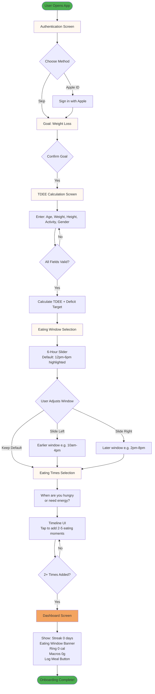
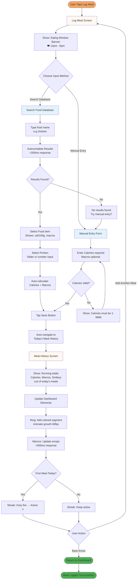

**Key Screens:**
1. **Authentication** - Sign in with Apple (primary) or Skip
2. **Goal Selection** - Confirm weight loss goal
3. **TDEE Calculation** - Enter age, weight, height, activity level, gender
4. **Eating Window** - Select 6-hour window (12-6pm default highlighted, slider to adjust)
5. **Eating Times** - Add 2-5 eating moments based on hunger/energy needs
6. **Dashboard** - Personalized home screen with 0 cal, inactive streak, ready to log

**Optimization Notes:**
- Progress indicator at top (1 of 5, 2 of 5) keeps user oriented
- Back button always available (top-left) for corrections
- Validation prevents progression with invalid data
- Smooth transitions maintain flow without jarring cuts
- Default values highlighted to speed completion (12-6pm window)

---

### Journey 2: Daily Meal Logging

**Goal:** Log meal in <30 seconds, see instant macro feedback, maintain streak.

**Entry Point:** Tap "Log Meal" button OR push notification reminder

**Success Criteria:**
- Experienced users log in <30 seconds
- New users log in <60 seconds
- User sees updated ring, macros, and streak immediately
- User understands can add more meals or return to dashboard

**Flow Diagram:**



**Key Screens:**
1. **Log Meal** - Two paths: Search Food Database OR Manual Entry (eating window banner visible)
2. **Search Results** - Autocomplete <200ms, shows calories per serving
3. **Portion Selection** - Slider or number input for amount
4. **Manual Entry** - Calories required, macros optional
5. **Today's Meal History** - Auto-navigate after save, shows running totals + meal list
6. **Dashboard** - Updated ring, macros, streak (auto-updated, no manual refresh)

**Path A: Food Database**
- Tap search bar → Type food name → Select from autocomplete → Choose portion → Save
- Auto-calculates calories + macros based on database values
- <30 sec for experienced users (know their common foods)

**Path B: Manual Entry**
- Tap "Manual Entry" → Enter calories (required) → Enter macros (optional) → Save
- Flexible for custom foods not in database
- <45 sec for any user

**Post-Save: Meal History**
- Auto-navigate to meal history (no modal confirmation)
- Shows running totals: "1,250 / 1,900 cal" with updated ring
- Macros with emojis: 😊 Protein 85g, 😐 Carbs 142g, 😞 Fats 38g
- "Add Another Meal" button (prominent) for multi-item logging
- Back arrow (top-left) returns to dashboard

**Streak Activation:**
- First meal of day: Grey fire 🔥 → Active colored fire 🔥
- Duolingo-style instant gratification
- No modal, just visual state change

**Optimization Notes:**
- Eating window banner provides context without cluttering dashboard
- Two clear input paths prevent decision paralysis
- Autocomplete <200ms feels instant (no perceived lag)
- Auto-navigate to history shows immediate result (no "Success!" modal)
- Back arrow always available (top-left) for navigation
- "Add Another Meal" supports multi-item logging (breakfast = eggs + toast + coffee)

---

### Additional Journey Notes (Simplified Implementations)

**Journey 3: Week 3 Phase Switch Discovery**
- **Trigger:** Push notification on Day 14: "Your calories are increasing to 2,300 today! 🎉"
- **Action:** User taps notification → Opens dashboard
- **Discovery:** Info icon (ℹ️) appears next to calorie value "2,300 / 2,300 cal"
- **Tap Info:** Modal popup with same message: "MATADOR Phase Switch - Your body needs maintenance calories for 2 weeks to preserve metabolism. Learn more →"
- **Learn More:** Links to Education tab explaining MATADOR study

**Journey 4: Eating Window Adjustment**
- **Trigger:** User wants to change eating window (e.g., shift schedule)
- **Action:** Tap pen icon (✏️) next to eating window banner
- **Screen:** Opens eating window editing screen (same as onboarding Step 4)
- **Save:** Updates eating window, returns to dashboard with new banner

**Journey 5: Streak Maintenance (Duolingo-Style)**
- **Default State:** Streak badge shows grey fire "🔥 0 days" (inactive)
- **First Meal Logged:** Fire turns active/colored "🔥 1 day"
- **Daily Logging:** Streak increments each day user logs at least 1 meal
- **Missed Day:** Streak resets to 0 (forgiving design - no punishment, just restart)
- **Long Streak:** No special visuals in POC (defer to Phase 2: badges, celebrations)

---

### Journey Patterns

**Navigation Patterns:**
- Progress indication for multi-step flows (onboarding: 1 of 5, 2 of 5, etc.)
- Back button always top-left for corrections
- Primary actions bottom, full-width, Fire Gold color
- Smooth slide transitions (no jarring cuts)
- Auto-navigation after save actions (meal → history)

**Decision Patterns:**
- Binary choices presented clearly (Search vs Manual Entry)
- Input validation with conversational error messages ("Calories must be between 1-9999")
- Progressive disclosure (show only what's needed at each step)
- Defaults highlighted to speed completion (12-6pm window)

**Feedback Patterns:**
- Instant visual updates (ring grows, emojis change, streak activates)
- Confirmation via screen content (meal history) not modals
- Contextual guidance (eating window banner, empty states)
- Real-time validation (green checkmark when valid, red border when invalid)

**Error Recovery Patterns:**
- Graceful degradation (no search results → suggest manual entry)
- Non-destructive actions (back button confirms "Discard meal?" if data entered)
- Forgiving design (macros optional, can log anytime, edit from history)
- Clear error messages with recovery path

---

### Flow Optimization Principles

1. **Minimize Steps to Value**
   - Onboarding: 5 screens to dashboard (efficient path)
   - Meal logging: 3 taps to save (Search → Select → Save OR Manual → Enter → Save)
   - Dashboard: 0 taps to see progress (instant glance)

2. **Reduce Cognitive Load**
   - One decision per screen (don't overwhelm with choices)
   - Defaults highlighted (12-6pm eating window, common foods in search)
   - Optional fields clearly marked (macros optional, calories required)

3. **Provide Clear Feedback**
   - Every action has immediate visual response
   - Progress visible at all times (ring, macros, streak)
   - Success states celebrated subtly (animated ring growth, emoji changes)

4. **Create Moments of Delight**
   - First meal logged: Streak fire activates (🎉 small win!)
   - Ring segments grow: Smooth 60fps animation feels satisfying
   - Macro smiley 😊: Positive reinforcement without judgment

5. **Handle Edge Cases Gracefully**
   - No search results: Offer manual entry path
   - Forgot to log meal: Can log anytime, no shame/punishment
   - Wrong portion: Can edit from meal history (tap meal → edit)
   - Offline: Cached data shows, syncs when online (Phase 2)

---

## Component Strategy

### Design System Components

**Available from iOS SwiftUI (Foundation Components):**

w-diet uses **Native iOS SwiftUI + Custom Brand Components** as the design system foundation. This provides:

**Standard SwiftUI Components:**
- **TabView** - Tab bar navigation (4 tabs: Home, Progress, Learn, Settings)
- **NavigationStack** - Screen-to-screen navigation with standard iOS transitions
- **List** - Scrolling lists (food search results, meal history, settings)
- **Form** - Input forms (onboarding TDEE inputs, manual meal entry)
- **Button** - Standard buttons (Next, Save, Cancel)
- **TextField** - Text input (search, manual calorie entry, TDEE fields)
- **Slider** - Range input (eating window slider, portion selection)
- **ProgressView** - Loading states (API calls, database queries)
- **Toggle** - On/off switches (settings, preferences - Phase 2)
- **Text** - Typography (all text using SF Pro Display/Text)
- **Image** - Icons and graphics (SF Symbols, fire character assets)
- **Sheet** - Modal presentations (edit screens, info popups)
- **Alert** - System alerts (errors, confirmations)
- **ScrollView** - Scrolling containers (content overflow)

**SwiftUI Advantages:**
- Native iOS performance (60fps animations, smooth scrolling)
- Zero loading overhead (built into iOS)
- Accessibility built-in (VoiceOver, Dynamic Type support in Phase 2)
- Automatic dark mode support (if added in Phase 2)
- Standard iOS gestures (swipe, tap, long-press)

---

### Custom Components

**Components Needed for w-diet:**

Based on user journeys and design direction, we identified 10 unique components:

1. ✅ **Segmented Progress Ring** - Hero calorie tracker with macro color segments
2. ✅ **Macro Feedback Card** - 3-column emoji-based macro display with colored underlines
3. ✅ **Streak Badge** - Duolingo-style fire icon with day count
4. ✅ **Eating Window Banner** - Notification-style contextual info banner
5. ⚠️ **Food Search Autocomplete** - Database search with <200ms results (partially available)
6. ⚠️ **Meal History List** - Running totals + today's meals (partially available)
7. ✅ **Fire Character** - Brand mascot for celebrations/coaching
8. ✅ **Roar Haptics** - Custom haptic feedback patterns
9. ⚠️ **Toast Notifications** - Temporary success messages (partially available)
10. ✅ **Cycle Timer Visual** - MATADOR phase indicator (Phase 2 - deferred)

**Legend:**
- ✅ Fully custom (not available in SwiftUI)
- ⚠️ Partially available (SwiftUI base + custom styling)

---

#### Custom Component #1: Segmented Progress Ring

**Purpose:** Display calorie progress with visual macro breakdown to educate users on calorie-macro relationship

**Content:**
- Total calories consumed (center, large text: "1,250")
- Calorie target (center, smaller text: "of 1,900 cal")
- Three colored segments representing calories from each macro:
  - Green segment: Protein calories (e.g., 85g × 4 cal/g = 340 cal)
  - Orange segment: Carb calories (e.g., 142g × 4 cal/g = 568 cal)
  - Red segment: Fat calories (e.g., 38g × 9 cal/g = 342 cal)
- Unfilled portion: Neutral gray (#E0E0E0)

**Actions:**
- No direct interaction (display-only component)
- Animates smoothly when meal logged (segment growth 60fps)

**States:**
- **Empty (0 cal):** Full gray ring, "0 / 1,900 cal" center text
- **Partial (1-1,899 cal):** Segmented ring filling clockwise, segments sized by macro calories
- **Complete (1,900 cal):** Full colored ring, all segments visible
- **Exceeded (>1,900 cal):** Ring overflow visualization (Phase 2)

**Variants:**
- Single size: 160px diameter
- Stroke width: 20px
- Segments arranged clockwise starting from top (12 o'clock): Protein → Carbs → Fats

**Accessibility:**
- VoiceOver: "Calories: 1,250 of 1,900. Protein 340 calories, Carbs 568 calories, Fats 342 calories."
- No keyboard interaction needed (display-only)
- High contrast mode: Increase stroke width to 24px for visibility (Phase 2)

**Interaction Behavior:**
- Animates segment growth when meal logged (smooth spring animation, 0.6s duration)
- Segments fill clockwise from 0° (top) based on calorie distribution
- Center text updates immediately on meal log (<100ms)

**Technical Implementation:**
- SVG or SwiftUI Shape with multi-segment path
- Real-time calculation: `(macro_grams × calories_per_gram) / target_calories × 360°`
- Rendering target: <100ms calculation, 60fps animation

---

#### Custom Component #2: Macro Feedback Card

**Purpose:** Show macro intake with emoji performance feedback and color-coded labels + underlines

**Content:**
- Three columns: Protein | Carbs | Fats
- Each column contains:
  - **Emoji** (28pt): Performance indicator (😊😐😞)
  - **Label** (11pt Semibold, uppercase): Macro name with colored text + thick underline
    - "PROTEIN" - Green text (#4CAF50) + 3pt green underline
    - "CARBS" - Orange text (#FFA726) + 3pt orange underline  
    - "FATS" - Red text (#EF5350) + 3pt red underline
  - **Value** (14pt Bold, neutral black): Grams consumed (e.g., "85g")

**Visual Enhancement - Colored Underlines:**
- **Underline thickness:** 3pt (thick, prominent)
- **Underline spacing:** 2pt gap between text baseline and underline
- **Purpose:** Triple visual reinforcement
  1. Ring segment color (macro calories in ring)
  2. Label text color (macro name)
  3. Underline color (strong visual anchor)
- **Result:** Premium editorial/magazine design aesthetic

**Emoji Performance Logic:**
- 😊 (green emoji): >70% of macro target achieved ("good progress")
- 😐 (gray emoji): 40-70% of target ("on track")
- 😞 (neutral/low emoji): <40% of target ("needs attention")
- **Note:** Emoji color independent of label color (shows performance vs identity)

**Actions:**
- Tap macro column → Navigate to macro detail screen (Phase 2)
- No interaction in POC (display-only)

**States:**
- **Empty (0g all macros):** All emojis 😐 (neutral), values "0g"
- **Partial:** Emojis update based on % of target, values show consumed grams
- **Complete:** Emojis reflect final performance for day

**Variants:**
- Single card design: White background, 16px border radius, subtle shadow (4-8pt blur)
- Three-column flex layout (space-between)

**Accessibility:**
- VoiceOver: "Protein: 85 grams, good progress. Carbs: 142 grams, on track. Fats: 38 grams, needs attention."
- Keyboard navigation: Tab cycles through macros (if tap interaction added in Phase 2)

**Interaction Behavior:**
- Emojis animate on update (scale + bounce effect, 0.3s)
- Values count up when meal logged (animated number transition)
- Update within <500ms of meal save

**Technical Implementation:**
- SwiftUI VStack (card) + HStack (three columns)
- Custom Text view with underline modifier or Rectangle overlay
- Design tokens: `MacroLabelUnderlineHeight: 3pt`, `MacroLabelUnderlineSpacing: 2pt`

---

#### Custom Component #3: Streak Badge

**Purpose:** Show daily logging streak with Duolingo-style activation to motivate consistency

**Content:**
- Fire emoji: 🔥 (grey when inactive, colored when active)
- Day count: "0 days" → "1 day" → "12 days"

**Actions:**
- Tap badge → Navigate to Streak details screen (shows calendar, Phase 2)
- No interaction in POC (display-only)

**States:**
- **Inactive (grey fire):** "🔥 0 days" - grey/desaturated fire (#999), neutral text
- **Active (colored fire):** "🔥 1 day" - full-color fire (Fire Gold #F4A460 or orange #FF6B35)
- **Long streak (7+ days):** Consider special animation or badge (Phase 2)

**Variants:**
- Single size: Floating badge
- White background, subtle shadow (4-8pt blur)
- Padding: 10px vertical, 16px horizontal
- Border radius: 20px (pill shape)

**Accessibility:**
- VoiceOver: "Logging streak: 12 days"
- No keyboard interaction needed (display-only in POC)

**Interaction Behavior:**
- First meal logged: Grey fire → Colored fire (instant state change + scale animation 0.3s)
- Count increments: Animated number transition (count up effect)
- Placement: Top of dashboard (prominent, always visible)

**Technical Implementation:**
- SwiftUI HStack (emoji + text) wrapped in custom pill-shaped container
- State-driven color: `fireColor = streakCount > 0 ? .fireGold : .gray`

---

#### Custom Component #4: Eating Window Banner

**Purpose:** Provide contextual eating window reminder without dashboard clutter

**Content:**
- Icon: 🍽️ (fork/knife emoji, 14pt)
- Text: "Eating window: 12pm - 6pm" (14pt Regular, neutral black)
- Edit icon: ✏️ (pen, 16pt, tappable)

**Actions:**
- Tap pen icon (✏️) → Navigate to Edit Eating Window screen
- Tap banner body → No action (display-only)

**States:**
- **Default:** Soft Fire Gold background (#FFF8F0), Fire Gold left border (4px solid #F4A460)
- **Edit mode:** Not applicable (navigation to separate screen)

**Variants:**
- Single design (notification-style banner)
- Used on: Dashboard (above ring), Log Meal screen (top of screen)

**Accessibility:**
- VoiceOver: "Eating window: 12pm to 6pm. Edit button."
- Keyboard: Tab to edit button, Enter to activate

**Interaction Behavior:**
- Static display (no hover states on iOS)
- Edit icon has 44x44pt tap target
- Banner full-width with 16px horizontal padding

**Technical Implementation:**
- SwiftUI HStack with custom background + left border modifier
- Edit button: Separate Button view with transparent background, icon-only

---

#### Custom Component #5: Food Search Autocomplete

**Purpose:** Fast food database search with instant results (<200ms)

**Content:**
- Search bar: Placeholder "Search for food..." (TextField)
- Results list: Food name, calories per 100g, macros preview
- No results state: "Food not found? Try manual entry" with link

**Actions:**
- Type in search bar → Trigger autocomplete query (debounced 300ms)
- Tap result → Navigate to Portion Selection screen
- Tap "Try manual entry" → Switch to Manual Entry mode

**States:**
- **Empty:** Search bar with placeholder, no results
- **Typing:** Search bar active, results loading (if >200ms, show spinner)
- **Results:** List of matching foods (max 10 results initially, scroll for more)
- **No Results:** Empty state with manual entry suggestion
- **Error:** "Search unavailable, use manual entry" (offline/API error)

**Variants:**
- Single design (search bar + list)

**Accessibility:**
- VoiceOver: "Search for food. Text field." Results announced as "10 results found."
- Keyboard: Standard text field behavior, arrow keys to navigate results

**Interaction Behavior:**
- Debounce search input (300ms after last keystroke)
- Target <200ms API response time
- Results animate in (fade + slide from top)
- Dismiss keyboard when result selected

**Technical Implementation:**
- SwiftUI TextField + List
- Custom row design: Food name (17pt Bold), calories (13pt Regular, secondary color)
- Search logic: Combine Debouncer + async API call

---

#### Custom Component #6: Meal History List

**Purpose:** Show today's logged meals with running totals

**Content:**
- **Header (sticky):** Running totals
  - Calorie progress: "1,250 / 1,900 cal"
  - Macros with emojis: "😊 Protein 85g | 😐 Carbs 142g | 😞 Fats 38g"
- **List:** Today's meals in reverse chronological order (most recent first)
  - Each row: Meal name, time logged, calories
- **Footer:** "Add Another Meal" button (prominent, Fire Gold)

**Actions:**
- Tap meal row → Navigate to Edit Meal screen (Phase 2, POC is view-only)
- Tap "Add Another Meal" → Return to Log Meal screen
- Tap back arrow (top-left) → Return to Dashboard

**States:**
- **Empty:** "No meals logged today. Tap Log Meal to start!" (empty state with icon)
- **1+ meals:** Running totals + list of meals
- **Loading:** Skeleton placeholders while fetching (should be instant with offline-first)

**Variants:**
- Single design (list with sticky header and footer button)

**Accessibility:**
- VoiceOver: "Running totals: 1,250 of 1,900 calories. Protein 85 grams, good. 3 meals logged today."
- Keyboard: Tab to navigate meals, Enter to edit (Phase 2)

**Interaction Behavior:**
- Real-time updates (running totals recalculate <100ms)
- Smooth list animations (new meal slides in from top)
- Sticky header (running totals always visible while scrolling)

**Technical Implementation:**
- SwiftUI List with custom header/footer
- Custom row design: HStack (meal name | time | calories)
- Sticky header: Use LazyVStack with pinned header

---

#### Custom Component #7: Fire Character (Brand Mascot)

**Purpose:** Friendly brand mascot for celebrations, coaching moments, and personality

**Content:**
- SVG or PNG asset of fire character
- Multiple expressions: Happy, Celebrating, Encouraging

**Actions:**
- No direct interaction (decorative/illustrative)
- Appears in: Celebrations (Phase 2), Empty states, Onboarding welcome

**States:**
- **Happy:** Default expression (used in POC)
- **Celebrating:** Roaring with confetti (milestone achievements - Phase 2)
- **Encouraging:** Supportive pose (gentle reminders - Phase 2)

**Variants:**
- Size variants: Small (60x60px), Medium (120x120px), Large (200x200px)
- Expression variants: Happy (POC), Celebrating (Phase 2), Encouraging (Phase 2)

**Accessibility:**
- Decorative image: `accessibilityLabel: ""` (VoiceOver skips)
- Or `accessibilityLabel: "Fire mascot"` if contextually meaningful

**Interaction Behavior:**
- Static display (no animation in POC)
- Phase 2: Subtle animations (bounce, roar) for celebrations

**Technical Implementation:**
- SwiftUI Image view with PNG/SVG asset
- Asset catalog with @1x, @2x, @3x resolutions

---

#### Custom Component #8: Roar Haptics

**Purpose:** Custom haptic feedback for celebrations and milestones

**Content:**
- N/A (haptic feedback, not visual)

**Actions:**
- Triggered on: First meal logged, Streak milestone, Phase switch

**States:**
- **Light Impact:** Subtle feedback (macro emoji update)
- **Medium Impact:** Standard feedback (meal saved)
- **Heavy Impact:** Strong feedback (streak milestone, roar moment)

**Variants:**
- Three intensity levels: Light, Medium, Heavy (UIImpactFeedbackGenerator styles)

**Accessibility:**
- Respects iOS Haptics setting (disabled if user turned off in Settings → Accessibility)
- Alternative: Visual feedback (animation) if haptics disabled

**Interaction Behavior:**
- Plays immediately on trigger event
- Duration: 50-200ms depending on intensity
- Non-blocking (doesn't interrupt user flow)

**Technical Implementation:**
- UIImpactFeedbackGenerator wrapper in SwiftUI
- Example: `UIImpactFeedbackGenerator(style: .medium).impactOccurred()`

---

#### Custom Component #9: Toast Notifications

**Purpose:** Temporary success messages without interrupting flow

**Content:**
- Short message: "Meal saved!" or "Streak activated!"
- Icon (optional): ✓ checkmark or 🔥 fire
- Auto-dismiss after 2-3 seconds

**Actions:**
- No interaction (auto-dismiss)
- Swipe to dismiss early (optional enhancement - Phase 2)

**States:**
- **Appearing:** Slide in from top with fade (0.3s)
- **Visible:** Static display for 2-3 seconds
- **Dismissing:** Slide out to top with fade (0.3s)

**Variants:**
- **Success:** Green background (#4CAF50 with 20% opacity)
- **Info:** Blue background (#2196F3 with 20% opacity)
- **Warning:** Orange background (#FFA726 with 20% opacity)

**Accessibility:**
- VoiceOver announces message immediately (interrupts current speech)
- Respects iOS Reduce Motion setting (fade only, no slide)

**Interaction Behavior:**
- Appears at top of screen (below status bar, above navigation)
- Non-blocking (doesn't prevent interaction with screen below)
- Queues if multiple toasts triggered rapidly (shows one at a time)

**Technical Implementation:**
- SwiftUI overlay with ZStack + animation modifiers
- Timer for auto-dismiss (2-3 seconds)
- Can use SwiftUI Alert as fallback in POC if toast is deferred

---

### Component Implementation Strategy

**Foundation Components (SwiftUI Standard):**
- **TabView** → Tab bar navigation (4 tabs: Home 🏠, Progress 📊, Learn 🎓, Settings ⚙️)
- **NavigationStack** → Screen-to-screen navigation with standard iOS push/pop
- **Button** → Primary actions (Log Meal, Save, Next) with Fire Gold styling
- **TextField** → Text input (TDEE inputs, manual calorie entry, food search)
- **Slider** → Range input (eating window 6-hour slider, portion selection)
- **List** → Scrolling lists (food search results, meal history, settings options)
- **Text** → Typography (all text using SF Pro Display for large, SF Pro Text for body)
- **Sheet** → Modal presentations (edit screens, info popups, phase switch explanations)

**Custom Components (Built for w-diet):**
- **Segmented Progress Ring** → SVG/SwiftUI Shape with animated macro-colored segments
- **Macro Feedback Card** → Custom VStack/HStack layout with emojis + colored underlines
- **Streak Badge** → Custom Button with conditional styling (grey vs active fire)
- **Eating Window Banner** → Custom HStack with notification styling + edit button
- **Food Search Autocomplete** → TextField + List with custom row design + debouncing
- **Meal History List** → List with custom sticky header/footer/rows
- **Fire Character** → SVG/PNG asset with expression variants (static in POC)
- **Roar Haptics** → UIImpactFeedbackGenerator wrapper for celebrations
- **Toast Notifications** → Custom overlay with auto-dismiss logic (or Alert fallback)

**Implementation Approach:**
- Build custom components using SwiftUI primitives + design system tokens
- All custom components follow Fire Gold palette, SF Pro typography, 8px spacing
- Ensure 44x44pt minimum tap targets (iOS HIG standard)
- Animations use spring curves (`.spring(response: 0.6, dampingFraction: 0.8)`) for native iOS feel
- Performance target: 60fps for all animations, <100ms for data updates

**Design Tokens (Consistency):**
- Colors: Defined in `Theme.swift` (Color.theme.primary, .success, .warning, etc.)
- Typography: Defined in `Typography.swift` (Font.display, .title1, .body, etc.)
- Spacing: Defined in `Spacing.swift` (8pt base, 16pt, 24pt, 32pt increments)
- Shadows: Defined in `Shadows.swift` (elevation1: 4pt blur, elevation2: 8pt blur)
- Underlines: Macro label underline height 3pt, spacing 2pt

---

### Implementation Roadmap

**Phase 1 - Core Components (POC Must-Haves):**

*Timeline: Week 1-2 of development*

1. **Segmented Progress Ring** (Priority: Critical)
   - Needed for: Dashboard hero element, defining visual feature
   - Complexity: High (SVG path math, animation, real-time calculation)
   - Estimated effort: 2-3 days

2. **Macro Feedback Card with Colored Underlines** (Priority: Critical)
   - Needed for: Core feedback mechanism, macro performance display
   - Complexity: Medium (layout + emoji logic + underline styling)
   - Estimated effort: 1 day

3. **Streak Badge** (Priority: Critical)
   - Needed for: Retention driver (Duolingo-style activation)
   - Complexity: Low (simple state-driven styling)
   - Estimated effort: 0.5 day

4. **Eating Window Banner** (Priority: Critical)
   - Needed for: Contextual guidance on dashboard and Log Meal screen
   - Complexity: Low (styled HStack with edit button)
   - Estimated effort: 0.5 day

5. **Food Search Autocomplete** (Priority: Critical)
   - Needed for: Fast meal logging (<30 sec target)
   - Complexity: Medium (debouncing, API integration, custom rows)
   - Estimated effort: 1-2 days

6. **Meal History List** (Priority: Critical)
   - Needed for: Post-logging confirmation, running totals display
   - Complexity: Medium (sticky header, custom rows, real-time updates)
   - Estimated effort: 1 day

**Phase 1 Total: ~6-8 days of component work**

---

**Phase 2 - Supporting Components (POC Nice-to-Haves):**

*Timeline: Week 3-4 or post-POC*

7. **Toast Notifications** (Priority: Medium)
   - Needed for: Success feedback ("Meal saved!")
   - Complexity: Medium (overlay + auto-dismiss + queue logic)
   - Estimated effort: 1 day
   - **Fallback:** Use SwiftUI Alert in POC if timeline is tight

8. **Roar Haptics** (Priority: Low)
   - Needed for: Celebration moments (streak milestones, first meal)
   - Complexity: Low (UIImpactFeedbackGenerator wrapper)
   - Estimated effort: 0.5 day
   - **Fallback:** Visual-only feedback in POC

**Phase 2 Total: ~1.5 days**

---

**Phase 3 - Enhancement Components (Post-POC):**

*Timeline: After POC validation, based on user feedback*

9. **Fire Character Animations** (Priority: Low)
   - Needed for: Personality/delight (bounce, roar animations)
   - Complexity: High (animation sequences, timing)
   - Estimated effort: 2-3 days
   - **POC:** Static fire PNG images only

10. **Cycle Timer Visual** (Priority: Deferred)
    - Needed for: MATADOR phase indicator (visual countdown)
    - Complexity: Medium (progress ring variant)
    - Estimated effort: 1-2 days
    - **POC:** Not included (phase info shown via notification + info icon)

11. **Milestone Celebrations** (Priority: Deferred)
    - Needed for: Confetti, special animations (7-day streak, weight milestones)
    - Complexity: High (particle effects, custom animations)
    - Estimated effort: 2-3 days
    - **POC:** Not included

**Phase 3 Total: ~5-8 days (deferred)**

---

**Prioritization Rationale:**
- **Phase 1 components enable critical user journeys** (onboarding, logging, feedback loop)
- **Phase 2 components enhance experience** but not blocking for POC (can use simpler alternatives)
- **Phase 3 components add delight** but should be built after validation with real users

**Total POC Component Work: ~6-8 days** (Phase 1 only)
**With Phase 2 enhancements: ~8-10 days**
**Full implementation (all phases): ~13-18 days**

---

## Step 12: UX Consistency Patterns & Updated Specifications

*Generated: 2026-01-02*
*Party Mode Collaboration: Sally (UX), John (PM), Barry (Dev), Winston (Architect)*

This section documents comprehensive UX patterns for consistent implementation across all screens, PLUS all critical updates from collaborative design sessions including weight tracking, macro display enhancements, and onboarding flow.

---

### Critical Updates Summary

**Major Design Decisions:**
1. **Weight Tracking Added:** Dashboard weight card with rolling average + downward-trend-only display
2. **Macro Display Enhanced:** current/goal format (128/160g) with colored progress bar underlines
3. **Weight Input Flow:** Notification prompt card + iOS picker wheel (one-handed operation)
4. **Streak Logic Updated:** Activates on weight log OR meal log (flexible engagement)
5. **Onboarding Flow Updated:** 8-step conditional flow with gender-based defaults

---

### Updated Dashboard Layout

**Final Component Hierarchy (Top to Bottom):**

1. **Streak Badge** (top center)
   - Inactive state: Grey 🔥 0 day streak (opacity 50%)
   - Active state: Colored 🔥 [N] day streak (full opacity, Fire Gold accent)
   - Trigger: First weight log OR first meal log of the day

2. **Eating Window Banner** (contextual)
   - Format: 🍽️ Eating window: 12pm - 6pm
   - Background: #FFF8F0 (warm beige)
   - Border: 4px left border #F4A460 (Fire Gold)
   - Tap behavior: No action (static display)
   - Edit: Via ✏️ icon (launches eating window adjustment modal)

3. **Segmented Progress Ring** (center, 160px diameter)
   - Multi-color calorie distribution by macro
   - Green segment: Protein calories
   - Orange segment: Carb calories
   - Red segment: Fat calories
   - Center text: Current calories / Target (e.g., "1,250 of 1,900 cal")

4. **Macro Feedback Card** (white card, rounded 16px)
   - Three columns: Protein | Carbs | Fats
   - Each column structure (top to bottom):
     - Emoji (28pt): 😊😐😞 (performance indicator)
     - Label (11pt, colored, uppercase): PROTEIN / CARBS / FATS
     - **Progress Bar** (40px wide × 3pt high): Colored fill showing % of goal ← NEW
     - Value (14pt bold): current/goal format (e.g., "128/160g") ← UPDATED

5. **Weight Card** (white card, rounded 16px) ← NEW
   - Left section: Current weight (28pt bold) + "kg" unit
   - Right section: Rolling average + conditional trend
   - Trend logic: Show green ↓ + amount ONLY if current < rolling_avg
   - Tap behavior: Opens weight input modal (iOS picker wheel)

6. **Log Meal Button** (Fire Gold, full-width, rounded 12px)
   - Primary CTA, always visible
   - Haptic feedback on tap

7. **Icon-Only Tab Bar** (bottom, 4 tabs)
   - 🏠 Home (active state: Fire Gold accent)
   - 📊 Progress
   - 🎓 Education
   - ⚙️ Settings

---

### Weight Tracking Specifications

#### Weight Card Design

**Layout:**
- Horizontal card with 3 sections: Current Weight (left) | Rolling Average (center-right) | Trend (right)
- Padding: 16px vertical, 20px horizontal
- Background: White (#FFFFFF)
- Border radius: 16px
- Box shadow: 0 4px 8px rgba(0,0,0,0.06)

**Current Weight Display:**
- Label: "WEIGHT" (11pt, semibold, uppercase, #666)
- Value: Large numeric (28pt bold, #2D2D2D)
- Unit: "kg" (displayed in value, e.g., "69.1 kg")

**Rolling Average Display:**
- Label: "Avg" (10pt, semibold, uppercase, #999)
- Value: (14pt semibold, #666)
- Calculation:
  - Day 1: Average = single entry (n=1)
  - Day 2: Average = (day1 + day2) / 2 (n=2)
  - ...continuing...
  - Day 7+: Rolling 7-day average (last 7 entries / 7)

**Trend Display (Conditional):**
- **Show IF:** current_weight < rolling_average
- **Hide IF:** current_weight >= rolling_average
- Visual: Green downward arrow ↓ (24pt) + amount (11pt semibold, green #4CAF50)
- Format: "-0.4" (kg difference, always shows as negative/down)
- Psychology: "Coach, not judge" - celebrate wins, hide setbacks

**Tap Behavior:**
- Entire card is tappable
- Tap → Opens weight input modal (see Weight Input Flow below)

**Empty State (No Weight Logged Today):**
- Current weight: "-- kg" (28pt, light grey #CCC)
- Hint text: "Tap to log your weight" (12pt, #999)
- No average or trend shown

---

#### Weight Input Flow

**Trigger Methods:**
1. **Notification Prompt Card** (preferred for new users)
2. **Tap weight card** (anytime)
3. **Morning push notification** (optional, user-configurable)

**Option C: Notification Prompt Card**

When weight not logged today, show prompt card above ring on dashboard:

**Prompt Card Design:**
- Background: White
- Border radius: 16px
- Padding: 20px
- Box shadow: 0 4px 12px rgba(0,0,0,0.1)
- Text alignment: Center

**Content:**
- Title: "⚖️ Log today's weight to track progress" (16pt semibold, #2D2D2D)
- Button: "Log Weight" (Fire Gold background, white text, 15pt semibold, 12px×24px padding, 10px border radius)

**Visibility Logic:**
- Show: Day 1 OR if no weight logged today
- Hide: After weight logged (card disappears from dashboard)
- Reappears: Next day if weight not yet logged

**User Flow:**
1. User sees notification prompt card on dashboard
2. Taps "Log Weight" button
3. Modal slides up from bottom
4. User adjusts iOS picker wheel (see Input Method below)
5. Taps "Save"
6. Modal dismisses
7. Dashboard updates: Prompt disappears, weight card shows new value, streak activates

---

#### Input Method B: iOS Picker Wheel

**Why Picker Wheel (vs Text Field):**
- **One-handed operation:** Morning routine context (holding coffee, getting dressed)
- **No keyboard:** More screen space, no obscured UI
- **No typos:** Can't accidentally enter 96.1 instead of 69.1 when half-awake
- **Familiar iOS pattern:** Native component, accessible

**Modal Design:**
- Background overlay: rgba(0, 0, 0, 0.5) (dims dashboard)
- Modal card: White, rounded 20px, centered
- Max width: 320px
- Padding: 32px horizontal, 24px vertical
- Box shadow: 0 8px 24px rgba(0,0,0,0.2)

**Modal Content:**
- Title: "Log Weight" (24pt bold, center, #2D2D2D)
- Subtitle: "Scroll to select your weight" (14pt, center, #666)
- Picker wheel (see below)
- Save button: Full-width, Fire Gold, 16px padding, 12px radius, 17pt semibold
- Cancel button: Full-width, transparent, 12px padding, 15pt regular, #666

**iOS Picker Wheel Specifications:**

**Layout:**
- Two-component picker: Whole number (kg) + Decimal (0.1 kg increments)
- Visual separator: "." (dot) between components (28pt bold, #2D2D2D)
- Unit label: "kg" (24pt semibold, #999, right of picker)

**Whole Number Component:**
- Range: 30-200 kg
- Width: 80px
- Font: 20pt semibold (unselected), 28pt bold (selected)
- Color: #999 (unselected), #2D2D2D (selected)

**Decimal Component:**
- Range: 0-9 (representing 0.0-0.9 kg)
- Width: 60px
- Font: 20pt semibold (unselected), 28pt bold (selected)
- Color: #999 (unselected), #2D2D2D (selected)

**Selection Indicator:**
- Horizontal band: rgba(244, 164, 96, 0.1) (Fire Gold tint, 10% opacity)
- Top/bottom borders: 1px solid #F4A460
- Height: 44pt (standard iOS tap target)

**Default Picker Values:**

**First Time (Based on Gender):**
- Male: 90.0 kg (default whole=90, decimal=0)
- Female: 70.0 kg (default whole=70, decimal=0)
- Other: 80.0 kg (default whole=80, decimal=0)
- **Psychology:** Start high → user swipes DOWN → positive feeling ("I'm lighter than expected!")

**Subsequent Logs:**
- Default to yesterday's weight (e.g., 69.1 kg)
- Most days: User just taps "Save" (no scrolling needed)
- Small changes: Quick swipe adjustment (69.1 → 69.3 kg)

**Interaction Behavior:**
- Swipe up/down: Scroll picker components (smooth iOS physics)
- Tap value: Jump to that value
- Haptic feedback: Light impact on value change

---

### Macro Display Specifications (Updated)

**Format Change:** current/goal (e.g., "128/160g") ← Previous was calories only

**Macro Goal Calculations:**

**Protein Goal:**
- Formula: `current_weight_kg × 2`
- Example: 80kg user → 160g protein goal
- Updates automatically when weight changes

**Fats Goal:**
- Formula: `current_weight_kg × 1.0`
- Example: 80kg user → 80g fats goal
- Rationale: Minimum for hormone health

**Carbs Goal:**
- Formula: Flexible (fills remaining calories after protein + fats)
- Calculation:
  1. Protein calories: `protein_goal_g × 4`
  2. Fat calories: `fat_goal_g × 9`
  3. Remaining calories: `total_calorie_target - protein_cals - fat_cals`
  4. Carbs goal: `remaining_cals / 4`
- Example (80kg user, 1900 cal diet phase):
  - Protein: 160g × 4 = 640 cal
  - Fats: 80g × 9 = 720 cal
  - Carbs: (1900 - 640 - 720) / 4 = 135g

**Auto-Recalculation:**
- Macro goals recalculate automatically when user logs new weight
- Example: 80kg → 79kg means protein goal drops from 160g → 158g
- No manual "update goals" button needed
- Scientifically accurate (protein needs scale with current bodyweight)

**Phase 2 Consideration:**
- Add "Lock Goals" toggle for users who want static targets
- Default: Auto-update (science-backed)

---

**Progress Bar Underline (NEW):**

Replaces static colored underline with dynamic progress bar showing % of goal achieved.

**Placement:**
- Position: Below macro label, above value
- Visual flow: Emoji → Label → **Progress Bar** → Value

**Specifications:**
- Width: 40px
- Height: 3pt
- Border radius: 2px
- Border: 0.5px solid rgba(0, 0, 0, 0.1) (subtle definition)
- Margin: 6px auto (centered)

**Background:**
- Color: rgba(224, 224, 224, 0.3) (light grey, 30% opacity)

**Fill:**
- Color: Matches macro identity color (NOT performance color)
  - Protein: Green (#4CAF50)
  - Carbs: Orange (#FFA726)
  - Fats: Red (#EF5350)
- Width: `(current / goal) × 100%`
  - Example: 128/160 protein = 80% → 32px fill, 8px empty
- Animation: 300ms ease-out on page load
- Border radius: 1px (inner fill)

**Four-Layer Feedback System:**
1. **Ring segment color:** Macro calorie distribution in total ring
2. **Colored text label:** Macro identity (PROTEIN/CARBS/FATS)
3. **Progress bar fill:** Quantity consumed (% of goal)
4. **Emoji:** Performance quality (😊😐😞)

**Why Progress Bar Color = Macro Color (Not Performance):**
- Maintains visual consistency with segmented ring
- Ring uses green/orange/red for macro identity
- Progress bar extends that visual language to the card
- Emoji already provides performance feedback (😊😐😞)
- Avoids confusion (carbs at 80% shouldn't show green bar when ring segment is orange)

**Smiley Logic (% of Goal):**
- 😊 Green: ≥70% of goal (e.g., 112g+ for 160g protein target)
- 😐 Yellow: 50-69% of goal (e.g., 80-111g)
- 😞 Red: <50% of goal (e.g., <80g)

---

### Streak System (Updated)

**Trigger Logic:**

Streak activates (grey → colored fire) when user performs **EITHER** action on a given day:
- Logs weight (any time of day) **OR**
- Logs at least one meal

**Flexibility Benefits:**
- Morning person? Log weight at 7am → Streak activates immediately
- Skip weighing? Log lunch at 12pm → Streak still activates
- Both? Even better! Double engagement
- Builds daily habit without rigid requirements

**Visual States:**

**Inactive (Default):**
- Icon: 🔥 (grey, 50% opacity)
- Text: "0 day streak" (15pt semibold, #2D2D2D, 50% opacity)
- Badge style: White background, subtle shadow

**Active (After First Log):**
- Icon: 🔥 (full color, 100% opacity)
- Text: "[N] day streak" (15pt semibold, #2D2D2D, 100% opacity)
- Badge style: White background, enhanced shadow
- Subtle scale animation on activation (1.0 → 1.1 → 1.0 over 300ms)

**Increment Logic:**
- Increments at midnight if user logged weight OR meal during day
- Resets to 0 if no activity for 24 hours
- Grace period: None in POC (strict 24-hour window)

---

### Onboarding Flow (Updated)

**8-Step Conditional Flow:**

1. **Welcome Screen**
   - Title: "Meet Your Fire Coach 🔥"
   - Subtitle: "Science-backed weight loss without the shame"
   - CTA: "Get Started"

2. **Gender Selection** ← ADDED
   - Title: "Select Your Gender"
   - Subtitle: "We use this to calculate your daily calorie needs accurately. TDEE (Total Daily Energy Expenditure) varies significantly between males and females."
   - Options:
     - 🙋‍♂️ Male
     - 🙋‍♀️ Female
     - 👤 Other
   - Purpose: TDEE calculation (transparent) + weight picker defaults (hidden UX benefit)

3. **Age Input**
   - Title: "What's your age?"
   - Input: Number picker (18-99)

4. **Height Input**
   - Title: "What's your height?"
   - Input: Number picker (cm) with unit toggle (cm/ft+in)

5. **Starting Weight**
   - Title: "What's your current weight?"
   - Input: iOS picker wheel
   - Defaults: Male=90kg, Female=70kg, Other=80kg

6. **Activity Level**
   - Title: "How active are you?"
   - Options:
     - Sedentary (little to no exercise)
     - Light (1-3 days/week)
     - Moderate (3-5 days/week)
     - Active (6-7 days/week)
     - Very Active (physical job + daily exercise)

7. **Goal Selection**
   - Title: "What's your goal?"
   - Options:
     - Lose Weight
     - Maintain Weight
     - Gain Weight
   - Note: All 3 options shown for Phase 4 flexibility

8. **Eating Window (Conditional)** ← Shows ONLY if Goal = Lose Weight
   - Title: "When do you eat?"
   - Subtitle: "Select your 6-hour eating window"
   - Input: 6-hour slider with 12pm-6pm default highlighted
   - Ask: "When are you hungry or need energy?"
   - Timeline UI: Tap to add 2-5 eating moments

**Conditional Logic:**
- IF Goal = "Lose Weight" → Show Eating Window screen → Dashboard
- IF Goal = "Maintain" OR "Gain" → Skip Eating Window → Dashboard

**Phase 1-3 Simplification:**
- All goals supported
- Conditional eating window is only difference
- Same features for all users (calorie/macro tracking, weight logging, streaks)
- No MATADOR cycling for Maintain/Gain users (static calorie targets)

**Phase 4 Enhancement:**
- Goal-specific features:
  - Lose: MATADOR protocol (2-week deficit/maintenance cycling)
  - Maintain: TDEE calories only, no cycling
  - Gain: TDEE + 500 cal surplus, no cycling
- Different dashboard messaging per goal
- Goal-specific education content

---

### Button Hierarchy Patterns

**Primary Button:**
- Background: Fire Gold (#F4A460)
- Text: White, 17pt semibold
- Padding: 16px vertical, full-width
- Border radius: 12px
- Hover state: Darken to #E39450
- Active state: Scale to 98%
- Use case: Main CTA (Log Meal, Save, Continue)

**Secondary Button:**
- Background: Light grey (#F0F0F0)
- Text: Dark grey (#333), 15pt semibold
- Padding: 12px vertical, full-width or auto-width
- Border radius: 10px
- Hover state: Darken to #E0E0E0
- Use case: Alternative actions (Cancel, Skip, Back)

**Tertiary Button:**
- Background: Transparent
- Text: Fire Gold (#F4A460) or Grey (#666), 15pt regular
- Padding: 8px
- No border
- Hover state: Opacity 70%
- Use case: Low-priority actions (Learn More, Edit)

**Icon-Only Button:**
- Size: 44×44pt minimum tap target
- Icon size: 24pt
- Background: None or subtle circle on tap
- Examples: ✏️ (edit), ℹ️ (info), ← (back)
- Haptic: Light impact on tap

---

### Feedback Patterns

**Success Feedback:**
- Toast notification: Green tint (#4CAF50), checkmark icon, 3-second auto-dismiss
- Fallback (POC): SwiftUI Alert with "OK" button
- Example: "Meal saved!" "Weight logged!"

**Error Feedback:**
- Inline validation: Red border (#EF5350) + red text below field
- Modal Alert: Red accent, "Try Again" button
- Example: "Please enter a valid weight" "Connection failed"

**Warning Feedback:**
- Orange tint (#FFA726), non-blocking
- Example: "Eating outside your window (12pm-6pm)"

**Info Feedback:**
- Modal with ℹ️ icon, Fire Gold accent
- "Got it" button to dismiss
- Example: Phase switch explanation, MATADOR science

**Progress Feedback:**
- <200ms: No indicator (feels instant)
- 200ms-2s: Spinner only (small Fire Gold circle)
- >2s: Spinner + text ("Loading food database...")

---

### Form Patterns

**Text Fields:**
- Border: 1px solid #E0E0E0 (default)
- Border (focus): 2px solid #F4A460
- Border (error): 2px solid #EF5350
- Padding: 12px
- Font: 17pt regular
- Background: #F8F8F8
- Border radius: 8px

**Validation:**
- Real-time: Format validation only (e.g., decimal numbers for weight)
- On blur: Business logic validation (e.g., weight must be 30-200kg)
- Error display: Inline below field, red text, 13pt

**Pickers (iOS Native):**
- Style: .wheel for modals
- Selection indicator: Fire Gold tint background
- Haptic: Light impact on value change

**Sliders:**
- Track: Light grey (#E0E0E0)
- Fill: Fire Gold (#F4A460)
- Thumb: White with shadow
- Labels: Above and below track

**Spacing:**
- Between fields: 12px vertical gap
- Between field groups: 24px vertical gap
- Between sections: 32px vertical gap

---

### Navigation Patterns

**Tab Bar (Bottom Navigation):**
- Height: 60pt (12pt padding top, 16pt padding bottom)
- Background: White
- Border: 1px solid #E0E0E0 (top only)
- Shadow: 0 -2px 8px rgba(0,0,0,0.05)

**Tab Items:**
- Layout: Icon-only (no labels in POC)
- Icon size: 24pt
- Spacing: Evenly distributed (space-around)
- Active state: Icon brightness 80%, optional Fire Gold tint
- Inactive state: Grey (#666)
- Tap: Haptic light impact + screen transition

**Screen Transitions:**
- Push (forward): Slide from right
- Pop (back): Slide to right
- Modal: Slide up from bottom
- Dismiss: Slide down
- Duration: 300ms ease-in-out

**Back Navigation:**
- Button: ← icon (24pt) top-left
- Alternative: Left-edge swipe gesture (iOS standard)
- Always visible except on root screens (Dashboard, tabs)

**Modal Presentations:**
- Style: Sheet (slide up from bottom)
- Dimming: 50% black overlay
- Dismissal: Swipe down or Cancel button
- Height: Auto-sizing or full-screen for complex flows

---

### State Patterns

**Empty States:**
- Icon: Relevant emoji or SF Symbol (64pt, grey)
- Title: "No [items] yet" (20pt semibold)
- Description: Brief explanation (15pt regular, grey)
- Action: Button if applicable ("Log Your First Meal")
- Example: Empty meal history, no weight entries

**Loading States:**
- Skeleton screens: Grey placeholder shapes with shimmer animation
- Spinner: Fire Gold circular progress (POC: system spinner)
- Text: Optional "Loading..." below spinner for >2s operations

**Error States:**
- Icon: ⚠️ or ❌ (48pt)
- Title: "Something went wrong" (20pt semibold)
- Description: User-friendly error message (15pt, avoid technical jargon)
- Actions:
  - Primary: "Try Again" button
  - Secondary: "Contact Support" or "Go Back"

**Offline State (Phase 2):**
- Banner: "You're offline. Changes will sync when connected."
- Color: Orange tint
- Persistent until connection restored
- POC: Not implemented (requires online connection)

---

### Accessibility Patterns (POC Scope)

**Typography:**
- Minimum: 12pt for body text
- Optimal: 15-17pt for primary content
- Dynamic Type: Not supported in POC (target demo 22-34, digitally native)
- Phase 2: Add Dynamic Type support for broader accessibility

**Tap Targets:**
- Minimum: 44×44pt (iOS HIG)
- Preferred: 48×48pt for primary actions
- Spacing: 8pt minimum between tappable elements

**Color Contrast:**
- Text on white: #2D2D2D (meets WCAG AA)
- White text on Fire Gold: Verify contrast ratio ≥4.5:1
- Smiley emojis: Visual + semantic (% of goal also shown numerically)

**Haptic Feedback:**
- Success: UINotificationFeedbackGenerator (success)
- Error: UINotificationFeedbackGenerator (error)
- Tap: UIImpactFeedbackGenerator (light)
- Streak activate: UIImpactFeedbackGenerator (medium)

**VoiceOver (Phase 2):**
- All buttons: Accessibility labels
- All images: Alt text
- Progress indicators: Announcements
- POC: Not prioritized (focus on visual UX first)

---

### Performance Budgets

**Dashboard Load:**
- Target: <100ms P95
- Includes: Weight query, macro calculations, ring rendering
- Strategy: SQLite local-first, pre-calculated aggregates

**Meal Logging:**
- Food autocomplete: <200ms P95 response
- Meal save: <100ms P95
- Dashboard refresh: <100ms P95

**Weight Logging:**
- Picker modal open: <50ms
- Save to database: <50ms
- Dashboard refresh: <100ms

**UI Animations:**
- Target: 60fps (16.67ms per frame)
- Ring fill: 300ms ease-out
- Progress bar fill: 300ms ease-out
- Modal transitions: 300ms ease-in-out

---

### Component Updates (Post-Party Mode)

**Updated Component List:**

**Phase 1 - Critical Components:**

1. **Segmented Progress Ring** (Priority: Critical)
   - Complexity: High (multi-segment SVG/SwiftUI Shape)
   - Estimated effort: 2-3 days
   - **Status:** Unchanged from original spec

2. **Macro Feedback Card with Progress Bars** (Priority: Critical) ← UPDATED
   - Content: Emoji + colored label + **progress bar** + current/goal value
   - Progress bar specs: 40px × 3pt, colored fill, 0.5px border
   - Complexity: Medium (progress bar adds animated fill logic)
   - Estimated effort: 1.5 days (up from 1 day)

3. **Weight Tracking Card** (Priority: Critical) ← NEW
   - Content: Current weight + rolling average + conditional trend
   - Tap behavior: Opens weight input modal
   - Complexity: Low (layout) + Medium (rolling average calculation)
   - Estimated effort: 1 day

4. **Weight Input Modal with iOS Picker** (Priority: Critical) ← NEW
   - Two-component picker wheel (whole kg + decimal)
   - Gender-based defaults (male=90kg, female=70kg, other=80kg)
   - Complexity: Medium (UIPickerView wrapper in SwiftUI)
   - Estimated effort: 2-3 hours

5. **Notification Prompt Card** (Priority: Critical) ← NEW
   - "Log today's weight" card on dashboard
   - Conditional display logic
   - Complexity: Low (card + visibility logic)
   - Estimated effort: 30 min

6. **Streak Badge** (Priority: Critical)
   - Updated trigger: Weight log OR meal log
   - Complexity: Low (conditional styling)
   - Estimated effort: 0.5 day
   - **Status:** Logic updated, effort unchanged

7. **Eating Window Banner** (Priority: Critical)
   - Complexity: Low (styled HStack with edit button)
   - Estimated effort: 0.5 day
   - **Status:** Unchanged

8. **Food Search Autocomplete** (Priority: Critical)
   - Complexity: Medium (debouncing, API, custom rows)
   - Estimated effort: 1-2 days
   - **Status:** Unchanged

9. **Meal History List** (Priority: Critical)
   - Complexity: Medium (sticky header, real-time updates)
   - Estimated effort: 1 day
   - **Status:** Unchanged

**Updated Phase 1 Total: ~10-12 days** (up from ~6-8 days)

**Additions:**
- Weight tracking card: +1 day
- Weight input modal: +0.25 day
- Notification prompt card: +0.1 day
- Macro card progress bars: +0.5 day
- **Net increase: +3-4 days**

**Phase 2 & 3:** Unchanged from original spec

---

### Design Artifacts Generated

**Mockups Created:**
1. `weight-card-mockup.html` - Dashboard with weight tracking, macro progress bars, segmented ring
2. `weight-input-mockup.html` - Three weight input options (tap card, edit button, notification prompt)
3. `weight-input-detailed-mockup.html` - Complete flow + three input methods (text field, picker wheel, stepper)
4. `color-theme-visualizer.html` - Fire Gold theme comparison
5. `ux-design-directions.html` - Four design directions (selected: Direction 2 Clean & Minimal)
6. `ring-comparison-mockup.html` - Segmented ring vs simple ring (selected: Segmented Version A)

**All mockups include:**
- Interactive HTML/CSS demonstrations
- Comparative analysis (pros/cons)
- Implementation specifications
- Visual consistency with Fire Gold theme

---

### Next Steps (Post-Step 12)

- **Step 13:** Responsive Design & Accessibility (document screen sizes, orientation handling)
- **Step 14:** Complete & Finalize UX Specification (final review, export deliverables)
- **Handoff:** Architecture phase (define data models, API contracts, tech stack)

---

**Step 12 Complete:** Comprehensive UX patterns documented, all Party Mode decisions integrated, design system locked for implementation.


---

## Step 13: Responsive Design & Accessibility

*Generated: 2026-01-02*

---

### Responsive Strategy

**Platform:** iOS-native (iPhone only)

**Target Devices:**
- iPhone only (no iPad, no web)
- iOS 16.0+ (supports iPhone 12 and newer)
- Screen sizes: 5.4" - 6.7" (iPhone 13 mini to iPhone 14 Pro Max)
- Portrait orientation only (locked)

**iOS-Specific Responsive Approach:**

Since w-diet is iOS-native, we don't have traditional web "breakpoints". Instead, we adapt to iOS screen size classes and safe areas:

**Screen Size Classes (iPhone):**
- All iPhones in portrait: Compact width, Regular height
- Single-column design throughout
- Vertical scrolling layouts
- No multi-column layouts needed

**Safe Area Handling:**
- Respect iOS safe areas (notch, Dynamic Island, home indicator)
- Use SwiftUI `.safeAreaInset()` for tab bar
- Use `.ignoresSafeArea()` only for background colors
- Tab bar sits above home indicator (standard iOS pattern)

**Dynamic Type:**
- Not supported in POC (target demo: 22-34 year olds, digitally native)
- Fixed font sizes for consistent visual design
- Phase 2: Add Dynamic Type support for broader accessibility

**Orientation:**
- Portrait only (locked in app settings)
- Prevents layout complexity for POC
- Standard for nutrition apps (natural for meal logging, one-handed use)

**Explicitly Out of Scope:**
- iPad: Not in POC or near-term roadmap
- Web: Not in POC or near-term roadmap
- Landscape orientation: Not supported
- Apple Watch: Not in POC

---

### Breakpoint Strategy

**iOS-Native Device Handling:**

Since this is iOS-only with portrait-locked orientation, we use **device size classes** instead of pixel breakpoints.

**Supported Devices (POC Testing):**
- iPhone SE (3rd gen): 375×667pt (smallest screen, compact width)
- iPhone 13/14: 390×844pt (standard, compact width)
- iPhone 14 Pro Max: 428×926pt (largest, compact width)
- iPhone 15 Pro: 393×852pt (test device, compact width)

**Layout Adaptation Strategy:**
- All devices use identical single-column layout
- Components scale proportionally within safe areas
- Font sizes remain fixed (no Dynamic Type in POC)
- Images and rings scale to fill available width with horizontal padding (24pt)
- Card layouts adapt height based on content, width fills screen

**No Traditional Breakpoints Needed:**
- SwiftUI automatically adapts to screen size within compact width class
- Safe area insets handle notch/Dynamic Island automatically
- All layouts use relative sizing (`.frame(maxWidth: .infinity)`)

**Device-Specific Considerations:**
- iPhone SE (smallest): Ensure all content fits without excessive scrolling
- iPhone Pro Max (largest): Don't over-stretch components (use maxWidth constraints)
- Dynamic Island (iPhone 14 Pro+): Respect top safe area inset

---

### Accessibility Strategy

**Legal Context:**
- **Company:** German (subject to EU accessibility regulations)
- **Audience:** German users (primary market)
- **Compliance Requirements:**
  - EU Web Accessibility Directive (applies to mobile apps of public sector entities)
  - German BITV 2.0 (Barrierefreie-Informationstechnik-Verordnung)
  - For private sector apps: WCAG 2.1 AA is industry best practice

**WCAG Compliance Target:** **Level AA** (Industry Standard)

**Rationale:**
- Legal compliance for German market
- Industry standard for app stores (Apple App Store guidelines)
- Good UX for broad user base
- Aligns with EU accessibility requirements
- AAA not required for general consumer nutrition app

---

**POC Scope (Minimal Accessibility):**

Given target demographic (22-34, digitally native, German students/professionals), POC focuses on essential accessibility:

**1. Color Contrast (WCAG 2.1 AA Compliant):**
- Text on white background: #2D2D2D (contrast ratio 14.5:1 ✓ Exceeds 4.5:1)
- White text on Fire Gold (#F4A460): Requires verification (target ≥4.5:1)
- If contrast insufficient: Use darker Fire Gold variant (#D88A40) or add text shadow
- Smiley emojis: Visual + semantic (% also shown numerically: "128/160g")
- Progress bars: Visual only (not relied upon for critical information)

**2. Touch Target Sizes (iOS HIG + WCAG AA):**
- Minimum: 44×44pt (iOS Human Interface Guidelines)
- All buttons meet this standard
- Tab bar icons: 24pt icon in 44pt tap target
- Small icons (edit ✏️, info ℹ️): 24pt icon with invisible 44pt tap area
- Progress bars: Not tappable (visual feedback only)

**3. Haptic Feedback:**
- Success actions: UINotificationFeedbackGenerator (success type)
- Error actions: UINotificationFeedbackGenerator (error type)
- Button taps: UIImpactFeedbackGenerator (light)
- Streak activation: UIImpactFeedbackGenerator (medium)
- Automatically respects user's "Haptics disabled" system preference

**4. Readable Typography:**
- Minimum body text: 12pt (captions, small labels)
- Primary content: 15-17pt (body text, values)
- Large text: 24pt+ (headings, weight values)
- High contrast: #2D2D2D on #FFFFFF (excellent readability)
- No Dynamic Type in POC (fixed sizes for consistent design)

**5. Semantic Structure:**
- Use proper SwiftUI components (Button, Label, Text)
- Avoid custom tap gestures on non-button elements
- Logical visual hierarchy (top to bottom reading order)

---

**Phase 2 Accessibility Enhancements (Post-POC):**

**1. VoiceOver Support (Screen Reader):**
- All buttons: Accessibility labels (e.g., "Log Meal", "Save Weight")
- All images: Alt text descriptions
- Progress indicators: Announcements ("Loading complete")
- Proper reading order (top to bottom, left to right)
- Custom accessibility labels for complex components (ring progress)

**2. Dynamic Type Support:**
- Support iOS text size preferences
- Layouts adapt to larger text (up to Accessibility Size 5)
- Test with largest text size to ensure no clipping

**3. Reduce Motion:**
- Respect "Reduce Motion" system preference
- Disable ring fill animations if enabled
- Use fade transitions instead of slide transitions
- Maintain visual feedback without animation

**4. High Contrast Mode:**
- Detect iOS "Increase Contrast" setting
- Use darker text (#1C1C1E instead of #2D2D2D)
- Stronger borders (2px instead of 1px)
- Enhanced visual separation between elements

**5. Voice Control (iOS Accessibility Feature):**
- All interactive elements properly labeled
- Voice Control can identify and activate buttons
- Custom voice commands for frequent actions (Phase 3)

---

### Testing Strategy

**POC Testing Environment:**

**Device Testing:**
- **Primary test device:** iPhone 15 Pro (physical device, iOS 17.x)
- **Emulators (Xcode Simulator):**
  - iPhone SE (3rd gen) - smallest screen, iOS 16.0
  - iPhone 14 - standard size, iOS 17.x
  - iPhone 14 Pro Max - largest screen, iOS 17.x
- **Orientation:** Portrait only (no landscape testing needed)
- **Dark Mode:** Test both light and dark mode (Phase 2: full dark mode support)

**iOS Version Testing:**
- Minimum: iOS 16.0 (deployment target)
- Primary: iOS 17.x (current stable)
- Test critical flows on both versions

**Emulator Limitations to Note:**
- Haptics: Not testable in simulator (requires physical device)
- True performance: Emulator is faster than real devices
- Touch precision: Mouse clicks vs actual finger taps
- Network conditions: Must simulate manually

**Physical Device Testing (iPhone 15 Pro):**
- Haptic feedback validation
- Real-world performance (dashboard load, meal logging speed)
- Touch target accuracy (finger-sized taps)
- Gesture interactions (swipe, scroll)
- Battery impact testing
- Network performance (poor connection simulation)

---

**Accessibility Testing (POC Scope):**

**Manual Testing:**
1. **Color Contrast:**
   - Tool: https://webaim.org/resources/contrastchecker/
   - Test all text/background combinations
   - Document any failures and remediate

2. **Tap Target Measurement:**
   - Xcode Accessibility Inspector
   - Verify all buttons ≥44×44pt
   - Test with finger (not just mouse clicks)

3. **Haptics Testing (Physical Device):**
   - Test all haptic feedback points
   - Verify appropriate intensity (light/medium/heavy)
   - Test with haptics disabled in iOS settings

4. **Navigation Flow:**
   - Test entire app with finger navigation only
   - Verify all screens reachable
   - No dead ends or broken navigation

**Automated Testing (Phase 1):**
- Xcode UI Tests for critical user flows
- Snapshot testing for layout consistency
- No accessibility automation in POC (manual only)

---

**Phase 2 Testing Enhancements:**

**Automated Accessibility Testing:**
- Xcode Accessibility Inspector (automated scan)
- SwiftLint accessibility rules
- Color contrast automation in CI/CD
- VoiceOver automated testing (XCTest)

**VoiceOver Testing:**
- Navigate entire app with VoiceOver enabled (eyes closed)
- Test all critical user flows (onboarding, meal logging, weight logging)
- Verify reading order and labels make sense
- Test with German VoiceOver voice

**Real User Testing:**
- Beta testers with visual impairments (TestFlight)
- Users with motor disabilities (test one-handed use)
- Diverse assistive technology testing
- German-speaking users with accessibility needs

**German Market Specific Testing:**
- German language VoiceOver testing
- BITV 2.0 compliance validation
- EU accessibility directive compliance check

---

### Implementation Guidelines

**Responsive Development (iOS SwiftUI):**

**Layout Best Practices:**
```swift
// Full-width components with horizontal padding
VStack {
    Text("Content")
}
.frame(maxWidth: .infinity)
.padding(.horizontal, 24)

// Respect safe areas for tab bar
TabView {
    DashboardView()
}
.safeAreaInset(edge: .bottom) {
    CustomTabBar()
}

// Use GeometryReader sparingly (performance impact)
// Prefer fixed heights for critical components (ring: 160pt, cards: auto)
```

**Safe Area Handling:**
- Use `.safeAreaInset()` for overlays (tab bar)
- Use `.ignoresSafeArea()` only for full-bleed backgrounds
- Never ignore safe areas for interactive content

**Typography Scale (Fixed, No Dynamic Type in POC):**
- Display: 34pt bold (large headings)
- Title 1: 28pt bold (screen titles)
- Title 2: 24pt bold (section headers)
- Body: 17pt regular (primary content)
- Caption: 14pt regular (labels, metadata)
- Small: 12pt regular (hints, fine print)

**Spacing System (8pt Base Unit):**
- Micro: 4pt (tight spacing within components)
- Small: 8pt (default spacing)
- Medium: 16pt (component spacing)
- Large: 24pt (section spacing)
- XLarge: 32pt (major section breaks)
- XXLarge: 40pt (screen padding top)

**Layout Padding:**
- Screen horizontal: 24pt (all screens)
- Card internal: 16-20pt (based on content density)
- Button vertical: 16pt (comfortable tap area)
- Component gaps: 8pt-16pt (based on relationship)

**Image & Asset Handling:**
- Use SF Symbols where possible (vector, scales perfectly, native iOS)
- Custom PNG assets: @2x (390pt) and @3x (428pt) resolutions
- SVG for custom icons: Import as PDF in Xcode Assets catalog
- Segmented ring: SwiftUI Shape (vector, no raster images)

**Performance Optimization:**
- Lazy loading: Not needed in POC (small data sets)
- Image caching: Standard SwiftUI caching sufficient
- Pre-calculate heavy operations (ring segments) on background thread
- Profile with Instruments (Xcode) before optimizing

---

**Accessibility Development (POC):**

**Touch Target Sizing:**
```swift
// Minimum 44×44pt for all interactive elements
Button("Save") {
    action()
}
.frame(height: 44)

// Small visual icon with invisible tap area
Image(systemName: "pencil")
    .frame(width: 20, height: 20)
    .contentShape(Rectangle())
    .frame(width: 44, height: 44) // Invisible tap padding
```

**Haptic Feedback Implementation:**
```swift
// Success feedback
let generator = UINotificationFeedbackGenerator()
generator.notificationOccurred(.success)

// Error feedback
generator.notificationOccurred(.error)

// Button tap (light impact)
let impact = UIImpactFeedbackGenerator(style: .light)
impact.impactOccurred()

// Streak activation (medium impact)
let mediumImpact = UIImpactFeedbackGenerator(style: .medium)
mediumImpact.impactOccurred()
```

**Color Contrast Validation:**
- Tool: https://webaim.org/resources/contrastchecker/
- Test all text/background combinations
- Document: Maintain contrast ratio table in design system
- Minimum: 4.5:1 for normal text, 3:1 for large text (≥18pt)

**Semantic Structure:**
```swift
// Good: Use proper Button component
Button("Log Meal") {
    logMeal()
}

// Bad: Custom tap gesture on Text
Text("Log Meal")
    .onTapGesture {
        logMeal()
    }
```

---

**Phase 2 Accessibility Development:**

**VoiceOver Labels:**
```swift
Button("") {
    action()
}
.accessibilityLabel("Log today's meal")
.accessibilityHint("Opens meal entry form")

Image("fire-icon")
    .accessibilityLabel("Fire coach mascot")
    .accessibilityHidden(true) // If decorative only
```

**Dynamic Type Support:**
```swift
Text("Body text")
    .font(.body) // Scales with user preference
    .dynamicTypeSize(...DoubleExtraLarge) // Set max size
```

**Reduce Motion:**
```swift
@Environment(\.accessibilityReduceMotion) var reduceMotion

if reduceMotion {
    // Use fade instead of slide
    content.transition(.opacity)
} else {
    content.transition(.slide)
}
```

---

**Testing Guidelines:**

**Device Testing Checklist:**
- ✅ iPhone SE (smallest): All content visible, no excessive scrolling
- ✅ iPhone 15 Pro (test device): Performance, haptics, gestures
- ✅ iPhone Pro Max (largest): No over-stretched components, proper maxWidth
- ✅ iOS 16.0: Minimum version compatibility
- ✅ iOS 17.x: Latest features work correctly

**Accessibility Testing Checklist (POC):**
- ✅ Color contrast: All combinations meet WCAG AA (4.5:1)
- ✅ Touch targets: All interactive elements ≥44×44pt
- ✅ Haptics: Work on physical device, respect disabled setting
- ✅ Navigation: All screens reachable, no dead ends
- ✅ Text legibility: All text readable at standard size

**Performance Testing Checklist:**
- ✅ Dashboard load: <100ms P95 (test on iPhone SE)
- ✅ Meal logging: <30 sec experienced user
- ✅ Weight input: Picker opens <50ms
- ✅ Ring animation: 60fps (no dropped frames)
- ✅ Scroll performance: Smooth 60fps on meal history

---

**German Market Compliance Notes:**

**Legal Requirements:**
- BITV 2.0: German federal accessibility regulation
- EU Web Accessibility Directive: Applies to public sector (w-diet is private sector)
- WCAG 2.1 AA: Industry best practice and app store guideline
- German language: Primary UI language (English Phase 2)

**Compliance Strategy:**
- POC: Meet WCAG 2.1 Level A minimum (essential accessibility)
- Phase 2: Full WCAG 2.1 AA compliance (industry standard)
- Phase 3: Consider AAA for specific features (if needed)

**Documentation:**
- Maintain accessibility statement (required for BITV 2.0 compliance)
- Document known limitations (e.g., no VoiceOver in POC)
- Provide accessibility feedback channel (email/form)

---

**Step 13 Complete:** Responsive design strategy defined for iOS-native portrait-only app. Accessibility compliance targeted at WCAG 2.1 AA for German market. Testing strategy documented with emulator + iPhone 15 Pro physical device.

