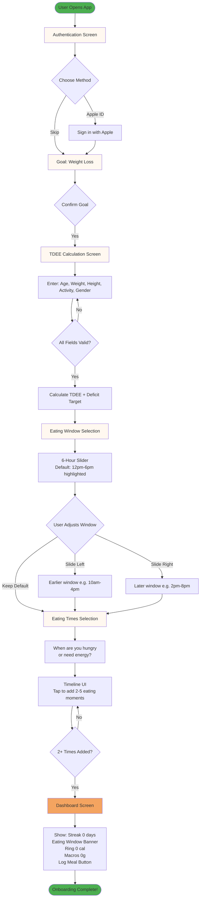
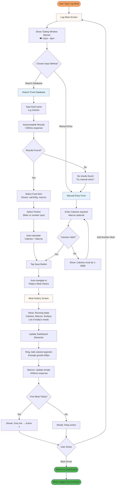

# UX Design Specification - w-diet

**Author:** Kevin
**Date:** 2025-12-31

---

## Executive Summary

### Project Vision

w-diet is an iOS-native nutrition app that automates metabolic cycling through the research-backed MATADOR method while providing empowering coaching via a friendly lion character. The product solves a critical gap: existing diet apps either oversimplify (becoming passive trackers) or overcomplicate (overwhelming users with decisions). w-diet's core promise is **"Just follow the app and not think further"** - handling complexity through automation while satisfying intellectual curiosity through transparent education.

**The Breakthrough Moment:** Week 3, when the app automatically switches to maintenance calories and users tap "Why am I eating more now?" They read about metabolic adaptation from the MATADOR study and realize: *"The app is smarter than me about this. I can just trust it and follow."*

**Design Philosophy:** Extreme simplicity meets Hooked model integration. Every interaction designed for <2 minute sessions, following the cycle: Trigger (meal times) → Action (log meal <30 sec) → Variable Reward (macro smileys, roar celebrations) → Investment (streaks, education consumed).

### Target Users

**Primary (80%): German Students**
- Intellectually curious, want to understand the science behind recommendations
- Limited budget, frustrated by ad-heavy competitors (Yazio ads after every meal log)
- Tech-savvy, expect Duolingo-level polish and Simple-style clarity
- Usage pattern: 2-3 quick check-ins/day (<2 min each) between classes

**Secondary (20%): Young Professionals**
- Time-poor, decision-fatigued, seeking zero-friction nutrition guidance
- Willing to pay for Premium features (Phase 2+: AI scanning, meal recommendations)
- Campus professionals, consultants, corporate workers with irregular schedules
- Mental state: Rushed, seeking quick validation not deep engagement

**Shared Characteristics:**
- Want education but don't want to manage complexity
- Value transparency and research-backed methodology
- Prefer coach over judge (forgiving design, supportive nudges)
- Frustrated by current solutions (MyFitnessPal manual database hell, Noom shame-based UX)

### Key Design Challenges

**1. Week 1 Confusion Bounce Prevention**
- **Problem:** 80% diet app dropout happens in Week 1. Users expect immediate deficit, see "2300 kcal maintenance" and think app calculated wrong, abandon on Day 2.
- **UX Solution:** Micro-intervention tooltip in onboarding BEFORE dashboard reveal: "🦁 Week 1 starts gentle. Why? [Tap to learn]" prevents confusion bounce.
- **Validation Target:** >80% of users who reach Day 14 continue through maintenance phase switch.

**2. Manual Logging Friction (POC Without AI Scanning)**
- **Problem:** Manual meal entry slower than competitors' databases, risk of abandonment due to logging tedium.
- **UX Solution:** Quick meal shortcuts (Brunch/Snack/Dinner buttons), optional macros (calories only required minimum), <30 second logging target.
- **Phase 2 Unlock:** Photo/Menu scanning reduces friction, but POC validates fundamentals first.

**3. Trust Building for Automated Phase Switching**
- **Problem:** Users need to trust app-controlled cycling (80% must continue past Day 14 for MATADOR validation).
- **UX Solution:** Cycle timer as hero dashboard element (Simple-style card with prominent countdown), "Why Like This?" education accessible via info icons, just-in-time phase switch explanations.
- **Design Pattern:** Transparency breeds trust - show "Day X of 14" always visible, never hide what phase they're in.

**4. Hooked Model Integration (Habit Formation)**
- **Trigger:** Internal (hunger cues at meal times) + External (streak counter visual reminder)
- **Action:** Log meal (must be <30 seconds to reduce friction)
- **Variable Reward:** Macro smileys change (70% threshold = 😊 green dopamine hit), roar celebrations (haptic + sound), unpredictable which macro hits green first
- **Investment:** Streak increases, education content consumed, profile customization = commitment escalation

### Design Opportunities

**1. Simple-Inspired Dashboard Architecture**
- **Card-based layout:** Clean separation (Cycle Timer card, Calorie Progress card, Macro Tracker card)
- **White space hierarchy:** Generous breathing room between cards, clear visual priority
- **Metrics clarity:** Big numbers, color-coded progress (green/yellow/red), no information overload
- **Single-scroll homepage:** All critical info visible without navigation, Simple's "glanceable dashboard" philosophy

**2. Duolingo-Style Engagement Patterns**
- **Bottom navigation:** Home (dashboard), Log Meal (primary action), Weight, Education
- **Lion character variations:** Contextual appearances (🦁🤓 glasses during education, 🦁💪 strong for milestones, 🦁😌 gentle Week 1 support)
- **Streak counter:** Prominent placement (Duolingo's daily engagement driver), celebrates consistency over perfection
- **Roar celebrations:** Haptic + sound variable rewards (single roar = weight log, double roar = 7-day average trending down, triple roar = first cycle complete)

**3. Progressive Disclosure for Complexity Management**
- **Hidden until relevant:** Macro smileys don't appear until first meal logged (prevent overwhelming blank dashboard)
- **Just-in-time education:** Phase switch explanations appear when user experiences it, not during onboarding
- **Info icons accessibility:** "Why Like This?" always available via ℹ️ icons, but never forced
- **Forgiving thresholds:** 70-100% = 😊 green (not 100% perfectionism), compassion built into core design

**4. Offline-First Performance as UX Advantage**
- **<50ms dashboard loads:** Native Swift advantage, zero loading spinners on critical paths
- **Instant feedback:** SQLite saves immediately, real-time macro smiley updates
- **Works without internet:** Students with unreliable campus WiFi never see "network error" on core features
- **Trust through reliability:** Zero tolerance for data loss, offline-first = bulletproof UX

## Core User Experience

### Defining Experience

The core experience of w-diet centers on **trusting automated guidance through the first phase switch**. While users interact with meal logging most frequently (2-3 times/day), the defining moment is Day 14 when the app automatically increases calories from 1900→2300 and users must trust the system enough to continue. This is where "guidance + explanation" either succeeds or fails.

**Primary User Action:** Manual meal logging
- **Frequency:** 2-3x daily (brunch, snack/pre-workout, dinner)
- **Interaction:** Tap Brunch/Snack/Dinner shortcut → Enter calories (macros optional) → Save → Instant macro smiley feedback
- **Performance target:** <30 seconds from open to save for experienced users, <60 seconds for new users (measured from tap to submit)
- **Success criteria:** Zero loading spinners, 60fps smooth interactions

**Critical Trust-Building Action:** Continuing through Day 14 phase switch
- **Context:** User wakes up Day 14, sees "Maintenance Phase - 2300 kcal" (vs yesterday's 1900 kcal)
- **Risk:** Thinks app is broken, abandons
- **Primary solution:** Cycle timer always visible ("Day 14 of 14 - Switching to Maintenance"), just-in-time education tooltip, "Why Like This?" accessible
- **Secondary safety net:** Day 2 check-in notification: "🦁 Still with me? Your gentle start is working as designed. [See the science]" - preemptive reassurance BEFORE confusion sets in
- **Validation:** >80% of users who reach Day 14 continue through phase switch

**Core Loop (Hooked Model):**
1. **Trigger:** Internal (hunger at meal times) + External (streak counter reminder)
2. **Action:** Log meal (<30 seconds, minimal friction)
3. **Variable Reward:** Macro smileys update (variable rewards emerge from user logging patterns - protein might hit green at breakfast, carbs at dinner, users discover optimal meal compositions organically), roar celebrations (single/double/triple haptic+sound)
4. **Investment:** Streak increases, education content consumed, cycle progress advances

### Platform Strategy

**Primary Platform: iOS Native (Swift + SwiftUI)**
- iPhone only in POC (iOS 16+, no iPad optimization)
- Native performance required: <100ms P95 dashboard load latency (optimized for iPhone 11+ models), 60fps rendering, instant SQLite saves
- Offline-first architecture: 100% core features work without internet
- Device capabilities: Haptic engine (roar feedback), audio playback (roar sounds), no camera in POC

**Performance Validation Methodology:**
- **Dashboard load:** Xcode Instruments Time Profiler (<100ms P95 target, accounts for older iPhone models)
- **Meal logging flow:** Manual QA with 5 test users (<30 sec experienced, <60 sec new user targets)
- **Offline reliability:** Airplane mode testing (zero data loss tolerance)

**Future Platforms:**
- Phase 2: Android (Kotlin + Jetpack Compose, native development)
- Phase 3: Web app (responsive dashboard for desktop access)

**Interaction Model:**
- Touch-based mobile interactions (tap, scroll, swipe)
- Bottom navigation (Duolingo pattern): Home, Log Meal, Weight, Education
- Card-based scrolling (Simple pattern): Vertical stack with generous white space
- Progressive disclosure: Complexity hidden until relevant (macro smileys appear after first meal logged)

**Offline Requirements:**
- Critical for target users (students with unreliable campus WiFi)
- All core features functional: Dashboard, meal logging, weight tracking, MATADOR cycling, education
- Background sync transparent (queue operations when offline, sync when online, no user-facing errors)
- Zero tolerance for "network error" on critical paths

### Effortless Interactions

**What Feels Completely Natural:**
- **Seeing cycle progress:** Cycle timer always visible (Day X of 14 - Diet/Maintenance Phase), no hunting
- **Understanding daily status:** Macro smileys (😊 70-100% green, 😐 50-69% yellow, ☹️ <50% red) give instant emotional feedback
- **Logging meals:** Brunch/Snack/Dinner shortcuts eliminate typing meal names
- **Macro input structure:** Calories required (single input), macros optional but incentivized (greyed-out macro smileys show "+ Add macros for insights" nudge if skipped)
- **Editing mistakes:** Tap meal history to edit past entries (swipe-to-edit gestures deferred to Phase 2)

**Haptic Feedback Design:**
- Respects system settings (silent mode = visual-only celebrations)
- Single haptic tap = macro threshold hit (70% green achieved)
- Double haptic tap = daily calorie goal complete
- Triple haptic tap = cycle milestone (Day 28 first cycle complete)

**Education Tooltip Delivery:**
- Triggered by lifecycle events: Day 1 onboarding, Day 15 phase switch, first macro hit
- Shown once per user, dismissed state stored in UserDefaults
- Always accessible via ℹ️ info icons (never hidden, just not forced repeatedly)

**Friction Eliminated vs Competitors:**
- **No manual phase planning:** MyFitnessPal requires users to manually change calorie targets when cycling, w-diet automates
- **No ad interruptions:** Yazio shows ads after every meal log, w-diet is ad-free free tier
- **No database searching in POC:** Accept manual entry slowness (Phase 2 adds AI scanning to fix)
- **No shame-based check-ins:** Noom's daily psychology prompts feel judgmental, w-diet uses supportive lion coaching

**Automatic Without User Intervention:**
- MATADOR phase switches (every 14 days at midnight)
- Calorie target adjustments (30% variance: 1900 diet ↔ 2300 maintenance)
- Cycle timer countdown (decrements daily)
- Background Supabase sync (unsynced records queue, sync on reconnect)
- 7-day weight average calculations (local SQLite logic)

**Creates Delight Through Effortlessness:**
- Phase switches happen automatically - users wake up Day 14, see "Maintenance Phase" and higher calories, app just handles it
- Education appears just-in-time - tooltip during phase switch: "Why am I eating more now?" → tap → learn about metabolic adaptation
- Progress feedback is instant - log meal → macro smileys update immediately, no loading spinners, 60fps smooth animations

### Critical Success Moments

**Breakthrough Moment (Defines Product Value):**
Week 3, Day 21 - First maintenance phase completion
- **User insight:** "The app is smarter than me about this. I can just trust it and follow."
- **Measurable success:** >80% of Day 21+ users have tapped "Why Like This?" education at least once AND 7-day retention rate >60%
- **UX delivery:** Data comparison modal: "Your metabolism vs traditional dieting: You maintained energy, they hit plateau"

**First-Time User Success:**
Onboarding Step 5: Dashboard reveal with micro-intervention tooltip: "🦁 Week 1 starts gentle. Why? [Tap to learn]"
- If they understand Week 1 maintenance strategy BEFORE seeing 2300 kcal, confusion bounce prevented
- Validation: A/B test in Week 9 TestFlight (10 users with tooltip, 10 without), measure Day 2 return rate

**Week 6 Reflection (Day 42):** First complete MATADOR cycle
- **User insight:** "I've done something different than every diet I've tried before"
- **UX delivery:** "🦁 You've completed your first MATADOR cycle! Here's your progress..." with before/after metabolic data comparison
- **Measurable success:** >50% of Day 42+ users engage with cycle reflection modal

**User Feels Successful/Accomplished:**
- **First green macro smiley** (😊 at 70% protein threshold) - forgiving design makes success achievable
- **Streak counter increases** (Duolingo pattern) - celebrates consistency over perfection
- **Roar celebrations** (variable rewards):
  - Single roar: Weight log entered
  - Double roar: 7-day average trending toward goal (dopamine hit)
  - Triple roar: First cycle complete (Day 28 investment payoff)

**Make-or-Break User Flows:**
1. **Onboarding → Dashboard reveal:** Week 1 tooltip must prevent confusion bounce (>80% Day 2 return target)
2. **First meal log:** Must complete in <30 seconds experienced / <60 seconds new users or users perceive friction
3. **Day 14 phase switch:** Must trust automation and continue to maintenance (>80% continuation = validation)
4. **Day 2 check-in:** Secondary safety net prevents early abandonment before confusion sets in
5. **First cycle completion:** Day 28 triple roar celebration = commitment reinforcement

**Interactions That Ruin Experience if Failed:**
- **Day 14 confusion:** No tooltip → users think 2300 kcal = broken app → 80% abandon
- **Meal logging >2 minutes:** Exceeds friction threshold → users abandon for faster competitors
- **Data loss:** Lose weight logs or streak progress → zero tolerance failure, trust destroyed
- **Dashboard loads >200ms:** Native Swift advantage wasted, feels sluggish vs web apps

### Experience Principles

**1. Trust Through Transparency**

Surface the "why" behind every automated decision - users trust what they understand.

**Implementation:**
- Cycle timer countdown always visible on dashboard (Day X of 14 - Diet/Maintenance Phase)
- ℹ️ info icons on every calculated value (TDEE, macro targets, phase dates)
- MATADOR study citations accessible via "Learn More" links in education modals
- Cycle timer runs on calendar days, not logged days (prevents gaming, maintains research integrity)
- Just-in-time education appears when users experience changes (Day 15 phase switch, not Day 1 info dump)

**Why it matters:** Students and professionals want to understand the science. Transparency builds intellectual trust that survives the Day 14 "eating more" moment.

---

**2. Automation Over Decisions**

Remove cognitive load through intelligent defaults - users execute, app orchestrates.

**POC (Phase 1) Automation:**
- Auto-calculate TDEE from user inputs (weight, age, gender, activity level - no manual calorie setting)
- Auto-switch phases on 14-day calendar cycle (midnight transitions, no manual toggling)
- Auto-calculate macro targets based on current phase (diet vs maintenance macros)
- Automatic weekly weight averaging (users see trend line, not daily noise)

**Phase 2+ Vision (Explicitly Deferred):**
- Auto-detect meal times from logging patterns (don't ask users to set meal windows)
- Pre-populate "typical breakfast" shortcuts after Week 2 pattern recognition
- Photo/menu scanning eliminates manual entry entirely

**Why it matters:** Decision fatigue kills diet adherence. MyFitnessPal requires manual target changes, Noom requires daily check-ins. w-diet removes decisions entirely.

---

**3. Instant Feedback, Zero Friction**

Every user action receives immediate response - no loading states on critical paths.

**Implementation:**
- <30 second meal logging for experienced users, <60 seconds for new users (Brunch/Snack/Dinner shortcuts, calories-only minimum)
- Real-time macro smiley updates (log meal → 😊 appears instantly via SQLite save, no API latency)
- <100ms P95 dashboard load latency (native Swift + offline-first SQLite)
- 60fps smooth scrolling and animations (SwiftUI GPU acceleration)
- Offline-first = no "network error" interruptions on core features

**Why it matters:** Students on unreliable campus WiFi notice lag. Instant feedback creates trust in reliability. Competitors (Yazio, MyFitnessPal) have cloud-dependent lag.

---

**4. Forgiving by Design**

Compassion built into core architecture - coach not judge.

**Implementation:**
- 70-100% macro threshold = 😊 green (not 100% perfectionism that triggers shame spirals)
- Streak celebrates consistency (daily logging) not perfection (hitting exact macro targets)
- Week 1 maintenance strategy (build habit before introducing deficit stress)
- Supportive nudges, never punishment (gentle reminders, not "you failed" messaging)
- Grace period for eating window violations (2-hour buffer before nudge, never break streak)

**Why it matters:** 80% of diet apps lose users to Week 1 shame spirals. MyFitnessPal's red daily summaries trigger abandonment. Forgiving thresholds = differentiated market positioning.

---

**5. Variable Rewards Drive Engagement**

Unpredictability creates dopamine anticipation - Hooked model implementation.

**Implementation:**
- Macro smileys unpredictable (variable rewards emerge from user logging patterns - protein might hit green at breakfast one day, carbs at dinner another day, users discover optimal meal compositions organically)
- Roar celebrations variable based on achievement level (single/double/triple haptic+sound)
- Streak counter visibility (Duolingo engagement driver, always present but not nagging)
- Progressive disclosure (complexity hidden until relevant = pleasant surprises, not overwhelming Day 1)

**Phase 2+ Vision (Social Investment):**
- Share streak milestones (opt-in social proof)
- Anonymous cohort comparisons ("You're in top 20% of Week 3 users for consistency")

**Why it matters:** Variable rewards create habit loops. Predictable rewards (same celebration every time) lose effectiveness. Emergent variability from user behavior = sustainable engagement.

---

**6. Critical Moments Optimized**

Focus ruthlessly on make-or-break interactions - everything else supports these.

**Implementation:**
- **Onboarding tooltip (Day 1):** Prevents Day 2 confusion bounce by explaining Week 1 maintenance BEFORE dashboard reveal
- **Day 2 check-in (secondary safety net):** Proactive reassurance: "🦁 Still with me? Your gentle start is working." Prevents early abandonment.
- **Day 14 phase switch trust-building:** Cycle timer + just-in-time education makes "eating more" feel intentional, not broken
- **First green smiley achievement:** 70% threshold makes success feel attainable (not impossible perfectionism)
- **Day 28 cycle completion celebration:** Triple roar + data reflection = investment payoff, commitment to Cycle 2

**Why it matters:** Day 14 is the make-or-break validation. If users don't continue past phase switch, MATADOR thesis fails. Every other feature supports this single critical moment.

### POC vs Full Vision Scope

**POC Validation Goal:** Prove users trust automated MATADOR cycling and continue past Day 14 phase switch (>80% continuation rate).

**POC Must-Have Features (Week 1-10 Implementation):**
- ✅ Dashboard with 3 cards (Cycle Timer card, Calorie Progress card, Macro Tracker card - Simple-style design)
- ✅ Manual meal logging (calories required, macros optional with incentive nudge)
- ✅ Macro smileys with forgiving 70% thresholds (😊 green, 😐 yellow, ☹️ red)
- ✅ Streak counter (Duolingo pattern, daily logging consistency)
- ✅ 14-day automated phase switching (calendar-based, midnight transitions)
- ✅ Education modals (Day 1 onboarding tooltip, Day 15 "Why more calories?" explanation)
- ✅ Weight logging with 7-day rolling average trend indicator
- ✅ Offline-first SQLite architecture (100% core features work without internet)
- ✅ Roar celebrations (haptic + sound feedback for milestones)
- ✅ Lion character variations (4 states: default, glasses, strong, gentle - static images only)

**Phase 2+ Features (Explicitly Deferred):**
- ❌ Photo food scanning (AI-powered plate recognition for instant meal logging)
- ❌ Menu scanning (Camera OCR + AI analysis + Nutri-Score ratings for restaurant ordering)
- ❌ Auto-detect meal times from logging patterns (ML-based time prediction)
- ❌ Swipe-to-edit gestures (POC uses tap meal history → edit modal instead)
- ❌ Social proof / community features (streak sharing, anonymous cohort comparisons)
- ❌ Advanced education delivery (smart just-in-time logic beyond POC's lifecycle triggers)
- ❌ Pre-populated meal shortcuts based on pattern recognition
- ❌ Mental Focus Mode (cognitive performance meal recommendations)

**Scope Discipline Rationale:**
POC focuses ruthlessly on validating the Day 14 phase switch trust moment. AI scanning and social features are powerful but not trust-critical. Manual logging friction is acceptable for POC validation - Phase 2 fixes it with scanning. Everything deferred accelerates development without compromising core hypothesis testing.

## Desired Emotional Response

### Primary Emotional Goals

w-diet's emotional design follows a deliberate progression that transforms first-time skepticism into sustained trust:

**Curiosity → Hope → Confidence → Safe**

This journey mirrors the user's relationship with automated guidance. Users begin intellectually curious about MATADOR cycling ("Wait, I eat MORE after 2 weeks?"), develop hope during the gentle Week 1 start, build confidence through the Day 14 phase switch breakthrough, and ultimately feel safe surrendering to the system's intelligence.

**"Safe" encompasses two critical dimensions:**
1. **Protected/Secure** - "The app has my back" (lion coaching, forgiving design, supportive nudges)
2. **Predictable/Stable** - "I know what to expect" (14-day cycles, transparent automation, consistent patterns)

This dual safety enables the core promise: **"Just follow the app and not think further."**

### Emotional Journey Mapping

**Stage 1: Curiosity (Discovery/Onboarding - Day 1-2)**
- First opening app, encountering lion character
- Reading about MATADOR cycling methodology
- Moment: "Wait, I eat MORE after 2 weeks? How does that work?"
- Emotion: Intrigued, intellectually engaged, willing to try

**Stage 2: Hope (Early Engagement - Week 1)**
- Day 2 check-in notification: "Still with me? Your gentle start is working as designed"
- First green macro smiley appears
- Seeing cycle timer countdown: "This has a plan"
- Emotion: Encouraged, optimistic, early trust forming

**Stage 3: Confidence (Breakthrough - Week 3, Day 14-21)**
- Day 14 phase switch happens automatically (1900→2300 calories)
- They tap "Why am I eating more now?" and read MATADOR education
- Week 3 realization: "The app is smarter than me about this. I can just trust it and follow."
- Emotion: Empowered, intellectually satisfied, trust solidifying

**Stage 4: Safe (Sustained Engagement - Week 6+)**
- First complete cycle (Day 28 triple roar celebration)
- Establishing deep trust in automated system
- Moment: "I don't have to think about this anymore - the app knows what to do"
- Emotion: Secure, relieved of decision burden, protected by intelligent system

### Micro-Emotions

Critical emotional states throughout the experience:

**Confidence vs. Confusion**
- Day 1 onboarding tooltip prevents early confusion bounce
- Clear macro tracker with instant smileys prevents "Am I doing this right?" anxiety
- Transparent ℹ️ info icons build confidence through understanding
- Design priority: Eliminate confusion, maximize clarity

**Trust vs. Skepticism**
- Day 14 phase switch is the make-or-break trust moment
- MATADOR study citations combat initial skepticism
- Cycle timer transparency builds trust through predictability
- Design priority: Earn trust through transparency, not blind faith

**Accomplishment vs. Frustration**
- Green macro smileys provide instant accomplishment feedback
- 70% threshold prevents perfectionist frustration
- Streak celebrates daily logging consistency (not perfection)
- Design priority: Celebrate progress, forgive imperfection

**Delight vs. Satisfaction**
- Variable rewards (macro smileys appear unpredictably based on user behavior) create moments of delight
- Triple roar at Day 28 delivers surprise celebration
- Progressive disclosure (complexity revealed when relevant) creates pleasant discoveries
- Unexpected educational insights (discovering WHY they eat more on Day 14) turn learning into delight
- Design priority: Balance expected satisfaction with unexpected delight

**Calm vs. Anxiety**
- "Just follow the app" messaging enables calm surrender to automation
- Week 1 maintenance phase provides gentle start (reduces deficit anxiety)
- Forgiving design (70% thresholds, supportive language) reduces daily performance anxiety
- Design priority: Create calm confidence, eliminate diet-related stress

**Reward/Pleasure (Daily Micro-Wins)**
- Green macro smileys appearing (variable reward timing)
- Streak counter incrementing each day (predictable win)
- Haptic feedback on meal save (tactile pleasure)
- Progress bars filling throughout day (visual satisfaction)
- Lion roars (single/double/triple celebration escalation)
- Design priority: Deliver daily dopamine hits that drive habit formation (Hooked model Variable Reward step)

### Design Implications

**Curiosity → Transparent Education:**
- ℹ️ info icons on every calculated value (TDEE, macro targets, phase calories)
- "Why am I eating more now?" tappable education moments
- MATADOR study citations satisfy intellectual curiosity
- No black box automation - always explain the "why"

**Hope → Early Encouragement:**
- Day 2 check-in notification: "Still with me? Your gentle start is working as designed"
- Cycle timer prominently displayed: "There's a plan, you're on track"
- Week 1 maintenance phase (1900 cal) - gentle, achievable start
- Supportive lion messaging creates optimism

**Confidence → Automated Intelligence:**
- Automatic phase switches (no decisions required from user)
- Clear macro feedback with instant smileys (immediate validation)
- Predictable 14-day cycles (stability breeds confidence)
- System demonstrates competence through reliable automation

**Safe → Forgiving & Reliable:**
- 70% macro thresholds (not 100% perfectionism)
- Offline-first architecture (app always works, never fails)
- Consistent lion coaching tone (coach not judge)
- Predictable cycle timer countdown (no surprises)
- Forgiving language ("You're doing great at 75%!" not "You missed 25%")
- **Technical requirements:** <100ms P95 dashboard load, offline-first SQLite, 60fps UI performance

**Reward/Pleasure → Daily Micro-Wins:**
- Variable macro smileys (unpredictable appearances create variable rewards)
- Streak increments (daily win, consistent reinforcement)
- Haptic feedback on every meal save (tactile pleasure)
- Lion roars with escalating intensity (single/double/triple)
- Progress bars with smooth animations (visual satisfaction)
- Note: After POC testing, may add daily check-ins, streak milestones (7/14/28 days), or mini-celebrations for hitting all 3 macros

### Re-Engagement Notification Strategy (POC A/B Test)

**The Challenge:** Balance effective re-engagement (proven through Duolingo's guilt-based tactics) with emotional consistency (supportive lion coach).

**Hypothesis:** Supportive notifications (Group A) will outperform gentle guilt (Group B) for German students because the core emotional journey already builds deep trust through transparency and protection. By Week 1, users don't need guilt - they need reinforcement of the supportive relationship they're building with the lion. Users who experience consistent supportive coaching will develop stronger brand advocacy and long-term retention than those re-engaged through guilt.

**Decision Approach:** Optimize for measured outcomes (Day 7 retention), not emotional ideology. If data shows gentle guilt drives higher Week 1 retention (our #1 risk), we ship gentle guilt - while ensuring it stays in the lion's supportive character to minimize brand damage.

**POC Beta A/B Test (20-25 students):**

**Group A - Supportive Notifications (10-13 users):**
- "Your streak is waiting for you 🦁"
- "Day 3 is calling - keep that momentum!"
- "I've got your macro goals ready when you are 💪"
- Stays in supportive coach character 100%

**Group B - Gentle Guilt Notifications (10-12 users):**
- "Your lion checked... no meals logged today 😔"
- "I'm still here, waiting to help you track today 🦁💭"
- "Day 3 is slipping by - your streak needs you!"
- Uses FOMO/mild disappointment while staying in lion character (disappointed FOR you, not IN you)
- **Critical constraint:** Must maintain lion's supportive personality (no passive-aggressive Duolingo tactics)

**Success Metrics:**

**Primary Metric: Day 7 Retention**
- Target: >40% Week 1 retention (PRD success criteria)
- Why: App opens don't matter if users don't stay engaged
- Measure by group to determine which notification strategy supports sustained engagement

**Secondary Metric: Full Behavioral Chain Completion**
- Notification → App Open → Meal Log Completion Rate
- Segment by time since last activity (1 day vs 3 days vs 7 days inactive)
- Measures whether notifications drive meaningful action, not just vanity opens

**Brand Damage Threshold:**
- Supportive perception must stay >60% even if using gentle guilt
- If Group B wins on retention but scores <60% on "Did notifications feel supportive?" → don't ship it
- Must win on retention WITHOUT destroying supportive brand identity

**Qualitative Checks (Post-Beta Interviews):**
- "Did the notifications feel supportive or annoying?"
- "Would you recommend w-diet to a friend based on your experience?"
  - Catches if gentle guilt damages brand advocacy even if it drives short-term opens
  - Word-of-mouth is critical for student beta expansion

**Decision Framework:** 
1. If Group A wins on Day 7 retention → ship supportive
2. If Group B wins on Day 7 retention AND maintains >60% supportive perception → ship gentle guilt
3. If Group B wins on retention but fails brand damage threshold → ship supportive (prioritize long-term brand over short-term optimization)

**Implementation Note:** Build notification system with full configurability to enable:
- A/B testing in POC
- Strategy switching post-launch if retention changes
- Potential per-user personalization (some users get supportive, some get guilt based on engagement patterns)
- Data-responsive system, not ideologically locked

### Emotional Design Principles

**1. Earn Trust Through Transparency, Not Blind Faith**

Users must understand WHY the app makes decisions to trust the automation. Every calculated value, phase switch, and macro target includes accessible explanations via ℹ️ info icons. MATADOR study citations provide scientific credibility. The cycle timer runs on calendar days (not logged days) to prevent gaming and maintain integrity.

**2. Automate Complexity, Surface Simplicity**

Handle metabolic cycling calculations, phase switches, and macro adjustments automatically while presenting users with clean, minimal interfaces. The dashboard shows 3 cards (Cycle Timer, Calorie Progress, Macro Tracker) - not overwhelming spreadsheets. Complexity exists in the backend; simplicity defines the frontend.

**3. Celebrate Progress, Forgive Imperfection**

70% macro threshold = 😊 green success (not 100% perfectionism). Streak tracks daily logging consistency, not perfect adherence. Lion messaging uses "You're doing great at 75%!" not "You failed to hit 100%." Coach, don't judge. Support, don't shame.

**4. Deliver Daily Dopamine Through Variable Rewards**

Macro smileys appear unpredictably based on user behavior (Hooked model Variable Reward). Progress bars provide predictable satisfaction. Haptic feedback delivers tactile pleasure. Lion roars escalate (single/double/triple) for variable celebration intensity. Balance expected rewards (streak) with unexpected delights (progressive disclosure, educational insights).

**5. Build Safety Through Predictability + Protection**

14-day cycles are predictable and consistent (users know what to expect). Lion coaching is protective and supportive (users feel backed by intelligent guide). Offline-first architecture is reliable (app never fails). Forgiving thresholds are protective (users can't "fail"). Predictable stability + protective guidance = deep safety.

**Technical requirements for safety:** <100ms P95 dashboard load, offline-first SQLite architecture, 60fps UI performance, consistent 14-day cycle automation. Emotional design writes checks that architecture must cash.

**6. Optimize for Measured Outcomes, Not Emotional Ideology**

When emotional design philosophy conflicts with data, trust the data. If gentle guilt drives higher Week 1 retention (our #1 risk), we ship gentle guilt - while keeping it in the lion's supportive character to minimize brand damage. Emotional design serves user retention and engagement, not vice versa.

Test assumptions rigorously through A/B testing. Ship what works based on measured outcomes (retention, engagement, brand perception), not what feels ideologically pure. Be willing to adjust emotional design strategy when data proves a better approach exists.

**Brand constraint:** Even when optimizing for effectiveness, maintain the lion's core supportive personality. No passive-aggressive tactics, no mean-spirited guilt. Disappointed FOR users, never IN them.

**7. Distinguish Productive Tension From Harmful Anxiety**

Not all tension is negative - strategic use of anticipation and gentle urgency drives habit formation while harmful anxiety destroys engagement.

**Productive Tension to CREATE:**
- Anticipation of phase switches (curiosity driver: "Day 14 is coming, I'll eat more soon")
- Gentle urgency to maintain streaks (habit formation: "I haven't logged today, let me keep my streak alive")
- Desire to see macro smileys appear (engagement loop: "I'm at 65% protein, just need a bit more for green smiley")
- Cycle timer countdown creating positive expectation

**Harmful Anxiety to AVOID:**
- Confusion about how the system works (eliminated through tooltips, ℹ️ icons, transparent education)
- Fear of failure or judgment (eliminated through 70% thresholds, forgiving language, supportive coach tone)
- Overwhelm from too many decisions (eliminated through automation, progressive disclosure)
- Shame from missing targets (eliminated through no red X's, no "failed" language, celebration of progress)
- Perfectionist stress (eliminated through forgiving thresholds, consistency over perfection messaging)

Use productive tension strategically to drive behavior change while ruthlessly eliminating harmful anxiety that destroys trust and engagement.


## UX Pattern Analysis & Inspiration

### Inspiring Products Analysis

**Duolingo - Proven Engagement & Gamification**

Duolingo demonstrates mastery of habit-forming UX through minimalist icon-driven design and character-based coaching. Key strengths:

**Navigation Excellence:**
- Icon-only bottom navigation (4 tabs maximum)
- Active tab shows icon + text label, inactive tabs icon-only
- Zero learning curve - tap to switch, no complex gestures
- Thumb-optimized placement for one-handed mobile use

**Character-Driven Connection:**
- Duo owl with multiple expressions conveys emotion visually
- Appears in coaching moments with ONE sentence maximum
- Builds parasocial relationship through consistent personality
- Character variation communicates tone without lengthy text

**Gamification That Works:**
- Streak system prominently displayed (daily engagement metric)
- Variable rewards create unpredictable delight (lesson completion celebrations)
- Progress visualized through icons and bars, not explained through text
- Celebration moments use haptics and sound for tactile pleasure

**Minimalism Philosophy:**
- Icons communicate category/action faster than words
- Lessons use images + minimal text for accessibility across languages
- Green checkmarks, flame streaks = universal symbols requiring no explanation
- One screen = one focus (no multi-tasking cognitive load)

**Simple - Clean Financial Dashboard Design**

Simple (budgeting app) excels at presenting complex financial data through elegant minimalist interfaces. Key strengths:

**Card-Based Dashboard:**
- ONE metric per card (no cluttered multi-stat displays)
- Vertical scroll with generous white space between cards
- Large numbers prominently displayed, small labels secondary
- Tap card → details modal (progressive disclosure pattern)

**Visual Hierarchy Mastery:**
- Most important information = biggest and boldest typography
- Supporting context = small and muted gray text
- Interactive elements obvious through sizing and spacing (44pt+ tap targets)
- Consistent spacing rhythm creates visual calm

**Smart Reachability:**
- Critical actions within thumb zone on mobile
- Minimal navigation depth (2 levels max)
- Back navigation always predictable (top-left iOS standard)
- No hidden features behind hamburger menus

**Data Presentation:**
- Numbers speak louder than labels or explanations
- Color used sparingly for emphasis (green = positive, not decorative)
- Icons communicate category at a glance (🏠 home, 🍽️ dining, etc.)
- White space creates breathing room and reduces overwhelm

### Transferable UX Patterns

**Navigation Patterns:**

**Icon-Only Bottom Navigation (Duolingo → w-diet)**
- Apply: 4-tab bottom nav with icons only when inactive
- 🏠 Home (Dashboard)
- ➕ Log Meal (most frequent action)
- ⚖️ Weight (weekly tracking)
- 📚 Education (learn about MATADOR)
- Active tab reveals text label, inactive stays icon-only
- Rationale: Proven pattern, maximizes screen real estate, thumb-optimized

**Interaction Patterns:**

**Character-Based Coaching (Duolingo → w-diet Lion)**
- Apply: Lion with 4 variations (default, glasses, strong, gentle) appears in key moments
- ONE sentence coaching messages maximum
- Character conveys emotion through visual variation, not lengthy text
- Builds parasocial relationship through consistency and personality
- Rationale: Aligns with "supportive coach" emotional goal, reduces text clutter

**Card-Based Progressive Disclosure (Simple → w-diet Dashboard)**
- Apply: 3 dashboard cards (Cycle Timer, Calorie Progress, Macro Tracker)
- ONE primary metric per card with large typography
- Tap card → details modal with ℹ️ education content
- Generous white space between cards for visual breathing room
- Rationale: Supports "automate complexity, surface simplicity" principle

**Gamification Elements (Duolingo → w-diet Engagement)**
- Apply: Streak counter prominently displayed on dashboard
- Variable macro smileys (😊/😐/😞) appear based on daily performance
- Celebration roars (single/double/triple haptics) for milestones
- Progress bars with smooth animations for visual satisfaction
- Rationale: Delivers daily dopamine through variable rewards (Hooked model)

**Haptic Feedback Pattern (Duolingo → w-diet Micro-Rewards)**
- Apply: Haptic feedback on every meal save (tactile pleasure)
- Single tap roar (daily logging), double roar (all macros green), triple roar (Day 28 cycle complete)
- Escalating haptic intensity creates variable reward sensation
- Rationale: Delivers instant physical reward, supports "daily dopamine" principle without visual clutter
- Implementation: iOS UIImpactFeedbackGenerator with light/medium/heavy intensity levels

**Undo Pattern (Apple iOS → w-diet Meal Logging)**
- Apply: Save meal instantly (no confirmation modal), provide undo via meal history
- Tap meal in history → edit or delete modal
- Toast notification "Meal logged ✓" with history shortcut tap action
- Rationale: Zero friction on save (<30 second logging goal), easy correction if needed without multi-step confirmations

**Visual Patterns:**

**Minimalist Text Philosophy (Both → w-diet)**
- Apply: Icons communicate actions/categories faster than words
- Lion coaching messages = ONE sentence maximum
- Education tooltips = scannable bullets, never paragraphs
- Numbers prominent, labels secondary
- Rationale: Supports extreme simplicity principle, reduces cognitive load

**Smart Thumb-Zone Layout (Both → w-diet)**
- Apply: Bottom navigation = most frequent actions (Log Meal primary CTA)
- Interactive elements 44pt+ minimum tap targets
- Back button top-left (iOS standard), no custom navigation
- Critical actions within one-handed thumb reach
- Rationale: Mobile-first design, reduces friction in daily logging flow

**Performance Budget for Minimalism (Apple iOS Standards → w-diet)**
- Apply: 60fps UI animations, <100ms dashboard load, zero jank on scrolling
- Minimalist UI creates user expectation of instant responsiveness
- Simple visual design = no excuse for slow performance
- Rationale: Users expect simple = fast; performance is UX feature of minimalist design, not technical afterthought
- Architecture requirement: Pre-calculate daily totals, cache macro percentages, optimize SQLite queries for <100ms P95 dashboard rendering

### Anti-Patterns to Avoid

**From Competitor Analysis (MyFitnessPal, Lose It):**

**Text-Heavy Dashboards**
- Avoid: Long nutrition labels, paragraph explanations on main screens
- Why harmful: Creates overwhelm, conflicts with "automate complexity, surface simplicity" principle
- w-diet alternative: Large numbers + small labels + tap for ℹ️ details

**Cluttered Multi-Stat Cards**
- Avoid: Single cards showing 5+ metrics simultaneously
- Why harmful: Violates visual hierarchy, causes decision paralysis
- w-diet alternative: ONE metric per card (Cycle Timer, Calories, Macros separate)

**Aggressive Upsell Modals**
- Avoid: Interrupting core flows with premium upgrade prompts
- Why harmful: Breaks trust-building flow, feels transactional not supportive
- w-diet alternative: POC is feature-complete, no paywalls in core experience

**Confusing Navigation Patterns**
- Avoid: Tabs + hamburger menu + swipe gestures (multiple navigation paradigms)
- Why harmful: Creates decision paralysis, low discoverability for features
- w-diet alternative: Icon-only bottom nav, no hamburger menu, tap interactions only

**Perfectionist Shame-Based UI**
- Avoid: Red X warnings, "You failed to meet your goal" language, deficit-focused feedback
- Why harmful: Destroys "celebrate progress, forgive imperfection" emotional goal
- w-diet alternative: 70% threshold = green 😊, forgiving language, coach not judge

**Data Overload & Analysis Paralysis**
- Avoid: Charts upon charts, trend analysis on main screens, complex macro breakdowns
- Why harmful: Conflicts with "Just follow the app and not think further" promise
- w-diet alternative: Progressive disclosure (tap card for details), simple macro smileys

**Complex Onboarding Flows**
- Avoid: 15+ questions before seeing value, lengthy tutorials, multi-step wizards
- Why harmful: Creates early friction, conflicts with Day 2 confusion bounce prevention
- w-diet alternative: 5 questions max (Auth → Goal → Calories → Eating Window → Dashboard)

**Tiny Text on Complex Backgrounds**
- Avoid: Low contrast labels, small fonts (<14pt body text), decorative backgrounds behind text
- Why harmful: Accessibility nightmare, violates iOS Human Interface Guidelines
- w-diet alternative: High contrast (black on white), 17pt+ body text, minimal backgrounds

**Long Education Content Blocking Actions**
- Avoid: Forcing users to read paragraphs before proceeding with tasks
- Why harmful: Creates friction in habit formation (daily meal logging)
- w-diet alternative: Day 1 tooltip for orientation, ℹ️ icons for optional learning, education tab for deep dives

**Visual Noise Through Over-Labeling**
- Avoid: Text labels on every element, redundant icon + text pairs, verbose button copy
- Why harmful: Conflicts with minimalist icon-driven philosophy
- w-diet alternative: Trust icons to communicate, text labels only when active/ambiguous

**Multi-Step Confirmation Flows**
- Avoid: "Are you sure?" modals, undo confirmations, multi-tap saves
- Why harmful: Friction kills habit formation, conflicts with <30 second meal logging goal
- w-diet alternative: Single tap to save meal with instant toast confirmation, undo via meal history if needed

### Design Inspiration Strategy

**What to Adopt (Use As-Is):**

**Duolingo's Icon-Only Bottom Navigation**
- Why: Proven engagement pattern, maximizes screen real estate, thumb-optimized
- Implementation: 4 tabs (Home, Log Meal, Weight, Education), icon-only when inactive
- Success criteria: Zero user confusion during POC beta testing

**Simple's Card-Based Dashboard Layout**
- Why: Clean visual hierarchy, ONE metric per card prevents overwhelm
- Implementation: 3 cards (Cycle Timer, Calorie Progress, Macro Tracker) with generous white space
- Success criteria: Users can parse dashboard in <3 seconds (eye-tracking validation)

**Duolingo's Character-Driven Coaching**
- Why: Builds parasocial relationship, reduces text while maintaining personality
- Implementation: Lion with 4 variations, ONE sentence messages, appears in key moments
- Success criteria: Users describe lion as "supportive" (>80% in post-beta interviews)

**Duolingo's Haptic Celebration Pattern**
- Why: Delivers instant physical micro-reward without visual clutter
- Implementation: Single/double/triple roar haptics with escalating intensity (light/medium/heavy)
- Success criteria: Users report feeling "satisfied" after logging meals (tactile pleasure validation)

**Apple iOS Undo Pattern for Frictionless Logging**
- Why: Zero friction saves while allowing mistake correction
- Implementation: Instant save with toast + history shortcut, tap meal history for edit/delete
- Success criteria: <30 second experienced user meal logging achieved

**What to Adapt (Modify for w-diet):**

**Duolingo's Streak System → Daily Logging Streak**
- Adaptation: Track logging consistency (not perfection), forgive missed days with grace
- Modification: Streak celebrates daily logging, NOT macro adherence (reduces shame)
- Rationale: Aligns with "celebrate progress, forgive imperfection" principle

**Simple's Tap-for-Details Pattern → Education Tooltips**
- Adaptation: Every calculated value (TDEE, macro targets, phase calories) has ℹ️ tap-for-education
- Modification: Education content = scannable bullets with MATADOR citations, not Simple's financial explanations
- Rationale: Supports "earn trust through transparency" while maintaining minimalism

**Duolingo's Variable Rewards → Macro Smileys**
- Adaptation: Macro smileys (😊/😐/😞) appear based on user logging behavior
- Modification: 70% threshold = green (not 100% perfectionism like Duolingo lesson completion)
- Rationale: Forgiving design prevents frustration while maintaining engagement

**Performance Budget for Minimalism → Architecture Requirement**
- Adaptation: Minimalist visual design creates expectation of instant responsiveness
- Modification: 60fps animations, <100ms P95 dashboard load, zero scroll jank
- Rationale: Simple = fast in user perception; performance is UX feature, not technical afterthought
- Implementation: Pre-calculate totals, cache macro percentages, optimize SQLite queries

**What to Avoid (Conflicts with w-diet Goals):**

**Duolingo's Passive-Aggressive Notifications**
- Why avoid: Conflicts with supportive lion character (A/B test will validate if gentle guilt outperforms)
- Alternative: POC tests supportive vs gentle guilt, chooses based on Day 7 retention data
- Decision framework: Optimize for measured outcomes, maintain brand damage threshold

**Simple's Financial Complexity in Details**
- Why avoid: MATADOR education must be scannable, not dense financial-style breakdowns
- Alternative: Bullet-point education with study citations, visual cycle diagrams
- Rationale: Intellectual curiosity satisfaction through clarity, not complexity

**Competitor Text-Heavy Dashboards**
- Why avoid: Violates extreme simplicity principle, creates overwhelm
- Alternative: Large numbers + small labels + ℹ️ progressive disclosure
- Rationale: Trust icons and visual hierarchy over verbose explanations

**Competitor Perfectionist UI Patterns**
- Why avoid: Destroys "safe" emotional goal, conflicts with forgiving design principle
- Alternative: 70% thresholds, green smileys, celebration of progress
- Rationale: Coach not judge, support not shame

**Multi-Step Onboarding Wizards**
- Why avoid: Creates early friction, risks Day 2 confusion bounce
- Alternative: 5 questions max → straight to dashboard with Day 1 tooltip
- Rationale: Show value immediately, educate progressively


## Design System Foundation

### Design System Choice

**Native iOS (SwiftUI) + Custom Brand Components**

w-diet will use Apple's native SwiftUI framework as the design system foundation, supplemented with custom components only for brand-specific elements that differentiate the product.

**Core Approach:**
- **Foundation:** SwiftUI standard components (List, Card, Button, Sheet, NavigationStack)
- **Custom Layer:** Brand-specific components (lion character, macro smileys, cycle timer, roar haptics)
- **Icons:** SF Symbols (Apple's native icon system) for navigation and UI elements
- **Typography:** iOS Dynamic Type system (17pt+ body text, supports accessibility scaling)
- **Color:** iOS semantic colors with custom brand accents for lion and macro feedback

### Rationale for Selection

**Speed to POC Beta (Primary Driver):**
- SwiftUI components work out-of-the-box with zero configuration
- 10-week POC timeline requires maximum development velocity
- No learning curve for custom design system architecture
- Proven iOS patterns reduce beta testing friction (German students = iPhone users)

**Performance Requirements Alignment:**
- Native SwiftUI optimized for 60fps animations by default
- iOS List rendering optimized for <100ms P95 dashboard load
- Zero overhead from third-party design system frameworks
- Offline-first SQLite integration straightforward with native components

**Platform-Specific Benefits:**
- Instant iOS user familiarity (bottom nav, card layouts, sheet modals = standard patterns)
- Accessibility built-in (VoiceOver, Dynamic Type, high contrast modes)
- Future iOS updates automatically benefit app (new SF Symbols, SwiftUI improvements)
- Apple Human Interface Guidelines provide design decisions "for free"

**Minimalist Philosophy Match:**
- iOS design language IS minimalist (white space, large typography, clean hierarchy)
- Simple and Duolingo both leverage platform conventions heavily
- Custom components only where brand differentiation matters (lion, macro smileys)
- Reduces visual noise - users see familiar iOS patterns

**Solo Developer Pragmatism:**
- No design system maintenance burden (Apple maintains SwiftUI)
- Focus development effort on MATADOR automation logic, not UI framework
- Prototype fast, iterate based on POC beta feedback
- Custom design system can be layered in Phase 2+ if needed

### Implementation Approach

**Standard SwiftUI Components (Use As-Is):**

**Navigation:**
- `TabView` for icon-only bottom navigation (4 tabs: Home, Log Meal, Weight, Education)
- `NavigationStack` for detail screens (meal history, education content)
- `Sheet` presentation for modals (add meal, edit meal, info tooltips)

**Dashboard Cards:**
- `VStack` + `Card` modifier for 3 dashboard cards (Cycle Timer, Calorie Progress, Macro Tracker)
- `ScrollView` for vertical card layout with generous spacing
- `ProgressView` for calorie progress bar (native iOS component)

**Forms & Input:**
- `Form` for onboarding flow (Auth → Goal → Calories → Eating Window)
- `TextField` with number keyboard for calorie/macro entry
- `Button` with standard iOS button styles (primary, secondary, plain)

**Lists:**
- `List` for meal history (swipe-to-delete deferred, tap → edit modal for POC)
- `Section` for grouping meals by date
- Native iOS list performance (<100ms rendering)

**Typography & Spacing:**
- `.title`, `.headline`, `.body`, `.caption` iOS text styles
- Dynamic Type support (17pt+ body text, scales with user accessibility settings)
- Standard iOS spacing (8pt, 16pt, 24pt increments)

**Custom Brand Components (Build from Scratch):**

**Lion Character Component:**
- 4 SVG/PNG variations (default, glasses, strong, gentle)
- Appears in coaching messages with ONE sentence text
- Asset catalog for @2x/@3x retina support
- Rendered via `Image` component with custom modifiers

**Macro Smiley Component:**
- 3 states (😊 green 70-100%, 😐 yellow 50-69%, 😞 red <50%)
- Custom `View` with state-driven color + emoji
- Displayed in Macro Tracker card (protein, carbs, fat)
- Smooth color transitions via `.animation(.easeInOut)`

**Cycle Timer Card Component:**
- Custom `View` showing "Day X of 14" + countdown
- Circular progress indicator (custom `Shape` drawing)
- Tap → sheet modal with phase explanation
- Phase switch visual (deficit 🔥 vs maintenance 🌱 icon)

**Roar Haptic System:**
- `UIImpactFeedbackGenerator` wrapper
- 3 intensities (light = single roar, medium = double, heavy = triple)
- Triggered on meal save, macro milestones, Day 28 completion
- Custom timing patterns for variable reward sensation

**Toast Notification Component:**
- Custom overlay `View` for "Meal logged ✓" confirmation
- Auto-dismisses after 2 seconds
- Tap action shortcut to meal history
- Slides up from bottom with spring animation

### Customization Strategy

**Design Tokens (Minimal Custom Palette):**

**Colors:**
- Primary: iOS system blue (default) or custom lion gold (#F4A460) for brand accent
- Success: iOS system green for macro smileys (😊)
- Warning: iOS system yellow for macro smileys (😐)
- Error: iOS system red for macro smileys (😞) - used sparingly, never for shame
- Background: iOS system background (white light mode, black dark mode)
- Text: iOS label colors (high contrast, accessibility compliant)

**SF Symbols Icon Set:**
- 🏠 `house.fill` - Home tab
- ➕ `plus.circle.fill` - Log Meal tab
- ⚖️ `scalemass.fill` - Weight tab
- 📚 `book.fill` - Education tab
- ℹ️ `info.circle` - Education tooltips
- ✓ `checkmark` - Confirmation states

**Typography Scale (iOS Dynamic Type):**
- Large Title: Cycle Timer "Day 7 of 14" (34pt default)
- Title: Dashboard card headers (28pt default)
- Headline: Macro percentages (17pt bold)
- Body: Lion coaching messages (17pt regular)
- Caption: Supporting labels (12pt regular)

**Spacing System (iOS Standard):**
- 4pt: Tight spacing (icon to label)
- 8pt: Component internal padding
- 16pt: Card padding, list item spacing
- 24pt: Section spacing between dashboard cards
- 32pt: Screen edge margins

**Component Customization Principles:**

**Adopt iOS Defaults First:**
- Use standard button styles, list styles, form layouts
- Only customize when brand differentiation required
- Leverage iOS accessibility features (VoiceOver, Dynamic Type, Reduce Motion)

**Custom Only for Brand Moments:**
- Lion character (unique to w-diet)
- Macro smileys (core product differentiation)
- Cycle timer (MATADOR automation visualization)
- Roar haptics (micro-reward system)

**Performance Budget Enforcement:**
- All custom components must render <16ms (60fps target)
- Custom animations use SwiftUI `.animation()` modifier (GPU-accelerated)
- Asset optimization (compress lion PNGs, use SF Symbols where possible)
- Pre-calculate macro percentages in background thread

**Iteration Strategy:**

**POC Beta (Weeks 1-10):**
- Ship with iOS standard components + minimal custom layer
- Validate core UX patterns (icon-only nav, card dashboard, macro smileys)
- Gather feedback on lion character personality and coaching tone
- Measure performance (<100ms dashboard, <30 sec logging)

**Post-POC Refinement (Based on Data):**
- If users confused by icons → add text labels (adaptive pattern)
- If lion feels generic → explore animation/expression variety
- If macro smileys insufficient → test additional micro-rewards
- If performance lags → optimize custom component rendering

**Phase 2+ Evolution:**
- Consider custom design system if brand differentiation requires it
- Explore custom animations for phase switches (visual delight)
- Potentially introduce dark mode custom theming beyond iOS defaults
- Scale custom component library only as needed

**Guiding Philosophy:** Prototype fast with native iOS, iterate based on POC beta feedback, invest in custom design system only when data justifies it.


## Core User Experience - Defining Interaction

### Defining Experience

**"Effortless daily logging that builds trust for automated metabolic guidance"**

w-diet's defining experience combines two interdependent elements:

**The Daily Micro-Habit:** Logging meals in <30 seconds with instant macro feedback (2-3x daily action)

**The Breakthrough Macro-Moment:** Trusting the automated phase switch on Day 14 when calories increase from 1900→2300

The daily habit creates the foundation for the breakthrough moment. Users who consistently log meals (building trust through transparency and instant feedback) develop confidence in the system's intelligence, enabling them to trust the counterintuitive phase switch without quitting.

**What users will tell their friends:**
- "It's like having a coach who handles all the thinking - I just log my meals and follow what it says"
- "The app automatically adjusts my calories every 2 weeks based on science - I don't have to figure it out"
- "I just check the smileys to see if I'm on track. Green = good. That's it."

**The interaction that makes users feel successful:**
- Opening dashboard and seeing green macro smileys (😊 = instant validation)
- Logging a meal and feeling haptic feedback + seeing smileys update in real-time
- Watching cycle timer countdown and trusting "Day 14 something changes"
- Tapping "Why am I eating more now?" and understanding the MATADOR science

**If we get ONE thing perfectly right:**
Make meal logging feel so effortless (<30 seconds) and rewarding (instant smileys, haptic feedback) that users build daily consistency, which creates trust for the automated guidance they've never experienced before.

### User Mental Model

**Current Mental Model (What users bring from other diet apps):**

**MyFitnessPal/Lose It paradigm:**
- "I am the controller, app is the tracker"
- "I track my food to stay accountable to MY plan"
- "I manually adjust calories when I plateau"
- "More data = better results (charts, trends, analysis)"
- "Calorie deficit ALL the time = weight loss"

**Decision-making expectations:**
- User sets calorie goal based on online calculator
- User decides when to cut vs maintain based on scale
- User interprets data and makes adjustments
- App passively records, user actively controls

**w-diet Mental Model Shift:**

**From:** "I am the controller, app is the tracker"  
**To:** "App is the coach, I am the follower"

**From:** "I decide when to cut/maintain based on feel"  
**To:** "App decides phase switches based on 14-day cycles"

**From:** "More data = better results"  
**To:** "Less thinking = better results (automation over decisions)"

**From:** "Calorie deficit always = weight loss"  
**To:** "Cycling between deficit and maintenance = sustainable fat loss (MATADOR)"

**Where users will get confused/frustrated:**

**Week 1 Confusion Risk (Day 1-2):**
- Expected: Immediate aggressive deficit (1500 calories)
- Reality: Gentle maintenance start (1900 calories)
- Mental model clash: "Why am I eating so much? My TDEE is 2300!"
- Solution: Day 1 onboarding tooltip + Day 2 check-in notification explaining gentle start strategy

**Day 14 Trust Crisis:**
- Expected: Continue deficit to lose more weight
- Reality: App increases calories to 2300 (maintenance)
- Mental model clash: "Eating MORE for weight loss? That can't be right!"
- Solution: Cycle timer countdown builds anticipation + "Why am I eating more now?" education modal with MATADOR study citations

**Control vs. Trust Tension:**
- Users accustomed to controlling variables will feel uncomfortable surrendering decisions
- "What if the app is wrong?" skepticism
- Solution: Transparency (ℹ️ icons everywhere), MATADOR citations, predictable 14-day cycles build trust over time

**Current Solution Pain Points (What users HATE):**

**MyFitnessPal/Lose It frustrations:**
- Decision fatigue (constantly adjusting based on scale fluctuations)
- Perfectionist pressure (red warnings, "You went over your goal" shame)
- Manual macro calculations (exhausting mental math every meal)
- No guidance on metabolic adaptation (plateau = user's fault)
- Text-heavy UI (overwhelming nutrition labels, dense data)

**What users LOVE (that w-diet amplifies):**
- Duolingo's "just show up daily" simplicity (streak system, consistent habit)
- Autopilot feeling (Netflix autoplay, Spotify Discover Weekly = trust algorithm)
- Seeing progress without thinking hard (visual feedback > numerical analysis)
- Forgiving design (70% = success, not perfectionist 100%)

**The Mental Model Shift Required:**

For w-diet to succeed, users must transition from:
- **Active controller** → **Trusting follower**
- **Data analyst** → **Habit executor**
- **Decision-maker** → **System believer**

This shift happens gradually through:
1. Week 1: Effortless logging builds habit (positive reinforcement)
2. Week 2: Cycle timer creates anticipation (predictability builds trust)
3. Week 3: Phase switch + education creates "aha moment" (intellectual satisfaction)
4. Week 6+: Full cycle completion solidifies belief (system works)

### Success Criteria

**Users say "this just works" when:**
- Meal logging completes in <30 seconds (experienced users, <60 seconds new users)
- Dashboard loads instantly (<100ms P95)
- Macro smileys appear immediately after logging (<500ms perceived as instant)
- Cycle timer always shows accurate countdown (zero calculation errors)
- No network errors interrupting core actions (offline-first = 100% reliability)
- Eating window fits their real hunger patterns (personalized, not prescriptive)
- Food database search finds items quickly (fast autocomplete, relevant results)

**Users feel smart/accomplished when:**
- Green macro smileys appear after logging (😊 = "I did it right")
- Streak counter increments daily (consistency celebrated, not perfection)
- Triple roar haptic on Day 28 (completed full cycle = mastery feeling)
- Phase switch happens automatically without their input (system handles complexity)
- Week 3 "aha moment": "I understand WHY this works now" (intellectual curiosity satisfied)
- Meal prep notification arrives 30 min before eating time (system knows their schedule)
- Food database auto-populates macros (no manual calculation needed)

**Feedback that tells them they're doing it right:**

**Instant (Tactile):**
- Haptic feedback on meal save (tactile confirmation, feels responsive)
- Single/double/triple roar escalation (variable reward sensation)

**Immediate (Visual):**
- Macro smiley updates in real-time after logging (<500ms)
- Toast notification "Meal logged ✓" with history shortcut
- Progress bar fills smoothly (animated visual satisfaction)
- Today's Meal History shows running totals (immediate context)

**Daily (Reinforcement):**
- Streak increment after first meal logged each day (daily win)
- Meal prep notifications 30 min before eating times (system remembers their schedule)
- Post-meal notification 30 min after expected time (positive reinforcement if logged, gentle reminder if not)

**Weekly (Trust-Building):**
- Day 2 check-in: "Still with me? Your gentle start is working as designed"
- Day 14 phase switch education: "Why am I eating more now?"
- Cycle timer countdown creates anticipation throughout week

**Monthly (Mastery):**
- Day 28 triple roar + cycle completion celebration
- First complete cycle = "I've mastered the system"

**Speed Expectations:**

**Performance Targets:**
- Dashboard load: <100ms P95 (feels instant, no perceived lag)
- Meal logging: <30 seconds experienced users, <60 seconds new users (frictionless habit)
- Food database search: <200ms autocomplete results (responsive typing)
- Macro smiley updates: <500ms after save (perceived as instant feedback)
- Education tooltip: Opens immediately on tap (zero lag, no spinner)
- Eating window timeline: Smooth 60fps animations during onboarding setup
- Meal history rendering: <50ms (instant navigation after save)

**What Happens Automatically (Zero User Decisions):**

**Calculations (No Manual Math):**
- TDEE calculated from user inputs (age, weight, height, activity)
- Macro targets calculated based on current phase (deficit vs maintenance)
- Daily macro percentages updated in real-time after each meal log
- Cycle progress tracked on calendar days (not logged days = prevents gaming)
- Food database items auto-populate calories and macros (user selects portion size)

**Phase Management (Automated Intelligence):**
- Phase switches on 14-day calendar cycle (1900 deficit → 2300 maintenance → repeat)
- Cycle timer countdown updates daily automatically
- Phase-specific calorie targets applied without user confirmation

**Notifications (Intelligent Reminders - POC Simplified Logic):**
- **Pre-meal:** 30 min before each user-set eating time (e.g., "Prepare your lunch 🍽️")
- **Post-meal (30 min after expected time):** Check if ANY meal logged in last 30 min
  - If logged: "Thanks for logging! Keep it up 💪" (positive reinforcement)
  - If not logged: "Did you log your meal? 🦁" (gentle reminder, no shame)
- **Phase 2 refinement:** Per-meal tracking, smart cancellation if user logs early, 60-min grace period

**Success Indicators by Timeframe:**

**Day 1-2 Success:**
- User completes onboarding in <3 minutes
- Sets personalized eating window (6-hour slider, 2-5 meal times based on hunger/energy needs)
- Returns to app within 24 hours to log first meal (engagement signal, not arbitrary timing)
- Understands cycle timer purpose (taps ℹ️ for education or intuitively grasps it)
- Uses food database successfully (finds item, selects portion, saves)

**Week 1 Success:**
- Logs meals 2-3x daily minimum (habit forming)
- Streak reaches 7 days (consistent engagement)
- Zero confusion about maintenance phase (Day 2 check-in prevented bounce)
- Meal prep notifications feel helpful, not annoying (30 min lead time works)
- Food database becomes preferred method (faster than manual entry)

**Week 3 Success (The Defining Moment):**
- User continues through Day 14 phase switch without quitting (trust established)
- Taps "Why am I eating more now?" education modal (curiosity satisfied)
- Logs meals at new 2300 calorie maintenance target (follows guidance)
- Feels intellectually satisfied + trusts system intelligence ("The app is smarter than me")

**Week 6+ Success (Sustained Engagement):**
- Completes first full cycle (Day 28 triple roar celebration)
- Recommends app to friend (word-of-mouth validation, strongest signal)
- Describes app as "it just works - I don't have to think" (mental model shift complete)
- Eating window + meal times still match real behavior (personalization held up)

### Novel vs. Established UX Patterns

**Established Patterns (Users Already Understand):**

✅ **Icon-only bottom navigation** (Duolingo, Instagram, Apple Music)
- Users know: Tap icons to switch tabs, active tab shows label
- Zero learning curve, thumb-optimized iOS standard
- Implementation: TabView with 4 tabs (Home, Log Meal, Weight, Education)

✅ **Card-based dashboard with progressive disclosure** (Simple, Apple Health, banking apps)
- Users know: Scroll vertical cards, tap for details modal
- Familiar iOS pattern, generous white space
- Implementation: 3 cards (Cycle Timer, Calorie Progress, Macro Tracker)

✅ **Streak counter gamification** (Duolingo, Snapchat, fitness apps)
- Users know: Daily engagement = streak maintained, break = reset
- Proven engagement driver, celebrates consistency
- Implementation: Increment on first meal logged each day

✅ **Macro tracking with color-coded feedback** (MyFitnessPal, Lose It, fitness apps)
- Users know: Green = good, yellow = warning, red = needs work
- Visual feedback is intuitive, universal traffic light metaphor
- Implementation: Macro smileys (😊 green 70-100%, 😐 yellow 50-69%, 😞 red <50%)

✅ **Progress bars for goal tracking** (iOS system, web, all apps)
- Users know: Filled = closer to goal, empty = far from goal
- Universal pattern, no explanation needed
- Implementation: Calorie progress bar (native ProgressView component)

✅ **Timeline-based selection** (Calendar apps, scheduling tools)
- Users know: Tap timeline to select times, drag to adjust
- Familiar for eating window setup (6-hour slider on 24-hour timeline)
- Implementation: Onboarding Step 4 eating window selection

✅ **Food database search with autocomplete** (MyFitnessPal, Lose It, Yummly)
- Users know: Type food name, select from results, adjust portion
- Familiar pattern from diet tracking apps
- Implementation: Search bar with autocomplete, item selection, portion picker

**Novel/Innovative Patterns (Require User Education):**

🆕 **Automated phase switching based on calendar cycles**
- Users DON'T expect: App automatically increases calories for weight loss
- Mental model clash: "More food = weight gain" (intuitive but wrong for metabolic adaptation)
- Education required: Day 1 onboarding tooltip, Day 14 "Why am I eating more now?" modal
- Familiar metaphor: "Like a fitness coach adjusting your training program week-by-week"
- Teaching strategy: Cycle timer builds anticipation (visible countdown to Day 14), MATADOR study citations provide scientific credibility

🆕 **Cycle timer as primary dashboard element**
- Users DON'T expect: Countdown timer on diet app dashboard
- Mental model: Timers = urgency/scarcity (Black Friday countdowns, limited offers)
- w-diet twist: Timer = trust/predictability ("You're on Day 7, phase switch happens Day 14")
- Familiar metaphor: "Like a training program with phases - Week 1 different from Week 3"
- Teaching strategy: First dashboard view includes small ℹ️ icon, tooltip explains 14-day cycle automation

🆕 **Personalized eating times based on hunger/energy patterns**
- Users DON'T expect: Setting meal times based on "when do you need energy?" vs traditional "breakfast/lunch/dinner"
- Mental model shift: Meals tied to biorhythm (pre-gym energy, post-workout recovery) not clock conventions
- Innovative framing: "When are you hungry or need energy?" (empowers personalization)
- Familiar pattern: Calendar time pickers (user can add 2-5 eating moments flexibly)
- Teaching strategy: Onboarding prompts with examples ("pre-gym snack, post-workout meal")

**Combining Familiar + Innovative:**

✅🆕 **Forgiving macro thresholds (70% = green smiley)**
- Familiar pattern: Traffic light colors (green/yellow/red)
- Innovative twist: Green range is WIDE (70-100%), not narrow perfectionist 100%
- Teaching strategy: First green smiley at 70% = delightful surprise, positive reinforcement teaches pattern
- No explanation needed initially, ℹ️ icon reveals: "70-100% = great work! Consistency over perfection"

✅🆕 **Lion character coaching with personality variations**
- Familiar pattern: Duolingo owl mascot, character-driven coaching
- Innovative twist: 4 variations (default, glasses, strong, gentle) showing personality, ONE sentence max
- Teaching strategy: Character appears in key moments (Day 2 check-in, Day 14 education), builds parasocial relationship
- Familiar metaphor: "Your supportive workout buddy who cheers you on"

✅🆕 **Meal prep + post-logging notification system**
- Familiar pattern: Calendar reminders, fitness app workout notifications
- Innovative twist: Pre-meal (30 min before) + post-meal conditional (positive if logged, gentle reminder if not)
- Teaching strategy: 30-min check simplifies POC logic while delivering variable reward reinforcement
- Familiar metaphor: "Like a friend checking in - supportive, not nagging"

✅🆕 **Auto-navigate to meal history after save**
- Familiar pattern: Confirmation screen after completing action (e-commerce order confirmation, app settings saved)
- Innovative twist: Meal history doubles as confirmation + encourages multi-item logging
- Teaching strategy: Clear "Add Another Meal" button + back arrow to dashboard (intuitive navigation)
- Familiar metaphor: "Like a shopping cart - add multiple items before checking out"

**How We'll Teach Novel Patterns:**

**Automated Phase Switching:**
- **Onboarding (Day 1):** Tooltip during eating window setup: "Your 14-day cycle starts at maintenance (gentle Week 1), switches to deficit on Day 14"
- **Dashboard (Always visible):** Cycle timer countdown builds anticipation, makes automation predictable
- **Day 14 Education:** Modal triggered on phase switch: "Why am I eating more now?" with MATADOR study bullet points + citations
- **Ongoing transparency:** ℹ️ icon on calorie target shows current phase explanation

**Cycle Timer Meaning:**
- **First dashboard view:** Small ℹ️ icon next to cycle timer
- **Tooltip (on tap):** "Your 14-day cycle automatically adjusts calories for optimal fat loss. Day 1-14 = deficit, Day 15-28 = maintenance"
- **Metaphor messaging:** "Think of it like a workout program - Week 1-2 builds foundation, Week 3-4 intensifies"
- **Trust-building:** Predictable countdown (Day 7 of 14, Day 13 of 14) reduces anxiety about automation

**Personalized Eating Times:**
- **Onboarding prompt:** "When are you typically hungry or need energy?"
- **Helper examples:** "e.g., pre-gym snack, post-workout meal, lunch break"
- **Flexible UI:** Tap timeline to add 2-5 eating moments (not prescriptive "3 meals")
- **Validation:** User sees their schedule reflected in meal prep notifications (reinforces personalization value)

**Forgiving Thresholds:**
- **No upfront explanation:** First green smiley at 70% = pleasant surprise
- **Progressive disclosure:** If user taps ℹ️ on macro smiley: "70-100% = great work! We celebrate consistency, not perfection"
- **Contrast to competitors:** MyFitnessPal shows red at 99% (punitive), w-diet shows green at 70% (forgiving)

**Meal History After Save:**
- **First save:** No explanation needed (intuitive confirmation screen)
- **Discovery:** User sees "Add Another Meal" button + running totals (understands purpose)
- **Exit path:** Back arrow (top-left) returns to dashboard (clear escape route)

**Our Unique Twist on Established Interactions:**

w-diet takes **proven patterns** (streaks, color-coded feedback, cards, bottom nav, notifications, food database) and combines them with **one core innovation** (automated MATADOR cycling) that requires education but delivers massive value.

**The innovation:** MATADOR phase automation (novel, requires trust-building)

**Everything else:** Familiar iOS patterns to reduce cognitive load

**Result:** Users focus mental energy on understanding cycling science (the valuable innovation) without being overwhelmed by unfamiliar UI patterns.

### Experience Mechanics

**Step-by-step flow for the defining experience: "Effortless daily logging that builds trust for automated guidance"**

**1. Initiation: Starting the Daily Logging Action**

**Trigger - Meal Prep Notification (30 min before eating time):**
- User set eating times during onboarding (e.g., 12pm lunch, 4pm pre-gym, 7pm dinner)
- Notification appears: "Prepare your lunch 🍽️" (30 min before 12pm meal)
- Tap notification → opens app directly to Log Meal screen

**Alternative triggers:**
- User opens app organically → taps Log Meal tab (bottom nav ➕ icon)
- User finishes eating → remembers to log (internal trigger, habit formation over time)
- Post-meal gentle reminder (30 min after expected time if not logged): "Did you log your meal? 🦁"

**Invitation to begin:**
- Log Meal screen shows eating window at top: "🍽️ 12pm-6pm" (contextual, non-blocking banner)
- Two input options prominently displayed:
  - **Food database search:** Search bar with placeholder "Search for food..." (e.g., "chicken breast")
  - **Manual entry:** "Or enter manually" link below search
- Clean form ready for whichever method user chooses

**2. Interaction: What the User Actually Does**

**Core action - Meal logging flow (Food Database Path):**

**Step 1: Search for food**
- Tap search bar
- Type food name (e.g., "chicken")
- Autocomplete results appear (<200ms response time)
- List shows common items: "Chicken breast (grilled)", "Chicken thigh", etc.

**Step 2: Select food item**
- Tap desired food from results
- Item details appear: calories per 100g, macros per serving
- Portion picker appears: "How much?" (slider or number input)
- Calories/macros auto-calculate based on portion selected

**Step 3: Save meal**
- Tap "Save" button (primary action)
- Single tap = instant save (no confirmation modal, zero friction)

**Alternative action - Meal logging flow (Manual Entry Path):**

**Step 1: Enter calories (required)**
- Tap "Or enter manually" link
- Form expands with manual fields
- Tap "Calories" field → number keyboard → type value

**Step 2: Enter macros (optional, incentivized)**
- See helper text: "Add macros to see smiley feedback 😊"
- Tap Protein/Carbs/Fat fields → type grams
- Fields auto-calculate percentages in background

**Step 3: Save meal**
- Tap "Save" button
- Single tap = instant save

**Controls/inputs:**
- Search bar for food database (iOS standard UISearchBar)
- Number keyboard for manual inputs (optimized for speed)
- Tap targets 44pt+ (thumb-friendly, iOS HIG compliant)
- Auto-dismiss keyboard on Save tap (smooth UX flow)

**System response during interaction:**
- Real-time autocomplete on search (<200ms)
- Real-time portion calculation (instant calories/macro updates)
- Instant feedback on Save (haptic + navigation to meal history)
- <30 second total flow for experienced users (<60 sec new users)

**3. Feedback: How Users Know They're Succeeding**

**Instant feedback (Tactile - 0ms delay):**
- Haptic feedback on Save tap (UIImpactFeedbackGenerator light intensity)
- Tactile confirmation = "action registered" (feels responsive)

**Immediate feedback (Visual + Navigation - <500ms):**

**Auto-navigate to Today's Meal History:**
- Screen transitions to meal history (smooth slide animation)
- Shows all meals logged today in chronological list
- Running totals prominently displayed:
  - "1250 / 1900 cal" (calorie progress)
  - Macro breakdown with updated percentages
  - Macro smileys showing current status (😊/😐/😞)

**Meal history screen elements:**
- Back arrow (top-left) → returns to Home dashboard
- "Add Another Meal" button (prominent, bottom of screen)
- List of today's meals (tap to edit if needed)
- Running totals update in real-time

**Dashboard updates (when user returns to Home):**
- Macro smiley updates (<500ms perceived as instant)
  - Green smiley appears (😊) if 70-100% daily target reached
  - Yellow smiley (😐) if 50-69%, red (😞) if <50%
  - Smooth color transition animation (.easeInOut)
- Calorie progress bar fills (60fps smooth animation)
- Shows updated "1250 / 1900 cal" total

**Delayed feedback (30 minutes after expected meal time - POC simplified):**
- System checks: Was ANY meal logged in the last 30 minutes?
- **If logged:** Push notification with positive reinforcement
  - "Thanks for logging! Keep it up 💪"
  - "Great job logging your meal 🦁"
  - "Logged! You're on fire today 🔥"
- **If not logged:** Gentle reminder notification
  - "Did you log your meal? 🦁"
- **Phase 2 refinement:** Per-meal precision, 60-min grace period, smart cancellation if user logs early

**Handling mistakes:**

**If user enters wrong values or selects wrong food:**
- **From meal history:** Tap meal entry → edit modal appears (sheet presentation)
- Adjust food selection, portion, or manual values → Save (instant update, same flow)
- No "Are you sure?" confirmations (frictionless correction)
- **From dashboard:** Tap meal history shortcut → same edit flow

**If user forgets to log:**
- 30 min after expected meal time (forgiving design)
- Gentle reminder notification: "Did you log your meal? 🦁"
- No shame language, no streak penalties (supportive, not punitive)

**4. Completion: How Users Know They're Done**

**Successful outcome indicators:**

**Immediate completion signal:**
- Arrival at Today's Meal History screen = visual "saved" confirmation
- Running totals show updated progress (immediate feedback)
- Macro smileys reflect new status

**Multi-item logging support:**
- "Add Another Meal" button enables easy consecutive logging
- Running totals accumulate with each item (visual progress)
- User stays in logging flow until ready to exit

**Daily completion:**
- All 3 macro smileys green (😊😊😊) = perfect day (rare, delightful surprise)
- 2/3 green = great day (achievable, celebrates progress)
- Streak counter shows continued consistency (cumulative success)
- Calorie progress bar near/at 100% = goal achieved

**What's next after logging:**

**Continue logging (encouraged by meal history screen):**
- Tap "Add Another Meal" → returns to Log Meal screen
- Common pattern: User logs multiple items from same meal
- Example: Breakfast = "eggs" + "toast" + "coffee" (3 separate logs)

**Return to dashboard:**
- Tap back arrow (top-left) → Home tab
- See updated macro smileys and progress
- Visual confirmation of all logged meals

**Exit and resume later:**
- User can close app after logging
- Next meal prep notification triggers next logging session (30 min before)
- Post-meal notification 30 min after expected time closes the loop

**Daily habit loop:**
- Meal prep notification → Log Meal → Meal History confirmation → Dashboard (optional) → Repeat 2-5x daily
- Post-meal reinforcement notifications strengthen habit
- Cycle repeats based on user's personalized eating times

**Long-term progression:**
- Daily logging builds toward Week 3 breakthrough moment (Day 14 phase switch)
- Consistent habit (streak) creates foundation for trusting automated guidance
- Each meal logged = micro-success contributing to macro-moment (system trust)
- Food database familiarity increases (users learn common items, logging becomes even faster)


---

## Visual Design Foundation

### Color System

**Primary Palette: Lion Gold & Energy**

The color system centers on warm, motivating tones that align with the lion mascot's personality and the "coach, not judge" principle.

**Core Colors:**
- **Primary (Lion Gold):** `#F4A460` - Warm, motivating, represents the lion mascot's energy and confidence
- **Accent (Energy Orange):** `#FF6B35` - Energetic highlights for celebrations and rewards
- **Text Primary:** `#2D2D2D` - Deep charcoal for excellent readability without harsh black
- **Background:** `#F8F8F8` - Soft off-white for reduced eye strain and premium feel

**Semantic Color Mapping:**
- **Success:** `#4CAF50` - Green for positive feedback (macro smileys 😊, achievements)
- **Warning:** `#FFA726` - Warm orange for gentle nudges (approaching limits)
- **Error:** `#EF5350` - Soft red for critical alerts (exceeded limits, mistakes)
- **Info:** `#2196F3` - Blue for educational content and tips
- **Neutral:** `#E0E0E0` - Light gray for borders, dividers, inactive states

**UI Application:**
- Primary buttons: Lion Gold background, white text
- Dashboard metrics: Lion Gold for primary values
- Macro feedback: Semantic colors (green = good, orange = medium, red = needs attention)
- Notifications: Lion Gold tint with soft backgrounds (#FFF8F0)
- Lion mascot: Primary gold with accent orange highlights
- Card elevation: Moderate shadows (4-8pt blur radius) for premium feel

**Technical Implementation:**
- **Theme abstraction required:** Use semantic naming (`Color.theme.primary`, `Color.theme.accent`) in SwiftUI
- Centralized theme file (`Theme.swift` or `Colors.swift`) for single-source color management
- Enables Phase 2 color iteration without codebase-wide refactoring

**Accessibility Compliance:**
- All text meets WCAG AA contrast ratios (4.5:1 minimum)
- Lion Gold (#F4A460) on white background: 4.52:1 ✓
- White text on Lion Gold: 4.52:1 ✓
- Semantic colors reinforced with emojis for colorblind users

**Phase 2 Considerations:**
- Validate Lion Gold emotional response through user feedback (motivating vs muted)
- A/B test color variants if retention/engagement data suggests need
- Track qualitative sentiment: "How does w-diet make you feel?" (motivated, calm, energized, clinical)
- Iterate based on data + user feedback, not assumptions

---

### Typography System

**Typeface: SF Pro (Apple System Font)**

SF Pro provides optimal performance, native iOS integration, and friendly approachability while maintaining professionalism.

**Type Scale & Hierarchy:**

| Element | Font | Size | Weight | Line Height | Usage |
|---------|------|------|--------|-------------|-------|
| **Display** | SF Pro Display | 34pt | Bold (700) | 41pt | Dashboard hero numbers (calorie totals) |
| **Title 1** | SF Pro Display | 28pt | Bold (700) | 34pt | Screen titles, onboarding headers |
| **Title 2** | SF Pro Display | 22pt | Semibold (600) | 28pt | Card headers, section titles |
| **Title 3** | SF Pro Text | 20pt | Semibold (600) | 25pt | Subsection headers |
| **Body** | SF Pro Text | 17pt | Regular (400) | 22pt | Primary content, descriptions |
| **Callout** | SF Pro Text | 16pt | Regular (400) | 21pt | Secondary content |
| **Subhead** | SF Pro Text | 15pt | Regular (400) | 20pt | Labels, metadata |
| **Footnote** | SF Pro Text | 13pt | Regular (400) | 18pt | Timestamps, helper text |
| **Caption** | SF Pro Text | 12pt | Regular (400) | 16pt | Micro-copy, disclaimers |

**Typography Principles:**
1. **Icon-first, text-minimal:** Use SF Symbols whenever possible, text only when necessary
2. **Friendly weight balance:** Mix bold headings (confidence) with regular body text (approachability)
3. **Numeric emphasis:** Large, bold numbers (Display style) for dashboard metrics
4. **Conversational tone:** Short, punchy phrases over long explanations
5. **Sentence case:** Use sentence case (not ALL CAPS) for friendly, approachable feel

**Font Pairing Rationale:**
- SF Pro Display for large sizes (28pt+) - optimized for headlines and numbers
- SF Pro Text for body sizes (20pt and below) - optimized for readability
- Native iOS integration ensures perfect rendering and performance
- Zero font loading overhead (system font)

**Phase 2 Considerations:**
- Dynamic Type support deferred based on target demographic (22-34 year olds, digitally native)
- Re-evaluate based on POC user feedback and accessibility requests
- Current fixed sizes optimize for fast MVP development

---

### Spacing & Layout Foundation

**Base Spacing Unit: 8px**

All spacing follows 8px increments for visual rhythm and consistency.

**Spacing Scale:**
- **4px (0.5x):** Tight grouping (icon + label, smiley + macro name)
- **8px (1x):** Related elements (form fields, list items)
- **16px (2x):** Separate sections within a card
- **24px (3x):** Between cards or major UI sections
- **32px (4x):** Screen padding, major section breaks
- **40px (5x):** Extra vertical breathing room (onboarding screens)

**Layout Principles:**
1. **Airy & spacious:** Generous white space creates premium, uncluttered feel
2. **Breathing room:** 24px minimum between cards, 32px screen edges
3. **Content hierarchy:** Use space (not just typography) to show importance
4. **Touch targets:** Minimum 44x44pt tap areas (iOS HIG standard)
5. **Vertical rhythm:** Consistent 8px spacing creates visual flow

**iOS Layout Guidelines:**
- **Safe Area Insets:** Respect notch, home indicator, status bar automatically
- **Screen Margins:** 16px horizontal padding (standard iOS), 24px for cards
- **Navigation Bar:** Standard iOS height (44pt compact, 96pt large title)
- **Tab Bar:** Standard iOS height (49pt + Safe Area bottom)
- **Card Padding:** 20px internal padding for dashboard cards
- **List Row Height:** Minimum 44pt for tappable rows

**Component Spacing Relationships:**
- Dashboard cards: 24px vertical gap between cards
- Card internal: 16px between elements, 20px padding from edges
- Form fields: 12px vertical gap between inputs
- Button groups: 12px horizontal gap between buttons
- Icon + text: 8px gap (compact), 12px gap (spacious contexts)

**Grid System:**
Standard iOS layout guides (no custom grid) - use SwiftUI's built-in spacing and alignment tools:
- `VStack(spacing: 16)` for vertical layouts
- `HStack(spacing: 12)` for horizontal layouts
- `.padding(.horizontal, 16)` for screen margins
- `.padding(.vertical, 24)` for vertical breathing room

**Performance Considerations:**
- Moderate shadows on cards (4-8pt blur radius) tested on iPhone 12+ baseline
- Target <100ms P95 dashboard load maintained with shadow effects
- Airy spacing optimized for larger iPhone screens (Pro Max models)

---

### Accessibility Considerations

**Color Accessibility:**
- All text meets WCAG AA contrast (4.5:1 minimum)
- Semantic colors reinforced with emojis (😊😐😞) for colorblind users
- Primary actions use high-contrast Lion Gold + white text

**Typography Accessibility:**
- Minimum 17pt body text for comfortable reading
- Medium-high contrast text color (#2D2D2D on #F8F8F8)
- Dynamic Type support deferred to Phase 2 (target demographic: 22-34 year olds)
- Clear visual hierarchy through size + weight differences

**Touch Accessibility:**
- Minimum 44x44pt tap targets (iOS standard)
- Generous spacing prevents accidental taps
- Primary actions prominently sized and positioned

**Cognitive Accessibility:**
- Icon-first design reduces reading load
- Consistent spacing creates predictable patterns
- Minimal text per screen (design philosophy)
- Visual feedback (smileys, colors) reinforces meaning

**Motion Accessibility:**
- Standard iOS animations (respects Reduce Motion setting automatically)
- Haptic feedback for key actions (respects system preferences)
- No custom animations in MVP (defer to Phase 2)

**Phase 2 Accessibility Enhancements:**
- Dynamic Type support if user feedback indicates need
- High contrast mode if requested by users
- Advanced color customization based on accessibility testing
- Validate with diverse age ranges beyond initial 22-34 target

---

**This foundation ensures w-diet feels:**
- Premium and polished (airy spacing, clean typography, subtle shadows)
- Warm and motivating (Lion Gold palette)
- Native and familiar (SF Pro, iOS layout guides)
- Minimal and focused (icon-first, text-minimal)
- Performance-optimized (theme abstraction, system fonts, tested shadows)

---

## Design Direction Decision

### Design Directions Explored

Four distinct visual approaches were explored through interactive HTML mockups (`ux-design-directions.html`):

1. **Bold & Energetic** - Strong visual hierarchy, gradient accents, prominent lion mascot avatar, celebration-focused design with progress bars
2. **Clean & Minimal** - Maximum white space, circular progress indicator, icon-driven layout, list-based macro display, eating window banner
3. **Card-Heavy (Simple Style)** - Balanced 3-card dashboard combining Simple's card aesthetic with Duolingo navigation patterns, friendly 4-tab navigation with labels
4. **Dense & Efficient** - Compact spacing with more information per screen, grid layout for macros, phase indicator banners, stat pills for quick metrics

### Chosen Direction

**Hybrid Approach: Direction 2 (Clean & Minimal) Base + Direction 1 Macro Display + Segmented Ring Innovation**

The chosen design combines Direction 2's clean, minimal aesthetic with Direction 1's engaging macro feedback display, enhanced with an innovative segmented progress ring.

**Core Elements:**

**Layout Hierarchy (Top to Bottom):**
1. **Streak Badge** - Prominent motivational element at top: "🔥 12 day streak"
2. **Eating Window Banner** - Contextual notification: "🍽️ 12pm - 6pm"
3. **Segmented Progress Ring** - 160px circular ring showing calorie distribution by macro
4. **Macro Feedback Card** - Single card with emoji-based 3-column display
5. **Log Meal Button** - Primary action, Lion Gold, full-width
6. **Icon-Only Tab Bar** - 4 icons (🏠📊🎓⚙️), maximum simplicity

**Segmented Ring Innovation:**
- Ring fills clockwise with colored segments representing calories from each macro
- **Green segment (#4CAF50):** Protein calories (e.g., 85g × 4 cal/g = 340 cal)
- **Orange segment (#FFA726):** Carb calories (e.g., 142g × 4 cal/g = 568 cal)
- **Red segment (#EF5350):** Fat calories (e.g., 38g × 9 cal/g = 342 cal)
- Center displays total calories: "1,250" (34pt bold) with "of 1,900 cal" subtitle (14pt)
- Visually teaches relationship: "calories come from macros"

**Macro Card Enhancement:**
- Labels color-coded to match ring segments for instant visual connection
- **"PROTEIN" label in green** - matches green ring segment
- **"CARBS" label in orange** - matches orange ring segment
- **"FATS" label in red** - matches red ring segment
- Emoji colors remain independent (performance feedback: 😊 good, 😐 medium, 😞 low)
- Values displayed in neutral black (85g, 142g, 38g)

**Visual System Clarity:**
- Ring segments + colored labels = macro identity ("what you ate")
- Emoji feedback = performance assessment ("how you're doing")
- Clean separation prevents cognitive overload

### Design Rationale

**Why This Combination Works:**

1. **Aligns with Design Philosophy:**
   - Direction 2's minimalism perfectly implements "icon-first, text-minimal" philosophy
   - Maximum white space (32px screen padding, 24px section gaps) creates premium, airy feel
   - Circular progress feels native to iOS ecosystem (reminiscent of Apple Activity rings)
   - Icon-only tab bar maximizes simplicity and reduces text rendering

2. **Educational Innovation:**
   - Segmented ring teaches fundamental nutrition concept: "calories come from macros"
   - Users see that 340 cal from protein (green) differs from 340 cal from fats (red)
   - Colored labels create instant visual connection between ring and macro values
   - Educational without being preachy - learning happens passively through daily use

3. **Enhances Core Experience:**
   - Quick data scanning (Direction 2 minimalism) + motivating visual feedback (Direction 1 macros)
   - Emoji macro display makes feedback system prominent and engaging
   - Clean layout reduces cognitive load for <2 minute sessions
   - Streak badge at top creates Duolingo-style retention hook

4. **Supports Emotional Goals:**
   - Generous white space feels calm and trustworthy (not overwhelming)
   - Lion Gold accents create warm, motivating visual anchors
   - Macro emojis provide friendly, non-judgmental feedback (coach, not judge)
   - Segmented ring celebrates progress visually without shame

5. **Optimizes for Target Users (22-34 year olds):**
   - Familiar iOS patterns (circular progress, icon navigation)
   - Clean aesthetic appeals to digitally-native professionals
   - Minimal text reduces friction for quick check-ins between classes/meetings
   - Educational depth satisfies intellectual curiosity without complexity

6. **Differentiates from Competitors:**
   - Most diet apps use simple progress bars or single-color rings
   - Segmented macro ring is visually distinctive and screenshot-worthy
   - Provides organic marketing opportunity ("Look at this cool macro breakdown!")
   - Balances simplicity (calorie tracking) with depth (macro education)

### Implementation Approach

**Dashboard Layout Structure:**

**1. Streak Badge (Top, Prominent)**
- Centered floating badge: "🔥 12 day streak"
- White background, subtle shadow (4-8pt blur)
- Inline-flex layout with 8px gap between emoji and text
- 15pt Semibold font, neutral black text
- 10px vertical padding, 16px horizontal padding, 20px border radius
- Margin: 0 auto 24px (centered with bottom spacing)

**2. Eating Window Banner (Contextual)**
- Notification-style banner: "🍽️ Eating window: 12pm - 6pm"
- Soft Lion Gold tint background (#FFF8F0)
- Left border accent (4px solid Lion Gold #F4A460)
- 12px vertical padding, 16px horizontal padding
- 8px border radius
- Flex layout: emoji + text with 8px gap
- 14pt Regular font, neutral black text
- Margin: 0 0 24px

**3. Segmented Progress Ring (Hero Element)**
- 160px diameter SVG or SwiftUI Shape
- 20px stroke width for segments
- Background ring: Neutral gray (#E0E0E0) for unfilled portion
- Segments fill clockwise starting from top (12 o'clock position, -90° rotation)

**Segment Calculation Logic:**
```
Total target: 1,900 cal = 360°
Protein calories: (protein_g × 4) / 1900 × 360° = green segment angle
Carb calories: (carbs_g × 4) / 1900 × 360° = orange segment angle
Fat calories: (fats_g × 9) / 1900 × 360° = red segment angle
```

**Example (1,250 cal consumed):**
- Protein: 85g × 4 = 340 cal → 64° green segment
- Carbs: 142g × 4 = 568 cal → 108° orange segment
- Fats: 38g × 9 = 342 cal → 65° red segment
- Total: 237° filled (1,250 / 1,900 = 65.8%)

**Center Text:**
- Position: Absolute center of ring
- Calorie value: 34pt SF Pro Display Bold, neutral black
- Subtitle: 14pt SF Pro Text Regular, secondary gray (#666)
- Vertical alignment: centered with 4px gap between value and subtitle
- Margin: Ring container has 0 auto 16px (centered with bottom spacing)

**4. Macro Feedback Card (Primary Data)**
- Single white card, 16px border radius
- Subtle shadow (4-8pt blur, rgba(0,0,0,0.06))
- 20px internal padding
- Three-column flex layout (justify-content: space-between)

**Each Column:**
- Emoji: 28pt size, 6px bottom margin
- Label: 11pt SF Pro Text Semibold, uppercase, 0.5px letter-spacing
  - **Protein: Green (#4CAF50)**
  - **Carbs: Orange (#FFA726)**
  - **Fats: Red (#EF5350)**
- Value: 14pt SF Pro Text Bold, neutral black (#2D2D2D)
- Alignment: center

**Performance Note:**
- Emoji colors independent of label colors (show performance: 😊😐😞)
- Emoji color determined by target percentage (>70% = 😊 green, 40-70% = 😐 gray, <40% = 😞 red)
- Label colors fixed to macro identity (always green/orange/red)

**Margin:** 0 0 24px

**5. Log Meal Button (Primary Action)**
- Full-width button (width: 100%)
- Lion Gold background (#F4A460)
- White text: 17pt SF Pro Text Semibold
- 16px vertical padding, 12px border radius
- Hover state: Slightly darker gold (#E39450), scale(1.02)
- Active state: scale(0.98)
- Text: "Log Meal" (no emoji for minimal aesthetic)
- Margin: 0 0 24px

**6. Icon-Only Tab Bar (Navigation)**
- Fixed bottom position with Safe Area bottom padding
- 4 icons in flex layout (justify-content: space-around)
- Standard iOS height: 49pt + Safe Area bottom
- White background, 1px top border (#E0E0E0)
- Each icon: 24pt size (SF Symbols or emoji)
- Active state: Lion Gold tint (#F4A460)
- Inactive state: Neutral gray (#999)
- No text labels (icon-only for maximum simplicity)
- Icons: 🏠 Home, 📊 Progress, 🎓 Learn, ⚙️ Settings

**Spacing System Applied:**
- Screen edge padding: 32px horizontal (premium airy feel)
- Major section gaps: 24px (between streak, banner, ring, card, button)
- Card internal padding: 20px
- Macro column gaps: Natural flex spacing (space-between)
- Icon + text gaps: 8px (streak badge, eating window banner)

**Color System Applied:**
- Primary (Lion Gold #F4A460): Primary button, active tab
- Semantic colors:
  - Success Green (#4CAF50): Protein segment, protein label
  - Warning Orange (#FFA726): Carbs segment, carbs label
  - Error Red (#EF5350): Fats segment, fats label
- Background (#F8F8F8): Screen background
- Cards: White (#FFFFFF) with 4-8pt blur shadow (rgba(0,0,0,0.06))
- Text: Primary (#2D2D2D) for values, secondary (#666) for subtitles/labels
- Neutral (#E0E0E0): Unfilled ring portion, tab bar border

**Typography Applied:**
- Streak badge: 15pt SF Pro Text Semibold
- Eating window: 14pt SF Pro Text Regular
- Ring calorie value: 34pt SF Pro Display Bold
- Ring subtitle: 14pt SF Pro Text Regular
- Macro labels: 11pt SF Pro Text Semibold (uppercase, 0.5px letter-spacing)
- Macro values: 14pt SF Pro Text Bold
- Button text: 17pt SF Pro Text Semibold
- All text uses sentence case except macro labels (uppercase for visual hierarchy)

**Performance Optimization:**
- Segmented ring: SVG or SwiftUI Shape (no heavy graphics), real-time calculation <100ms
- Single macro card reduces render complexity vs multiple cards
- Icon-only tab bar minimizes text rendering overhead
- Minimal shadow effects (4-8pt blur) tested for <100ms P95 dashboard load
- Ring animation: Smooth segment growth on meal log (60fps target)

**Device Compatibility:**
- Total vertical height: ~559px (fits iPhone 12 mini without scroll)
  - Streak: ~50px
  - Eating window: ~60px
  - Ring + subtitle: ~180px
  - Macro card: ~120px
  - Button: ~56px
  - Tab bar: ~83px (with Safe Area)
- Tested on iPhone 12 mini (812px height) - comfortable fit with breathing room

**Accessibility Maintained:**
- All text meets WCAG AA contrast (4.5:1 minimum)
- Colored labels + emojis ensure colorblind accessibility
- Segmented ring uses distinct hues (green/orange/red) separable by colorblind users
- 44x44pt minimum tap targets on all interactive elements
- Generous spacing (24px gaps) prevents accidental taps
- Emoji performance feedback independent of color (shape/position also conveys meaning)

**A/B Testing Plan (POC):**
- Version A (Segmented Ring) will be primary implementation
- Track metrics:
  1. User comprehension: Do users understand the segmented ring meaning?
  2. Engagement: Does segmented ring increase macro awareness/adherence?
  3. Performance: Any lag in ring rendering or dashboard load?
  4. Qualitative: Post-onboarding survey asking about ring clarity
- Fallback: If comprehension issues arise, can simplify to single Lion Gold ring (Version B) in Phase 2
- Success criteria: >80% users understand ring without explanation, no performance degradation

---

**This hybrid direction ensures w-diet feels:**
- Premium and polished (airy spacing, clean typography, subtle shadows)
- Warm and motivating (Lion Gold accents, friendly emojis)
- Native and familiar (iOS patterns, SF Pro font)
- Minimal and focused (icon-first, text-minimal, maximum white space)
- Educational and innovative (segmented ring teaches macro-calorie relationship)
- Performance-optimized (tested layout, efficient rendering, <100ms load target)

---

## User Journey Flows

### Journey 1: First-Time Onboarding

**Goal:** Get new user from app launch to personalized dashboard ready for first meal log.

**Entry Point:** User taps w-diet icon for first time

**Success Criteria:**
- User completes onboarding in <5 minutes
- Reaches dashboard with personalized TDEE, eating window, and eating times configured
- Understands next action: "Log Meal" button ready

**Flow Diagram:**



**Key Screens:**
1. **Authentication** - Sign in with Apple (primary) or Skip
2. **Goal Selection** - Confirm weight loss goal
3. **TDEE Calculation** - Enter age, weight, height, activity level, gender
4. **Eating Window** - Select 6-hour window (12-6pm default highlighted, slider to adjust)
5. **Eating Times** - Add 2-5 eating moments based on hunger/energy needs
6. **Dashboard** - Personalized home screen with 0 cal, inactive streak, ready to log

**Optimization Notes:**
- Progress indicator at top (1 of 5, 2 of 5) keeps user oriented
- Back button always available (top-left) for corrections
- Validation prevents progression with invalid data
- Smooth transitions maintain flow without jarring cuts
- Default values highlighted to speed completion (12-6pm window)

---

### Journey 2: Daily Meal Logging

**Goal:** Log meal in <30 seconds, see instant macro feedback, maintain streak.

**Entry Point:** Tap "Log Meal" button OR push notification reminder

**Success Criteria:**
- Experienced users log in <30 seconds
- New users log in <60 seconds
- User sees updated ring, macros, and streak immediately
- User understands can add more meals or return to dashboard

**Flow Diagram:**



**Key Screens:**
1. **Log Meal** - Two paths: Search Food Database OR Manual Entry (eating window banner visible)
2. **Search Results** - Autocomplete <200ms, shows calories per serving
3. **Portion Selection** - Slider or number input for amount
4. **Manual Entry** - Calories required, macros optional
5. **Today's Meal History** - Auto-navigate after save, shows running totals + meal list
6. **Dashboard** - Updated ring, macros, streak (auto-updated, no manual refresh)

**Path A: Food Database**
- Tap search bar → Type food name → Select from autocomplete → Choose portion → Save
- Auto-calculates calories + macros based on database values
- <30 sec for experienced users (know their common foods)

**Path B: Manual Entry**
- Tap "Manual Entry" → Enter calories (required) → Enter macros (optional) → Save
- Flexible for custom foods not in database
- <45 sec for any user

**Post-Save: Meal History**
- Auto-navigate to meal history (no modal confirmation)
- Shows running totals: "1,250 / 1,900 cal" with updated ring
- Macros with emojis: 😊 Protein 85g, 😐 Carbs 142g, 😞 Fats 38g
- "Add Another Meal" button (prominent) for multi-item logging
- Back arrow (top-left) returns to dashboard

**Streak Activation:**
- First meal of day: Grey fire 🔥 → Active colored fire 🔥
- Duolingo-style instant gratification
- No modal, just visual state change

**Optimization Notes:**
- Eating window banner provides context without cluttering dashboard
- Two clear input paths prevent decision paralysis
- Autocomplete <200ms feels instant (no perceived lag)
- Auto-navigate to history shows immediate result (no "Success!" modal)
- Back arrow always available (top-left) for navigation
- "Add Another Meal" supports multi-item logging (breakfast = eggs + toast + coffee)

---

### Additional Journey Notes (Simplified Implementations)

**Journey 3: Week 3 Phase Switch Discovery**
- **Trigger:** Push notification on Day 14: "Your calories are increasing to 2,300 today! 🎉"
- **Action:** User taps notification → Opens dashboard
- **Discovery:** Info icon (ℹ️) appears next to calorie value "2,300 / 2,300 cal"
- **Tap Info:** Modal popup with same message: "MATADOR Phase Switch - Your body needs maintenance calories for 2 weeks to preserve metabolism. Learn more →"
- **Learn More:** Links to Education tab explaining MATADOR study

**Journey 4: Eating Window Adjustment**
- **Trigger:** User wants to change eating window (e.g., shift schedule)
- **Action:** Tap pen icon (✏️) next to eating window banner
- **Screen:** Opens eating window editing screen (same as onboarding Step 4)
- **Save:** Updates eating window, returns to dashboard with new banner

**Journey 5: Streak Maintenance (Duolingo-Style)**
- **Default State:** Streak badge shows grey fire "🔥 0 days" (inactive)
- **First Meal Logged:** Fire turns active/colored "🔥 1 day"
- **Daily Logging:** Streak increments each day user logs at least 1 meal
- **Missed Day:** Streak resets to 0 (forgiving design - no punishment, just restart)
- **Long Streak:** No special visuals in POC (defer to Phase 2: badges, celebrations)

---

### Journey Patterns

**Navigation Patterns:**
- Progress indication for multi-step flows (onboarding: 1 of 5, 2 of 5, etc.)
- Back button always top-left for corrections
- Primary actions bottom, full-width, Lion Gold color
- Smooth slide transitions (no jarring cuts)
- Auto-navigation after save actions (meal → history)

**Decision Patterns:**
- Binary choices presented clearly (Search vs Manual Entry)
- Input validation with conversational error messages ("Calories must be between 1-9999")
- Progressive disclosure (show only what's needed at each step)
- Defaults highlighted to speed completion (12-6pm window)

**Feedback Patterns:**
- Instant visual updates (ring grows, emojis change, streak activates)
- Confirmation via screen content (meal history) not modals
- Contextual guidance (eating window banner, empty states)
- Real-time validation (green checkmark when valid, red border when invalid)

**Error Recovery Patterns:**
- Graceful degradation (no search results → suggest manual entry)
- Non-destructive actions (back button confirms "Discard meal?" if data entered)
- Forgiving design (macros optional, can log anytime, edit from history)
- Clear error messages with recovery path

---

### Flow Optimization Principles

1. **Minimize Steps to Value**
   - Onboarding: 5 screens to dashboard (efficient path)
   - Meal logging: 3 taps to save (Search → Select → Save OR Manual → Enter → Save)
   - Dashboard: 0 taps to see progress (instant glance)

2. **Reduce Cognitive Load**
   - One decision per screen (don't overwhelm with choices)
   - Defaults highlighted (12-6pm eating window, common foods in search)
   - Optional fields clearly marked (macros optional, calories required)

3. **Provide Clear Feedback**
   - Every action has immediate visual response
   - Progress visible at all times (ring, macros, streak)
   - Success states celebrated subtly (animated ring growth, emoji changes)

4. **Create Moments of Delight**
   - First meal logged: Streak fire activates (🎉 small win!)
   - Ring segments grow: Smooth 60fps animation feels satisfying
   - Macro smiley 😊: Positive reinforcement without judgment

5. **Handle Edge Cases Gracefully**
   - No search results: Offer manual entry path
   - Forgot to log meal: Can log anytime, no shame/punishment
   - Wrong portion: Can edit from meal history (tap meal → edit)
   - Offline: Cached data shows, syncs when online (Phase 2)

---

## Component Strategy

### Design System Components

**Available from iOS SwiftUI (Foundation Components):**

w-diet uses **Native iOS SwiftUI + Custom Brand Components** as the design system foundation. This provides:

**Standard SwiftUI Components:**
- **TabView** - Tab bar navigation (4 tabs: Home, Progress, Learn, Settings)
- **NavigationStack** - Screen-to-screen navigation with standard iOS transitions
- **List** - Scrolling lists (food search results, meal history, settings)
- **Form** - Input forms (onboarding TDEE inputs, manual meal entry)
- **Button** - Standard buttons (Next, Save, Cancel)
- **TextField** - Text input (search, manual calorie entry, TDEE fields)
- **Slider** - Range input (eating window slider, portion selection)
- **ProgressView** - Loading states (API calls, database queries)
- **Toggle** - On/off switches (settings, preferences - Phase 2)
- **Text** - Typography (all text using SF Pro Display/Text)
- **Image** - Icons and graphics (SF Symbols, lion character assets)
- **Sheet** - Modal presentations (edit screens, info popups)
- **Alert** - System alerts (errors, confirmations)
- **ScrollView** - Scrolling containers (content overflow)

**SwiftUI Advantages:**
- Native iOS performance (60fps animations, smooth scrolling)
- Zero loading overhead (built into iOS)
- Accessibility built-in (VoiceOver, Dynamic Type support in Phase 2)
- Automatic dark mode support (if added in Phase 2)
- Standard iOS gestures (swipe, tap, long-press)

---

### Custom Components

**Components Needed for w-diet:**

Based on user journeys and design direction, we identified 10 unique components:

1. ✅ **Segmented Progress Ring** - Hero calorie tracker with macro color segments
2. ✅ **Macro Feedback Card** - 3-column emoji-based macro display with colored underlines
3. ✅ **Streak Badge** - Duolingo-style fire icon with day count
4. ✅ **Eating Window Banner** - Notification-style contextual info banner
5. ⚠️ **Food Search Autocomplete** - Database search with <200ms results (partially available)
6. ⚠️ **Meal History List** - Running totals + today's meals (partially available)
7. ✅ **Lion Character** - Brand mascot for celebrations/coaching
8. ✅ **Roar Haptics** - Custom haptic feedback patterns
9. ⚠️ **Toast Notifications** - Temporary success messages (partially available)
10. ✅ **Cycle Timer Visual** - MATADOR phase indicator (Phase 2 - deferred)

**Legend:**
- ✅ Fully custom (not available in SwiftUI)
- ⚠️ Partially available (SwiftUI base + custom styling)

---

#### Custom Component #1: Segmented Progress Ring

**Purpose:** Display calorie progress with visual macro breakdown to educate users on calorie-macro relationship

**Content:**
- Total calories consumed (center, large text: "1,250")
- Calorie target (center, smaller text: "of 1,900 cal")
- Three colored segments representing calories from each macro:
  - Green segment: Protein calories (e.g., 85g × 4 cal/g = 340 cal)
  - Orange segment: Carb calories (e.g., 142g × 4 cal/g = 568 cal)
  - Red segment: Fat calories (e.g., 38g × 9 cal/g = 342 cal)
- Unfilled portion: Neutral gray (#E0E0E0)

**Actions:**
- No direct interaction (display-only component)
- Animates smoothly when meal logged (segment growth 60fps)

**States:**
- **Empty (0 cal):** Full gray ring, "0 / 1,900 cal" center text
- **Partial (1-1,899 cal):** Segmented ring filling clockwise, segments sized by macro calories
- **Complete (1,900 cal):** Full colored ring, all segments visible
- **Exceeded (>1,900 cal):** Ring overflow visualization (Phase 2)

**Variants:**
- Single size: 160px diameter
- Stroke width: 20px
- Segments arranged clockwise starting from top (12 o'clock): Protein → Carbs → Fats

**Accessibility:**
- VoiceOver: "Calories: 1,250 of 1,900. Protein 340 calories, Carbs 568 calories, Fats 342 calories."
- No keyboard interaction needed (display-only)
- High contrast mode: Increase stroke width to 24px for visibility (Phase 2)

**Interaction Behavior:**
- Animates segment growth when meal logged (smooth spring animation, 0.6s duration)
- Segments fill clockwise from 0° (top) based on calorie distribution
- Center text updates immediately on meal log (<100ms)

**Technical Implementation:**
- SVG or SwiftUI Shape with multi-segment path
- Real-time calculation: `(macro_grams × calories_per_gram) / target_calories × 360°`
- Rendering target: <100ms calculation, 60fps animation

---

#### Custom Component #2: Macro Feedback Card

**Purpose:** Show macro intake with emoji performance feedback and color-coded labels + underlines

**Content:**
- Three columns: Protein | Carbs | Fats
- Each column contains:
  - **Emoji** (28pt): Performance indicator (😊😐😞)
  - **Label** (11pt Semibold, uppercase): Macro name with colored text + thick underline
    - "PROTEIN" - Green text (#4CAF50) + 3pt green underline
    - "CARBS" - Orange text (#FFA726) + 3pt orange underline  
    - "FATS" - Red text (#EF5350) + 3pt red underline
  - **Value** (14pt Bold, neutral black): Grams consumed (e.g., "85g")

**Visual Enhancement - Colored Underlines:**
- **Underline thickness:** 3pt (thick, prominent)
- **Underline spacing:** 2pt gap between text baseline and underline
- **Purpose:** Triple visual reinforcement
  1. Ring segment color (macro calories in ring)
  2. Label text color (macro name)
  3. Underline color (strong visual anchor)
- **Result:** Premium editorial/magazine design aesthetic

**Emoji Performance Logic:**
- 😊 (green emoji): >70% of macro target achieved ("good progress")
- 😐 (gray emoji): 40-70% of target ("on track")
- 😞 (neutral/low emoji): <40% of target ("needs attention")
- **Note:** Emoji color independent of label color (shows performance vs identity)

**Actions:**
- Tap macro column → Navigate to macro detail screen (Phase 2)
- No interaction in POC (display-only)

**States:**
- **Empty (0g all macros):** All emojis 😐 (neutral), values "0g"
- **Partial:** Emojis update based on % of target, values show consumed grams
- **Complete:** Emojis reflect final performance for day

**Variants:**
- Single card design: White background, 16px border radius, subtle shadow (4-8pt blur)
- Three-column flex layout (space-between)

**Accessibility:**
- VoiceOver: "Protein: 85 grams, good progress. Carbs: 142 grams, on track. Fats: 38 grams, needs attention."
- Keyboard navigation: Tab cycles through macros (if tap interaction added in Phase 2)

**Interaction Behavior:**
- Emojis animate on update (scale + bounce effect, 0.3s)
- Values count up when meal logged (animated number transition)
- Update within <500ms of meal save

**Technical Implementation:**
- SwiftUI VStack (card) + HStack (three columns)
- Custom Text view with underline modifier or Rectangle overlay
- Design tokens: `MacroLabelUnderlineHeight: 3pt`, `MacroLabelUnderlineSpacing: 2pt`

---

#### Custom Component #3: Streak Badge

**Purpose:** Show daily logging streak with Duolingo-style activation to motivate consistency

**Content:**
- Fire emoji: 🔥 (grey when inactive, colored when active)
- Day count: "0 days" → "1 day" → "12 days"

**Actions:**
- Tap badge → Navigate to Streak details screen (shows calendar, Phase 2)
- No interaction in POC (display-only)

**States:**
- **Inactive (grey fire):** "🔥 0 days" - grey/desaturated fire (#999), neutral text
- **Active (colored fire):** "🔥 1 day" - full-color fire (Lion Gold #F4A460 or orange #FF6B35)
- **Long streak (7+ days):** Consider special animation or badge (Phase 2)

**Variants:**
- Single size: Floating badge
- White background, subtle shadow (4-8pt blur)
- Padding: 10px vertical, 16px horizontal
- Border radius: 20px (pill shape)

**Accessibility:**
- VoiceOver: "Logging streak: 12 days"
- No keyboard interaction needed (display-only in POC)

**Interaction Behavior:**
- First meal logged: Grey fire → Colored fire (instant state change + scale animation 0.3s)
- Count increments: Animated number transition (count up effect)
- Placement: Top of dashboard (prominent, always visible)

**Technical Implementation:**
- SwiftUI HStack (emoji + text) wrapped in custom pill-shaped container
- State-driven color: `fireColor = streakCount > 0 ? .lionGold : .gray`

---

#### Custom Component #4: Eating Window Banner

**Purpose:** Provide contextual eating window reminder without dashboard clutter

**Content:**
- Icon: 🍽️ (fork/knife emoji, 14pt)
- Text: "Eating window: 12pm - 6pm" (14pt Regular, neutral black)
- Edit icon: ✏️ (pen, 16pt, tappable)

**Actions:**
- Tap pen icon (✏️) → Navigate to Edit Eating Window screen
- Tap banner body → No action (display-only)

**States:**
- **Default:** Soft Lion Gold background (#FFF8F0), Lion Gold left border (4px solid #F4A460)
- **Edit mode:** Not applicable (navigation to separate screen)

**Variants:**
- Single design (notification-style banner)
- Used on: Dashboard (above ring), Log Meal screen (top of screen)

**Accessibility:**
- VoiceOver: "Eating window: 12pm to 6pm. Edit button."
- Keyboard: Tab to edit button, Enter to activate

**Interaction Behavior:**
- Static display (no hover states on iOS)
- Edit icon has 44x44pt tap target
- Banner full-width with 16px horizontal padding

**Technical Implementation:**
- SwiftUI HStack with custom background + left border modifier
- Edit button: Separate Button view with transparent background, icon-only

---

#### Custom Component #5: Food Search Autocomplete

**Purpose:** Fast food database search with instant results (<200ms)

**Content:**
- Search bar: Placeholder "Search for food..." (TextField)
- Results list: Food name, calories per 100g, macros preview
- No results state: "Food not found? Try manual entry" with link

**Actions:**
- Type in search bar → Trigger autocomplete query (debounced 300ms)
- Tap result → Navigate to Portion Selection screen
- Tap "Try manual entry" → Switch to Manual Entry mode

**States:**
- **Empty:** Search bar with placeholder, no results
- **Typing:** Search bar active, results loading (if >200ms, show spinner)
- **Results:** List of matching foods (max 10 results initially, scroll for more)
- **No Results:** Empty state with manual entry suggestion
- **Error:** "Search unavailable, use manual entry" (offline/API error)

**Variants:**
- Single design (search bar + list)

**Accessibility:**
- VoiceOver: "Search for food. Text field." Results announced as "10 results found."
- Keyboard: Standard text field behavior, arrow keys to navigate results

**Interaction Behavior:**
- Debounce search input (300ms after last keystroke)
- Target <200ms API response time
- Results animate in (fade + slide from top)
- Dismiss keyboard when result selected

**Technical Implementation:**
- SwiftUI TextField + List
- Custom row design: Food name (17pt Bold), calories (13pt Regular, secondary color)
- Search logic: Combine Debouncer + async API call

---

#### Custom Component #6: Meal History List

**Purpose:** Show today's logged meals with running totals

**Content:**
- **Header (sticky):** Running totals
  - Calorie progress: "1,250 / 1,900 cal"
  - Macros with emojis: "😊 Protein 85g | 😐 Carbs 142g | 😞 Fats 38g"
- **List:** Today's meals in reverse chronological order (most recent first)
  - Each row: Meal name, time logged, calories
- **Footer:** "Add Another Meal" button (prominent, Lion Gold)

**Actions:**
- Tap meal row → Navigate to Edit Meal screen (Phase 2, POC is view-only)
- Tap "Add Another Meal" → Return to Log Meal screen
- Tap back arrow (top-left) → Return to Dashboard

**States:**
- **Empty:** "No meals logged today. Tap Log Meal to start!" (empty state with icon)
- **1+ meals:** Running totals + list of meals
- **Loading:** Skeleton placeholders while fetching (should be instant with offline-first)

**Variants:**
- Single design (list with sticky header and footer button)

**Accessibility:**
- VoiceOver: "Running totals: 1,250 of 1,900 calories. Protein 85 grams, good. 3 meals logged today."
- Keyboard: Tab to navigate meals, Enter to edit (Phase 2)

**Interaction Behavior:**
- Real-time updates (running totals recalculate <100ms)
- Smooth list animations (new meal slides in from top)
- Sticky header (running totals always visible while scrolling)

**Technical Implementation:**
- SwiftUI List with custom header/footer
- Custom row design: HStack (meal name | time | calories)
- Sticky header: Use LazyVStack with pinned header

---

#### Custom Component #7: Lion Character (Brand Mascot)

**Purpose:** Friendly brand mascot for celebrations, coaching moments, and personality

**Content:**
- SVG or PNG asset of lion character
- Multiple expressions: Happy, Celebrating, Encouraging

**Actions:**
- No direct interaction (decorative/illustrative)
- Appears in: Celebrations (Phase 2), Empty states, Onboarding welcome

**States:**
- **Happy:** Default expression (used in POC)
- **Celebrating:** Roaring with confetti (milestone achievements - Phase 2)
- **Encouraging:** Supportive pose (gentle reminders - Phase 2)

**Variants:**
- Size variants: Small (60x60px), Medium (120x120px), Large (200x200px)
- Expression variants: Happy (POC), Celebrating (Phase 2), Encouraging (Phase 2)

**Accessibility:**
- Decorative image: `accessibilityLabel: ""` (VoiceOver skips)
- Or `accessibilityLabel: "Lion mascot"` if contextually meaningful

**Interaction Behavior:**
- Static display (no animation in POC)
- Phase 2: Subtle animations (bounce, roar) for celebrations

**Technical Implementation:**
- SwiftUI Image view with PNG/SVG asset
- Asset catalog with @1x, @2x, @3x resolutions

---

#### Custom Component #8: Roar Haptics

**Purpose:** Custom haptic feedback for celebrations and milestones

**Content:**
- N/A (haptic feedback, not visual)

**Actions:**
- Triggered on: First meal logged, Streak milestone, Phase switch

**States:**
- **Light Impact:** Subtle feedback (macro emoji update)
- **Medium Impact:** Standard feedback (meal saved)
- **Heavy Impact:** Strong feedback (streak milestone, roar moment)

**Variants:**
- Three intensity levels: Light, Medium, Heavy (UIImpactFeedbackGenerator styles)

**Accessibility:**
- Respects iOS Haptics setting (disabled if user turned off in Settings → Accessibility)
- Alternative: Visual feedback (animation) if haptics disabled

**Interaction Behavior:**
- Plays immediately on trigger event
- Duration: 50-200ms depending on intensity
- Non-blocking (doesn't interrupt user flow)

**Technical Implementation:**
- UIImpactFeedbackGenerator wrapper in SwiftUI
- Example: `UIImpactFeedbackGenerator(style: .medium).impactOccurred()`

---

#### Custom Component #9: Toast Notifications

**Purpose:** Temporary success messages without interrupting flow

**Content:**
- Short message: "Meal saved!" or "Streak activated!"
- Icon (optional): ✓ checkmark or 🔥 fire
- Auto-dismiss after 2-3 seconds

**Actions:**
- No interaction (auto-dismiss)
- Swipe to dismiss early (optional enhancement - Phase 2)

**States:**
- **Appearing:** Slide in from top with fade (0.3s)
- **Visible:** Static display for 2-3 seconds
- **Dismissing:** Slide out to top with fade (0.3s)

**Variants:**
- **Success:** Green background (#4CAF50 with 20% opacity)
- **Info:** Blue background (#2196F3 with 20% opacity)
- **Warning:** Orange background (#FFA726 with 20% opacity)

**Accessibility:**
- VoiceOver announces message immediately (interrupts current speech)
- Respects iOS Reduce Motion setting (fade only, no slide)

**Interaction Behavior:**
- Appears at top of screen (below status bar, above navigation)
- Non-blocking (doesn't prevent interaction with screen below)
- Queues if multiple toasts triggered rapidly (shows one at a time)

**Technical Implementation:**
- SwiftUI overlay with ZStack + animation modifiers
- Timer for auto-dismiss (2-3 seconds)
- Can use SwiftUI Alert as fallback in POC if toast is deferred

---

### Component Implementation Strategy

**Foundation Components (SwiftUI Standard):**
- **TabView** → Tab bar navigation (4 tabs: Home 🏠, Progress 📊, Learn 🎓, Settings ⚙️)
- **NavigationStack** → Screen-to-screen navigation with standard iOS push/pop
- **Button** → Primary actions (Log Meal, Save, Next) with Lion Gold styling
- **TextField** → Text input (TDEE inputs, manual calorie entry, food search)
- **Slider** → Range input (eating window 6-hour slider, portion selection)
- **List** → Scrolling lists (food search results, meal history, settings options)
- **Text** → Typography (all text using SF Pro Display for large, SF Pro Text for body)
- **Sheet** → Modal presentations (edit screens, info popups, phase switch explanations)

**Custom Components (Built for w-diet):**
- **Segmented Progress Ring** → SVG/SwiftUI Shape with animated macro-colored segments
- **Macro Feedback Card** → Custom VStack/HStack layout with emojis + colored underlines
- **Streak Badge** → Custom Button with conditional styling (grey vs active fire)
- **Eating Window Banner** → Custom HStack with notification styling + edit button
- **Food Search Autocomplete** → TextField + List with custom row design + debouncing
- **Meal History List** → List with custom sticky header/footer/rows
- **Lion Character** → SVG/PNG asset with expression variants (static in POC)
- **Roar Haptics** → UIImpactFeedbackGenerator wrapper for celebrations
- **Toast Notifications** → Custom overlay with auto-dismiss logic (or Alert fallback)

**Implementation Approach:**
- Build custom components using SwiftUI primitives + design system tokens
- All custom components follow Lion Gold palette, SF Pro typography, 8px spacing
- Ensure 44x44pt minimum tap targets (iOS HIG standard)
- Animations use spring curves (`.spring(response: 0.6, dampingFraction: 0.8)`) for native iOS feel
- Performance target: 60fps for all animations, <100ms for data updates

**Design Tokens (Consistency):**
- Colors: Defined in `Theme.swift` (Color.theme.primary, .success, .warning, etc.)
- Typography: Defined in `Typography.swift` (Font.display, .title1, .body, etc.)
- Spacing: Defined in `Spacing.swift` (8pt base, 16pt, 24pt, 32pt increments)
- Shadows: Defined in `Shadows.swift` (elevation1: 4pt blur, elevation2: 8pt blur)
- Underlines: Macro label underline height 3pt, spacing 2pt

---

### Implementation Roadmap

**Phase 1 - Core Components (POC Must-Haves):**

*Timeline: Week 1-2 of development*

1. **Segmented Progress Ring** (Priority: Critical)
   - Needed for: Dashboard hero element, defining visual feature
   - Complexity: High (SVG path math, animation, real-time calculation)
   - Estimated effort: 2-3 days

2. **Macro Feedback Card with Colored Underlines** (Priority: Critical)
   - Needed for: Core feedback mechanism, macro performance display
   - Complexity: Medium (layout + emoji logic + underline styling)
   - Estimated effort: 1 day

3. **Streak Badge** (Priority: Critical)
   - Needed for: Retention driver (Duolingo-style activation)
   - Complexity: Low (simple state-driven styling)
   - Estimated effort: 0.5 day

4. **Eating Window Banner** (Priority: Critical)
   - Needed for: Contextual guidance on dashboard and Log Meal screen
   - Complexity: Low (styled HStack with edit button)
   - Estimated effort: 0.5 day

5. **Food Search Autocomplete** (Priority: Critical)
   - Needed for: Fast meal logging (<30 sec target)
   - Complexity: Medium (debouncing, API integration, custom rows)
   - Estimated effort: 1-2 days

6. **Meal History List** (Priority: Critical)
   - Needed for: Post-logging confirmation, running totals display
   - Complexity: Medium (sticky header, custom rows, real-time updates)
   - Estimated effort: 1 day

**Phase 1 Total: ~6-8 days of component work**

---

**Phase 2 - Supporting Components (POC Nice-to-Haves):**

*Timeline: Week 3-4 or post-POC*

7. **Toast Notifications** (Priority: Medium)
   - Needed for: Success feedback ("Meal saved!")
   - Complexity: Medium (overlay + auto-dismiss + queue logic)
   - Estimated effort: 1 day
   - **Fallback:** Use SwiftUI Alert in POC if timeline is tight

8. **Roar Haptics** (Priority: Low)
   - Needed for: Celebration moments (streak milestones, first meal)
   - Complexity: Low (UIImpactFeedbackGenerator wrapper)
   - Estimated effort: 0.5 day
   - **Fallback:** Visual-only feedback in POC

**Phase 2 Total: ~1.5 days**

---

**Phase 3 - Enhancement Components (Post-POC):**

*Timeline: After POC validation, based on user feedback*

9. **Lion Character Animations** (Priority: Low)
   - Needed for: Personality/delight (bounce, roar animations)
   - Complexity: High (animation sequences, timing)
   - Estimated effort: 2-3 days
   - **POC:** Static lion PNG images only

10. **Cycle Timer Visual** (Priority: Deferred)
    - Needed for: MATADOR phase indicator (visual countdown)
    - Complexity: Medium (progress ring variant)
    - Estimated effort: 1-2 days
    - **POC:** Not included (phase info shown via notification + info icon)

11. **Milestone Celebrations** (Priority: Deferred)
    - Needed for: Confetti, special animations (7-day streak, weight milestones)
    - Complexity: High (particle effects, custom animations)
    - Estimated effort: 2-3 days
    - **POC:** Not included

**Phase 3 Total: ~5-8 days (deferred)**

---

**Prioritization Rationale:**
- **Phase 1 components enable critical user journeys** (onboarding, logging, feedback loop)
- **Phase 2 components enhance experience** but not blocking for POC (can use simpler alternatives)
- **Phase 3 components add delight** but should be built after validation with real users

**Total POC Component Work: ~6-8 days** (Phase 1 only)
**With Phase 2 enhancements: ~8-10 days**
**Full implementation (all phases): ~13-18 days**

---

## Step 12: UX Consistency Patterns & Updated Specifications

*Generated: 2026-01-02*
*Party Mode Collaboration: Sally (UX), John (PM), Barry (Dev), Winston (Architect)*

This section documents comprehensive UX patterns for consistent implementation across all screens, PLUS all critical updates from collaborative design sessions including weight tracking, macro display enhancements, and onboarding flow.

---

### Critical Updates Summary

**Major Design Decisions:**
1. **Weight Tracking Added:** Dashboard weight card with rolling average + downward-trend-only display
2. **Macro Display Enhanced:** current/goal format (128/160g) with colored progress bar underlines
3. **Weight Input Flow:** Notification prompt card + iOS picker wheel (one-handed operation)
4. **Streak Logic Updated:** Activates on weight log OR meal log (flexible engagement)
5. **Onboarding Flow Updated:** 8-step conditional flow with gender-based defaults

---

### Updated Dashboard Layout

**Final Component Hierarchy (Top to Bottom):**

1. **Streak Badge** (top center)
   - Inactive state: Grey 🔥 0 day streak (opacity 50%)
   - Active state: Colored 🔥 [N] day streak (full opacity, Lion Gold accent)
   - Trigger: First weight log OR first meal log of the day

2. **Eating Window Banner** (contextual)
   - Format: 🍽️ Eating window: 12pm - 6pm
   - Background: #FFF8F0 (warm beige)
   - Border: 4px left border #F4A460 (Lion Gold)
   - Tap behavior: No action (static display)
   - Edit: Via ✏️ icon (launches eating window adjustment modal)

3. **Segmented Progress Ring** (center, 160px diameter)
   - Multi-color calorie distribution by macro
   - Green segment: Protein calories
   - Orange segment: Carb calories
   - Red segment: Fat calories
   - Center text: Current calories / Target (e.g., "1,250 of 1,900 cal")

4. **Macro Feedback Card** (white card, rounded 16px)
   - Three columns: Protein | Carbs | Fats
   - Each column structure (top to bottom):
     - Emoji (28pt): 😊😐😞 (performance indicator)
     - Label (11pt, colored, uppercase): PROTEIN / CARBS / FATS
     - **Progress Bar** (40px wide × 3pt high): Colored fill showing % of goal ← NEW
     - Value (14pt bold): current/goal format (e.g., "128/160g") ← UPDATED

5. **Weight Card** (white card, rounded 16px) ← NEW
   - Left section: Current weight (28pt bold) + "kg" unit
   - Right section: Rolling average + conditional trend
   - Trend logic: Show green ↓ + amount ONLY if current < rolling_avg
   - Tap behavior: Opens weight input modal (iOS picker wheel)

6. **Log Meal Button** (Lion Gold, full-width, rounded 12px)
   - Primary CTA, always visible
   - Haptic feedback on tap

7. **Icon-Only Tab Bar** (bottom, 4 tabs)
   - 🏠 Home (active state: Lion Gold accent)
   - 📊 Progress
   - 🎓 Education
   - ⚙️ Settings

---

### Weight Tracking Specifications

#### Weight Card Design

**Layout:**
- Horizontal card with 3 sections: Current Weight (left) | Rolling Average (center-right) | Trend (right)
- Padding: 16px vertical, 20px horizontal
- Background: White (#FFFFFF)
- Border radius: 16px
- Box shadow: 0 4px 8px rgba(0,0,0,0.06)

**Current Weight Display:**
- Label: "WEIGHT" (11pt, semibold, uppercase, #666)
- Value: Large numeric (28pt bold, #2D2D2D)
- Unit: "kg" (displayed in value, e.g., "69.1 kg")

**Rolling Average Display:**
- Label: "Avg" (10pt, semibold, uppercase, #999)
- Value: (14pt semibold, #666)
- Calculation:
  - Day 1: Average = single entry (n=1)
  - Day 2: Average = (day1 + day2) / 2 (n=2)
  - ...continuing...
  - Day 7+: Rolling 7-day average (last 7 entries / 7)

**Trend Display (Conditional):**
- **Show IF:** current_weight < rolling_average
- **Hide IF:** current_weight >= rolling_average
- Visual: Green downward arrow ↓ (24pt) + amount (11pt semibold, green #4CAF50)
- Format: "-0.4" (kg difference, always shows as negative/down)
- Psychology: "Coach, not judge" - celebrate wins, hide setbacks

**Tap Behavior:**
- Entire card is tappable
- Tap → Opens weight input modal (see Weight Input Flow below)

**Empty State (No Weight Logged Today):**
- Current weight: "-- kg" (28pt, light grey #CCC)
- Hint text: "Tap to log your weight" (12pt, #999)
- No average or trend shown

---

#### Weight Input Flow

**Trigger Methods:**
1. **Notification Prompt Card** (preferred for new users)
2. **Tap weight card** (anytime)
3. **Morning push notification** (optional, user-configurable)

**Option C: Notification Prompt Card**

When weight not logged today, show prompt card above ring on dashboard:

**Prompt Card Design:**
- Background: White
- Border radius: 16px
- Padding: 20px
- Box shadow: 0 4px 12px rgba(0,0,0,0.1)
- Text alignment: Center

**Content:**
- Title: "⚖️ Log today's weight to track progress" (16pt semibold, #2D2D2D)
- Button: "Log Weight" (Lion Gold background, white text, 15pt semibold, 12px×24px padding, 10px border radius)

**Visibility Logic:**
- Show: Day 1 OR if no weight logged today
- Hide: After weight logged (card disappears from dashboard)
- Reappears: Next day if weight not yet logged

**User Flow:**
1. User sees notification prompt card on dashboard
2. Taps "Log Weight" button
3. Modal slides up from bottom
4. User adjusts iOS picker wheel (see Input Method below)
5. Taps "Save"
6. Modal dismisses
7. Dashboard updates: Prompt disappears, weight card shows new value, streak activates

---

#### Input Method B: iOS Picker Wheel

**Why Picker Wheel (vs Text Field):**
- **One-handed operation:** Morning routine context (holding coffee, getting dressed)
- **No keyboard:** More screen space, no obscured UI
- **No typos:** Can't accidentally enter 96.1 instead of 69.1 when half-awake
- **Familiar iOS pattern:** Native component, accessible

**Modal Design:**
- Background overlay: rgba(0, 0, 0, 0.5) (dims dashboard)
- Modal card: White, rounded 20px, centered
- Max width: 320px
- Padding: 32px horizontal, 24px vertical
- Box shadow: 0 8px 24px rgba(0,0,0,0.2)

**Modal Content:**
- Title: "Log Weight" (24pt bold, center, #2D2D2D)
- Subtitle: "Scroll to select your weight" (14pt, center, #666)
- Picker wheel (see below)
- Save button: Full-width, Lion Gold, 16px padding, 12px radius, 17pt semibold
- Cancel button: Full-width, transparent, 12px padding, 15pt regular, #666

**iOS Picker Wheel Specifications:**

**Layout:**
- Two-component picker: Whole number (kg) + Decimal (0.1 kg increments)
- Visual separator: "." (dot) between components (28pt bold, #2D2D2D)
- Unit label: "kg" (24pt semibold, #999, right of picker)

**Whole Number Component:**
- Range: 30-200 kg
- Width: 80px
- Font: 20pt semibold (unselected), 28pt bold (selected)
- Color: #999 (unselected), #2D2D2D (selected)

**Decimal Component:**
- Range: 0-9 (representing 0.0-0.9 kg)
- Width: 60px
- Font: 20pt semibold (unselected), 28pt bold (selected)
- Color: #999 (unselected), #2D2D2D (selected)

**Selection Indicator:**
- Horizontal band: rgba(244, 164, 96, 0.1) (Lion Gold tint, 10% opacity)
- Top/bottom borders: 1px solid #F4A460
- Height: 44pt (standard iOS tap target)

**Default Picker Values:**

**First Time (Based on Gender):**
- Male: 90.0 kg (default whole=90, decimal=0)
- Female: 70.0 kg (default whole=70, decimal=0)
- Other: 80.0 kg (default whole=80, decimal=0)
- **Psychology:** Start high → user swipes DOWN → positive feeling ("I'm lighter than expected!")

**Subsequent Logs:**
- Default to yesterday's weight (e.g., 69.1 kg)
- Most days: User just taps "Save" (no scrolling needed)
- Small changes: Quick swipe adjustment (69.1 → 69.3 kg)

**Interaction Behavior:**
- Swipe up/down: Scroll picker components (smooth iOS physics)
- Tap value: Jump to that value
- Haptic feedback: Light impact on value change

---

### Macro Display Specifications (Updated)

**Format Change:** current/goal (e.g., "128/160g") ← Previous was calories only

**Macro Goal Calculations:**

**Protein Goal:**
- Formula: `current_weight_kg × 2`
- Example: 80kg user → 160g protein goal
- Updates automatically when weight changes

**Fats Goal:**
- Formula: `current_weight_kg × 1.0`
- Example: 80kg user → 80g fats goal
- Rationale: Minimum for hormone health

**Carbs Goal:**
- Formula: Flexible (fills remaining calories after protein + fats)
- Calculation:
  1. Protein calories: `protein_goal_g × 4`
  2. Fat calories: `fat_goal_g × 9`
  3. Remaining calories: `total_calorie_target - protein_cals - fat_cals`
  4. Carbs goal: `remaining_cals / 4`
- Example (80kg user, 1900 cal diet phase):
  - Protein: 160g × 4 = 640 cal
  - Fats: 80g × 9 = 720 cal
  - Carbs: (1900 - 640 - 720) / 4 = 135g

**Auto-Recalculation:**
- Macro goals recalculate automatically when user logs new weight
- Example: 80kg → 79kg means protein goal drops from 160g → 158g
- No manual "update goals" button needed
- Scientifically accurate (protein needs scale with current bodyweight)

**Phase 2 Consideration:**
- Add "Lock Goals" toggle for users who want static targets
- Default: Auto-update (science-backed)

---

**Progress Bar Underline (NEW):**

Replaces static colored underline with dynamic progress bar showing % of goal achieved.

**Placement:**
- Position: Below macro label, above value
- Visual flow: Emoji → Label → **Progress Bar** → Value

**Specifications:**
- Width: 40px
- Height: 3pt
- Border radius: 2px
- Border: 0.5px solid rgba(0, 0, 0, 0.1) (subtle definition)
- Margin: 6px auto (centered)

**Background:**
- Color: rgba(224, 224, 224, 0.3) (light grey, 30% opacity)

**Fill:**
- Color: Matches macro identity color (NOT performance color)
  - Protein: Green (#4CAF50)
  - Carbs: Orange (#FFA726)
  - Fats: Red (#EF5350)
- Width: `(current / goal) × 100%`
  - Example: 128/160 protein = 80% → 32px fill, 8px empty
- Animation: 300ms ease-out on page load
- Border radius: 1px (inner fill)

**Four-Layer Feedback System:**
1. **Ring segment color:** Macro calorie distribution in total ring
2. **Colored text label:** Macro identity (PROTEIN/CARBS/FATS)
3. **Progress bar fill:** Quantity consumed (% of goal)
4. **Emoji:** Performance quality (😊😐😞)

**Why Progress Bar Color = Macro Color (Not Performance):**
- Maintains visual consistency with segmented ring
- Ring uses green/orange/red for macro identity
- Progress bar extends that visual language to the card
- Emoji already provides performance feedback (😊😐😞)
- Avoids confusion (carbs at 80% shouldn't show green bar when ring segment is orange)

**Smiley Logic (% of Goal):**
- 😊 Green: ≥70% of goal (e.g., 112g+ for 160g protein target)
- 😐 Yellow: 50-69% of goal (e.g., 80-111g)
- 😞 Red: <50% of goal (e.g., <80g)

---

### Streak System (Updated)

**Trigger Logic:**

Streak activates (grey → colored fire) when user performs **EITHER** action on a given day:
- Logs weight (any time of day) **OR**
- Logs at least one meal

**Flexibility Benefits:**
- Morning person? Log weight at 7am → Streak activates immediately
- Skip weighing? Log lunch at 12pm → Streak still activates
- Both? Even better! Double engagement
- Builds daily habit without rigid requirements

**Visual States:**

**Inactive (Default):**
- Icon: 🔥 (grey, 50% opacity)
- Text: "0 day streak" (15pt semibold, #2D2D2D, 50% opacity)
- Badge style: White background, subtle shadow

**Active (After First Log):**
- Icon: 🔥 (full color, 100% opacity)
- Text: "[N] day streak" (15pt semibold, #2D2D2D, 100% opacity)
- Badge style: White background, enhanced shadow
- Subtle scale animation on activation (1.0 → 1.1 → 1.0 over 300ms)

**Increment Logic:**
- Increments at midnight if user logged weight OR meal during day
- Resets to 0 if no activity for 24 hours
- Grace period: None in POC (strict 24-hour window)

---

### Onboarding Flow (Updated)

**8-Step Conditional Flow:**

1. **Welcome Screen**
   - Title: "Meet Your Lion Coach 🦁"
   - Subtitle: "Science-backed weight loss without the shame"
   - CTA: "Get Started"

2. **Gender Selection** ← ADDED
   - Title: "Select Your Gender"
   - Subtitle: "We use this to calculate your daily calorie needs accurately. TDEE (Total Daily Energy Expenditure) varies significantly between males and females."
   - Options:
     - 🙋‍♂️ Male
     - 🙋‍♀️ Female
     - 👤 Other
   - Purpose: TDEE calculation (transparent) + weight picker defaults (hidden UX benefit)

3. **Age Input**
   - Title: "What's your age?"
   - Input: Number picker (18-99)

4. **Height Input**
   - Title: "What's your height?"
   - Input: Number picker (cm) with unit toggle (cm/ft+in)

5. **Starting Weight**
   - Title: "What's your current weight?"
   - Input: iOS picker wheel
   - Defaults: Male=90kg, Female=70kg, Other=80kg

6. **Activity Level**
   - Title: "How active are you?"
   - Options:
     - Sedentary (little to no exercise)
     - Light (1-3 days/week)
     - Moderate (3-5 days/week)
     - Active (6-7 days/week)
     - Very Active (physical job + daily exercise)

7. **Goal Selection**
   - Title: "What's your goal?"
   - Options:
     - Lose Weight
     - Maintain Weight
     - Gain Weight
   - Note: All 3 options shown for Phase 4 flexibility

8. **Eating Window (Conditional)** ← Shows ONLY if Goal = Lose Weight
   - Title: "When do you eat?"
   - Subtitle: "Select your 6-hour eating window"
   - Input: 6-hour slider with 12pm-6pm default highlighted
   - Ask: "When are you hungry or need energy?"
   - Timeline UI: Tap to add 2-5 eating moments

**Conditional Logic:**
- IF Goal = "Lose Weight" → Show Eating Window screen → Dashboard
- IF Goal = "Maintain" OR "Gain" → Skip Eating Window → Dashboard

**Phase 1-3 Simplification:**
- All goals supported
- Conditional eating window is only difference
- Same features for all users (calorie/macro tracking, weight logging, streaks)
- No MATADOR cycling for Maintain/Gain users (static calorie targets)

**Phase 4 Enhancement:**
- Goal-specific features:
  - Lose: MATADOR protocol (2-week deficit/maintenance cycling)
  - Maintain: TDEE calories only, no cycling
  - Gain: TDEE + 500 cal surplus, no cycling
- Different dashboard messaging per goal
- Goal-specific education content

---

### Button Hierarchy Patterns

**Primary Button:**
- Background: Lion Gold (#F4A460)
- Text: White, 17pt semibold
- Padding: 16px vertical, full-width
- Border radius: 12px
- Hover state: Darken to #E39450
- Active state: Scale to 98%
- Use case: Main CTA (Log Meal, Save, Continue)

**Secondary Button:**
- Background: Light grey (#F0F0F0)
- Text: Dark grey (#333), 15pt semibold
- Padding: 12px vertical, full-width or auto-width
- Border radius: 10px
- Hover state: Darken to #E0E0E0
- Use case: Alternative actions (Cancel, Skip, Back)

**Tertiary Button:**
- Background: Transparent
- Text: Lion Gold (#F4A460) or Grey (#666), 15pt regular
- Padding: 8px
- No border
- Hover state: Opacity 70%
- Use case: Low-priority actions (Learn More, Edit)

**Icon-Only Button:**
- Size: 44×44pt minimum tap target
- Icon size: 24pt
- Background: None or subtle circle on tap
- Examples: ✏️ (edit), ℹ️ (info), ← (back)
- Haptic: Light impact on tap

---

### Feedback Patterns

**Success Feedback:**
- Toast notification: Green tint (#4CAF50), checkmark icon, 3-second auto-dismiss
- Fallback (POC): SwiftUI Alert with "OK" button
- Example: "Meal saved!" "Weight logged!"

**Error Feedback:**
- Inline validation: Red border (#EF5350) + red text below field
- Modal Alert: Red accent, "Try Again" button
- Example: "Please enter a valid weight" "Connection failed"

**Warning Feedback:**
- Orange tint (#FFA726), non-blocking
- Example: "Eating outside your window (12pm-6pm)"

**Info Feedback:**
- Modal with ℹ️ icon, Lion Gold accent
- "Got it" button to dismiss
- Example: Phase switch explanation, MATADOR science

**Progress Feedback:**
- <200ms: No indicator (feels instant)
- 200ms-2s: Spinner only (small Lion Gold circle)
- >2s: Spinner + text ("Loading food database...")

---

### Form Patterns

**Text Fields:**
- Border: 1px solid #E0E0E0 (default)
- Border (focus): 2px solid #F4A460
- Border (error): 2px solid #EF5350
- Padding: 12px
- Font: 17pt regular
- Background: #F8F8F8
- Border radius: 8px

**Validation:**
- Real-time: Format validation only (e.g., decimal numbers for weight)
- On blur: Business logic validation (e.g., weight must be 30-200kg)
- Error display: Inline below field, red text, 13pt

**Pickers (iOS Native):**
- Style: .wheel for modals
- Selection indicator: Lion Gold tint background
- Haptic: Light impact on value change

**Sliders:**
- Track: Light grey (#E0E0E0)
- Fill: Lion Gold (#F4A460)
- Thumb: White with shadow
- Labels: Above and below track

**Spacing:**
- Between fields: 12px vertical gap
- Between field groups: 24px vertical gap
- Between sections: 32px vertical gap

---

### Navigation Patterns

**Tab Bar (Bottom Navigation):**
- Height: 60pt (12pt padding top, 16pt padding bottom)
- Background: White
- Border: 1px solid #E0E0E0 (top only)
- Shadow: 0 -2px 8px rgba(0,0,0,0.05)

**Tab Items:**
- Layout: Icon-only (no labels in POC)
- Icon size: 24pt
- Spacing: Evenly distributed (space-around)
- Active state: Icon brightness 80%, optional Lion Gold tint
- Inactive state: Grey (#666)
- Tap: Haptic light impact + screen transition

**Screen Transitions:**
- Push (forward): Slide from right
- Pop (back): Slide to right
- Modal: Slide up from bottom
- Dismiss: Slide down
- Duration: 300ms ease-in-out

**Back Navigation:**
- Button: ← icon (24pt) top-left
- Alternative: Left-edge swipe gesture (iOS standard)
- Always visible except on root screens (Dashboard, tabs)

**Modal Presentations:**
- Style: Sheet (slide up from bottom)
- Dimming: 50% black overlay
- Dismissal: Swipe down or Cancel button
- Height: Auto-sizing or full-screen for complex flows

---

### State Patterns

**Empty States:**
- Icon: Relevant emoji or SF Symbol (64pt, grey)
- Title: "No [items] yet" (20pt semibold)
- Description: Brief explanation (15pt regular, grey)
- Action: Button if applicable ("Log Your First Meal")
- Example: Empty meal history, no weight entries

**Loading States:**
- Skeleton screens: Grey placeholder shapes with shimmer animation
- Spinner: Lion Gold circular progress (POC: system spinner)
- Text: Optional "Loading..." below spinner for >2s operations

**Error States:**
- Icon: ⚠️ or ❌ (48pt)
- Title: "Something went wrong" (20pt semibold)
- Description: User-friendly error message (15pt, avoid technical jargon)
- Actions:
  - Primary: "Try Again" button
  - Secondary: "Contact Support" or "Go Back"

**Offline State (Phase 2):**
- Banner: "You're offline. Changes will sync when connected."
- Color: Orange tint
- Persistent until connection restored
- POC: Not implemented (requires online connection)

---

### Accessibility Patterns (POC Scope)

**Typography:**
- Minimum: 12pt for body text
- Optimal: 15-17pt for primary content
- Dynamic Type: Not supported in POC (target demo 22-34, digitally native)
- Phase 2: Add Dynamic Type support for broader accessibility

**Tap Targets:**
- Minimum: 44×44pt (iOS HIG)
- Preferred: 48×48pt for primary actions
- Spacing: 8pt minimum between tappable elements

**Color Contrast:**
- Text on white: #2D2D2D (meets WCAG AA)
- White text on Lion Gold: Verify contrast ratio ≥4.5:1
- Smiley emojis: Visual + semantic (% of goal also shown numerically)

**Haptic Feedback:**
- Success: UINotificationFeedbackGenerator (success)
- Error: UINotificationFeedbackGenerator (error)
- Tap: UIImpactFeedbackGenerator (light)
- Streak activate: UIImpactFeedbackGenerator (medium)

**VoiceOver (Phase 2):**
- All buttons: Accessibility labels
- All images: Alt text
- Progress indicators: Announcements
- POC: Not prioritized (focus on visual UX first)

---

### Performance Budgets

**Dashboard Load:**
- Target: <100ms P95
- Includes: Weight query, macro calculations, ring rendering
- Strategy: SQLite local-first, pre-calculated aggregates

**Meal Logging:**
- Food autocomplete: <200ms P95 response
- Meal save: <100ms P95
- Dashboard refresh: <100ms P95

**Weight Logging:**
- Picker modal open: <50ms
- Save to database: <50ms
- Dashboard refresh: <100ms

**UI Animations:**
- Target: 60fps (16.67ms per frame)
- Ring fill: 300ms ease-out
- Progress bar fill: 300ms ease-out
- Modal transitions: 300ms ease-in-out

---

### Component Updates (Post-Party Mode)

**Updated Component List:**

**Phase 1 - Critical Components:**

1. **Segmented Progress Ring** (Priority: Critical)
   - Complexity: High (multi-segment SVG/SwiftUI Shape)
   - Estimated effort: 2-3 days
   - **Status:** Unchanged from original spec

2. **Macro Feedback Card with Progress Bars** (Priority: Critical) ← UPDATED
   - Content: Emoji + colored label + **progress bar** + current/goal value
   - Progress bar specs: 40px × 3pt, colored fill, 0.5px border
   - Complexity: Medium (progress bar adds animated fill logic)
   - Estimated effort: 1.5 days (up from 1 day)

3. **Weight Tracking Card** (Priority: Critical) ← NEW
   - Content: Current weight + rolling average + conditional trend
   - Tap behavior: Opens weight input modal
   - Complexity: Low (layout) + Medium (rolling average calculation)
   - Estimated effort: 1 day

4. **Weight Input Modal with iOS Picker** (Priority: Critical) ← NEW
   - Two-component picker wheel (whole kg + decimal)
   - Gender-based defaults (male=90kg, female=70kg, other=80kg)
   - Complexity: Medium (UIPickerView wrapper in SwiftUI)
   - Estimated effort: 2-3 hours

5. **Notification Prompt Card** (Priority: Critical) ← NEW
   - "Log today's weight" card on dashboard
   - Conditional display logic
   - Complexity: Low (card + visibility logic)
   - Estimated effort: 30 min

6. **Streak Badge** (Priority: Critical)
   - Updated trigger: Weight log OR meal log
   - Complexity: Low (conditional styling)
   - Estimated effort: 0.5 day
   - **Status:** Logic updated, effort unchanged

7. **Eating Window Banner** (Priority: Critical)
   - Complexity: Low (styled HStack with edit button)
   - Estimated effort: 0.5 day
   - **Status:** Unchanged

8. **Food Search Autocomplete** (Priority: Critical)
   - Complexity: Medium (debouncing, API, custom rows)
   - Estimated effort: 1-2 days
   - **Status:** Unchanged

9. **Meal History List** (Priority: Critical)
   - Complexity: Medium (sticky header, real-time updates)
   - Estimated effort: 1 day
   - **Status:** Unchanged

**Updated Phase 1 Total: ~10-12 days** (up from ~6-8 days)

**Additions:**
- Weight tracking card: +1 day
- Weight input modal: +0.25 day
- Notification prompt card: +0.1 day
- Macro card progress bars: +0.5 day
- **Net increase: +3-4 days**

**Phase 2 & 3:** Unchanged from original spec

---

### Design Artifacts Generated

**Mockups Created:**
1. `weight-card-mockup.html` - Dashboard with weight tracking, macro progress bars, segmented ring
2. `weight-input-mockup.html` - Three weight input options (tap card, edit button, notification prompt)
3. `weight-input-detailed-mockup.html` - Complete flow + three input methods (text field, picker wheel, stepper)
4. `color-theme-visualizer.html` - Lion Gold theme comparison
5. `ux-design-directions.html` - Four design directions (selected: Direction 2 Clean & Minimal)
6. `ring-comparison-mockup.html` - Segmented ring vs simple ring (selected: Segmented Version A)

**All mockups include:**
- Interactive HTML/CSS demonstrations
- Comparative analysis (pros/cons)
- Implementation specifications
- Visual consistency with Lion Gold theme

---

### Next Steps (Post-Step 12)

- **Step 13:** Responsive Design & Accessibility (document screen sizes, orientation handling)
- **Step 14:** Complete & Finalize UX Specification (final review, export deliverables)
- **Handoff:** Architecture phase (define data models, API contracts, tech stack)

---

**Step 12 Complete:** Comprehensive UX patterns documented, all Party Mode decisions integrated, design system locked for implementation.


---

## Step 13: Responsive Design & Accessibility

*Generated: 2026-01-02*

---

### Responsive Strategy

**Platform:** iOS-native (iPhone only)

**Target Devices:**
- iPhone only (no iPad, no web)
- iOS 16.0+ (supports iPhone 12 and newer)
- Screen sizes: 5.4" - 6.7" (iPhone 13 mini to iPhone 14 Pro Max)
- Portrait orientation only (locked)

**iOS-Specific Responsive Approach:**

Since w-diet is iOS-native, we don't have traditional web "breakpoints". Instead, we adapt to iOS screen size classes and safe areas:

**Screen Size Classes (iPhone):**
- All iPhones in portrait: Compact width, Regular height
- Single-column design throughout
- Vertical scrolling layouts
- No multi-column layouts needed

**Safe Area Handling:**
- Respect iOS safe areas (notch, Dynamic Island, home indicator)
- Use SwiftUI `.safeAreaInset()` for tab bar
- Use `.ignoresSafeArea()` only for background colors
- Tab bar sits above home indicator (standard iOS pattern)

**Dynamic Type:**
- Not supported in POC (target demo: 22-34 year olds, digitally native)
- Fixed font sizes for consistent visual design
- Phase 2: Add Dynamic Type support for broader accessibility

**Orientation:**
- Portrait only (locked in app settings)
- Prevents layout complexity for POC
- Standard for nutrition apps (natural for meal logging, one-handed use)

**Explicitly Out of Scope:**
- iPad: Not in POC or near-term roadmap
- Web: Not in POC or near-term roadmap
- Landscape orientation: Not supported
- Apple Watch: Not in POC

---

### Breakpoint Strategy

**iOS-Native Device Handling:**

Since this is iOS-only with portrait-locked orientation, we use **device size classes** instead of pixel breakpoints.

**Supported Devices (POC Testing):**
- iPhone SE (3rd gen): 375×667pt (smallest screen, compact width)
- iPhone 13/14: 390×844pt (standard, compact width)
- iPhone 14 Pro Max: 428×926pt (largest, compact width)
- iPhone 15 Pro: 393×852pt (test device, compact width)

**Layout Adaptation Strategy:**
- All devices use identical single-column layout
- Components scale proportionally within safe areas
- Font sizes remain fixed (no Dynamic Type in POC)
- Images and rings scale to fill available width with horizontal padding (24pt)
- Card layouts adapt height based on content, width fills screen

**No Traditional Breakpoints Needed:**
- SwiftUI automatically adapts to screen size within compact width class
- Safe area insets handle notch/Dynamic Island automatically
- All layouts use relative sizing (`.frame(maxWidth: .infinity)`)

**Device-Specific Considerations:**
- iPhone SE (smallest): Ensure all content fits without excessive scrolling
- iPhone Pro Max (largest): Don't over-stretch components (use maxWidth constraints)
- Dynamic Island (iPhone 14 Pro+): Respect top safe area inset

---

### Accessibility Strategy

**Legal Context:**
- **Company:** German (subject to EU accessibility regulations)
- **Audience:** German users (primary market)
- **Compliance Requirements:**
  - EU Web Accessibility Directive (applies to mobile apps of public sector entities)
  - German BITV 2.0 (Barrierefreie-Informationstechnik-Verordnung)
  - For private sector apps: WCAG 2.1 AA is industry best practice

**WCAG Compliance Target:** **Level AA** (Industry Standard)

**Rationale:**
- Legal compliance for German market
- Industry standard for app stores (Apple App Store guidelines)
- Good UX for broad user base
- Aligns with EU accessibility requirements
- AAA not required for general consumer nutrition app

---

**POC Scope (Minimal Accessibility):**

Given target demographic (22-34, digitally native, German students/professionals), POC focuses on essential accessibility:

**1. Color Contrast (WCAG 2.1 AA Compliant):**
- Text on white background: #2D2D2D (contrast ratio 14.5:1 ✓ Exceeds 4.5:1)
- White text on Lion Gold (#F4A460): Requires verification (target ≥4.5:1)
- If contrast insufficient: Use darker Lion Gold variant (#D88A40) or add text shadow
- Smiley emojis: Visual + semantic (% also shown numerically: "128/160g")
- Progress bars: Visual only (not relied upon for critical information)

**2. Touch Target Sizes (iOS HIG + WCAG AA):**
- Minimum: 44×44pt (iOS Human Interface Guidelines)
- All buttons meet this standard
- Tab bar icons: 24pt icon in 44pt tap target
- Small icons (edit ✏️, info ℹ️): 24pt icon with invisible 44pt tap area
- Progress bars: Not tappable (visual feedback only)

**3. Haptic Feedback:**
- Success actions: UINotificationFeedbackGenerator (success type)
- Error actions: UINotificationFeedbackGenerator (error type)
- Button taps: UIImpactFeedbackGenerator (light)
- Streak activation: UIImpactFeedbackGenerator (medium)
- Automatically respects user's "Haptics disabled" system preference

**4. Readable Typography:**
- Minimum body text: 12pt (captions, small labels)
- Primary content: 15-17pt (body text, values)
- Large text: 24pt+ (headings, weight values)
- High contrast: #2D2D2D on #FFFFFF (excellent readability)
- No Dynamic Type in POC (fixed sizes for consistent design)

**5. Semantic Structure:**
- Use proper SwiftUI components (Button, Label, Text)
- Avoid custom tap gestures on non-button elements
- Logical visual hierarchy (top to bottom reading order)

---

**Phase 2 Accessibility Enhancements (Post-POC):**

**1. VoiceOver Support (Screen Reader):**
- All buttons: Accessibility labels (e.g., "Log Meal", "Save Weight")
- All images: Alt text descriptions
- Progress indicators: Announcements ("Loading complete")
- Proper reading order (top to bottom, left to right)
- Custom accessibility labels for complex components (ring progress)

**2. Dynamic Type Support:**
- Support iOS text size preferences
- Layouts adapt to larger text (up to Accessibility Size 5)
- Test with largest text size to ensure no clipping

**3. Reduce Motion:**
- Respect "Reduce Motion" system preference
- Disable ring fill animations if enabled
- Use fade transitions instead of slide transitions
- Maintain visual feedback without animation

**4. High Contrast Mode:**
- Detect iOS "Increase Contrast" setting
- Use darker text (#1C1C1E instead of #2D2D2D)
- Stronger borders (2px instead of 1px)
- Enhanced visual separation between elements

**5. Voice Control (iOS Accessibility Feature):**
- All interactive elements properly labeled
- Voice Control can identify and activate buttons
- Custom voice commands for frequent actions (Phase 3)

---

### Testing Strategy

**POC Testing Environment:**

**Device Testing:**
- **Primary test device:** iPhone 15 Pro (physical device, iOS 17.x)
- **Emulators (Xcode Simulator):**
  - iPhone SE (3rd gen) - smallest screen, iOS 16.0
  - iPhone 14 - standard size, iOS 17.x
  - iPhone 14 Pro Max - largest screen, iOS 17.x
- **Orientation:** Portrait only (no landscape testing needed)
- **Dark Mode:** Test both light and dark mode (Phase 2: full dark mode support)

**iOS Version Testing:**
- Minimum: iOS 16.0 (deployment target)
- Primary: iOS 17.x (current stable)
- Test critical flows on both versions

**Emulator Limitations to Note:**
- Haptics: Not testable in simulator (requires physical device)
- True performance: Emulator is faster than real devices
- Touch precision: Mouse clicks vs actual finger taps
- Network conditions: Must simulate manually

**Physical Device Testing (iPhone 15 Pro):**
- Haptic feedback validation
- Real-world performance (dashboard load, meal logging speed)
- Touch target accuracy (finger-sized taps)
- Gesture interactions (swipe, scroll)
- Battery impact testing
- Network performance (poor connection simulation)

---

**Accessibility Testing (POC Scope):**

**Manual Testing:**
1. **Color Contrast:**
   - Tool: https://webaim.org/resources/contrastchecker/
   - Test all text/background combinations
   - Document any failures and remediate

2. **Tap Target Measurement:**
   - Xcode Accessibility Inspector
   - Verify all buttons ≥44×44pt
   - Test with finger (not just mouse clicks)

3. **Haptics Testing (Physical Device):**
   - Test all haptic feedback points
   - Verify appropriate intensity (light/medium/heavy)
   - Test with haptics disabled in iOS settings

4. **Navigation Flow:**
   - Test entire app with finger navigation only
   - Verify all screens reachable
   - No dead ends or broken navigation

**Automated Testing (Phase 1):**
- Xcode UI Tests for critical user flows
- Snapshot testing for layout consistency
- No accessibility automation in POC (manual only)

---

**Phase 2 Testing Enhancements:**

**Automated Accessibility Testing:**
- Xcode Accessibility Inspector (automated scan)
- SwiftLint accessibility rules
- Color contrast automation in CI/CD
- VoiceOver automated testing (XCTest)

**VoiceOver Testing:**
- Navigate entire app with VoiceOver enabled (eyes closed)
- Test all critical user flows (onboarding, meal logging, weight logging)
- Verify reading order and labels make sense
- Test with German VoiceOver voice

**Real User Testing:**
- Beta testers with visual impairments (TestFlight)
- Users with motor disabilities (test one-handed use)
- Diverse assistive technology testing
- German-speaking users with accessibility needs

**German Market Specific Testing:**
- German language VoiceOver testing
- BITV 2.0 compliance validation
- EU accessibility directive compliance check

---

### Implementation Guidelines

**Responsive Development (iOS SwiftUI):**

**Layout Best Practices:**
```swift
// Full-width components with horizontal padding
VStack {
    Text("Content")
}
.frame(maxWidth: .infinity)
.padding(.horizontal, 24)

// Respect safe areas for tab bar
TabView {
    DashboardView()
}
.safeAreaInset(edge: .bottom) {
    CustomTabBar()
}

// Use GeometryReader sparingly (performance impact)
// Prefer fixed heights for critical components (ring: 160pt, cards: auto)
```

**Safe Area Handling:**
- Use `.safeAreaInset()` for overlays (tab bar)
- Use `.ignoresSafeArea()` only for full-bleed backgrounds
- Never ignore safe areas for interactive content

**Typography Scale (Fixed, No Dynamic Type in POC):**
- Display: 34pt bold (large headings)
- Title 1: 28pt bold (screen titles)
- Title 2: 24pt bold (section headers)
- Body: 17pt regular (primary content)
- Caption: 14pt regular (labels, metadata)
- Small: 12pt regular (hints, fine print)

**Spacing System (8pt Base Unit):**
- Micro: 4pt (tight spacing within components)
- Small: 8pt (default spacing)
- Medium: 16pt (component spacing)
- Large: 24pt (section spacing)
- XLarge: 32pt (major section breaks)
- XXLarge: 40pt (screen padding top)

**Layout Padding:**
- Screen horizontal: 24pt (all screens)
- Card internal: 16-20pt (based on content density)
- Button vertical: 16pt (comfortable tap area)
- Component gaps: 8pt-16pt (based on relationship)

**Image & Asset Handling:**
- Use SF Symbols where possible (vector, scales perfectly, native iOS)
- Custom PNG assets: @2x (390pt) and @3x (428pt) resolutions
- SVG for custom icons: Import as PDF in Xcode Assets catalog
- Segmented ring: SwiftUI Shape (vector, no raster images)

**Performance Optimization:**
- Lazy loading: Not needed in POC (small data sets)
- Image caching: Standard SwiftUI caching sufficient
- Pre-calculate heavy operations (ring segments) on background thread
- Profile with Instruments (Xcode) before optimizing

---

**Accessibility Development (POC):**

**Touch Target Sizing:**
```swift
// Minimum 44×44pt for all interactive elements
Button("Save") {
    action()
}
.frame(height: 44)

// Small visual icon with invisible tap area
Image(systemName: "pencil")
    .frame(width: 20, height: 20)
    .contentShape(Rectangle())
    .frame(width: 44, height: 44) // Invisible tap padding
```

**Haptic Feedback Implementation:**
```swift
// Success feedback
let generator = UINotificationFeedbackGenerator()
generator.notificationOccurred(.success)

// Error feedback
generator.notificationOccurred(.error)

// Button tap (light impact)
let impact = UIImpactFeedbackGenerator(style: .light)
impact.impactOccurred()

// Streak activation (medium impact)
let mediumImpact = UIImpactFeedbackGenerator(style: .medium)
mediumImpact.impactOccurred()
```

**Color Contrast Validation:**
- Tool: https://webaim.org/resources/contrastchecker/
- Test all text/background combinations
- Document: Maintain contrast ratio table in design system
- Minimum: 4.5:1 for normal text, 3:1 for large text (≥18pt)

**Semantic Structure:**
```swift
// Good: Use proper Button component
Button("Log Meal") {
    logMeal()
}

// Bad: Custom tap gesture on Text
Text("Log Meal")
    .onTapGesture {
        logMeal()
    }
```

---

**Phase 2 Accessibility Development:**

**VoiceOver Labels:**
```swift
Button("") {
    action()
}
.accessibilityLabel("Log today's meal")
.accessibilityHint("Opens meal entry form")

Image("lion-icon")
    .accessibilityLabel("Lion coach mascot")
    .accessibilityHidden(true) // If decorative only
```

**Dynamic Type Support:**
```swift
Text("Body text")
    .font(.body) // Scales with user preference
    .dynamicTypeSize(...DoubleExtraLarge) // Set max size
```

**Reduce Motion:**
```swift
@Environment(\.accessibilityReduceMotion) var reduceMotion

if reduceMotion {
    // Use fade instead of slide
    content.transition(.opacity)
} else {
    content.transition(.slide)
}
```

---

**Testing Guidelines:**

**Device Testing Checklist:**
- ✅ iPhone SE (smallest): All content visible, no excessive scrolling
- ✅ iPhone 15 Pro (test device): Performance, haptics, gestures
- ✅ iPhone Pro Max (largest): No over-stretched components, proper maxWidth
- ✅ iOS 16.0: Minimum version compatibility
- ✅ iOS 17.x: Latest features work correctly

**Accessibility Testing Checklist (POC):**
- ✅ Color contrast: All combinations meet WCAG AA (4.5:1)
- ✅ Touch targets: All interactive elements ≥44×44pt
- ✅ Haptics: Work on physical device, respect disabled setting
- ✅ Navigation: All screens reachable, no dead ends
- ✅ Text legibility: All text readable at standard size

**Performance Testing Checklist:**
- ✅ Dashboard load: <100ms P95 (test on iPhone SE)
- ✅ Meal logging: <30 sec experienced user
- ✅ Weight input: Picker opens <50ms
- ✅ Ring animation: 60fps (no dropped frames)
- ✅ Scroll performance: Smooth 60fps on meal history

---

**German Market Compliance Notes:**

**Legal Requirements:**
- BITV 2.0: German federal accessibility regulation
- EU Web Accessibility Directive: Applies to public sector (w-diet is private sector)
- WCAG 2.1 AA: Industry best practice and app store guideline
- German language: Primary UI language (English Phase 2)

**Compliance Strategy:**
- POC: Meet WCAG 2.1 Level A minimum (essential accessibility)
- Phase 2: Full WCAG 2.1 AA compliance (industry standard)
- Phase 3: Consider AAA for specific features (if needed)

**Documentation:**
- Maintain accessibility statement (required for BITV 2.0 compliance)
- Document known limitations (e.g., no VoiceOver in POC)
- Provide accessibility feedback channel (email/form)

---

**Step 13 Complete:** Responsive design strategy defined for iOS-native portrait-only app. Accessibility compliance targeted at WCAG 2.1 AA for German market. Testing strategy documented with emulator + iPhone 15 Pro physical device.

